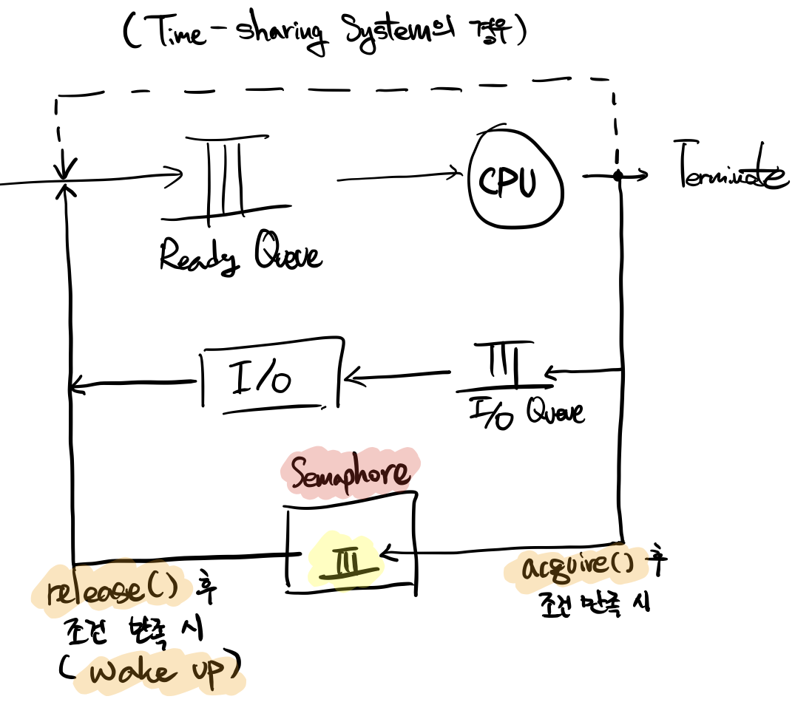

# 3-3. 세마포, Semaphore

세마포(Semaphore)는 네덜란드의 **Edsger Dijkstra**가 제안했으며, **프로세스 동기화**에 사용하는 도구들 중 가장 대표적인 **소프트웨어 도구**입니다. 세마포는 아래의 네 가지 요소로 구성되며, 네덜란드어로 명칭된 2~3의 두 동작은 주로 영문의 괄호 내용으로 사용됩니다.

1. 정수형 변수

2. P, Probern (`acquire()`)

3. V, Verhogen (`release()`)

4. Semaphore Queue

   프로세스(쓰레드)가 대기하는 큐

<br>

### Semaphore의 동작 프로세스




<br>

<br>

## 3-3-1. Semaphore의 작동 방식의 예

**3-1-1의 용돈 계좌 문제**를 예로 들겠습니다. 기존의 코드에 다음과 같은 세마포 클래스를 생성하며, 기존의 `deposit()` 메서드와 `withdraw()` 메서드 각각의 시작과 끝에 `acquire()` 메서드와 `release()` 메서드를 실행하도록 합니다.

```java
class Semaphore {
	  private int value;
    Semaphore(int value) { ... }

  	void acquire() {
		  	value --;
    		if (value < 0) {
       	block Thread;
    		}
    }
  	
  	void release() {
      	value ++;
      	if (value <= 0) {
          wakeup Thread;
        }
    }
}
```

1. `Sempaphore`의 인스턴스인 `sem`을 생성하며, 인스턴스 변수인 `sem.value` 값을 `1`로 초기화
2. 만약 `bank.withdraw()` 메서드가 실행되어 `sem.acquire()` 메서드가 실행되고,  `sem.value`값이 `0`이 변경됨
3. `bank.withdraw()` 메서드가 종료되기 전, switching이 발생
4. `bank.deposit()` 메서드가 실행되며 `sem.acquire()`가 한번 더 실행되면 `sem.value` 값이 `-1`이 되어 `block`
5. `bank.withdraw()` 메서드의 작업이 완료되고, `sem.release()` 메서드가 실행되어 `sem.value`의 값을 `+1`
6. `sem.value() >= 0`이기 때문에 `bank.deposit()` 작업이 `wakeup` 및 작업 시작
7. `bank.deposti()`이 작업을 종료하며 `sem.release()`를 호출하므로, `sem.value` 값은 초기값인 `1`로 복원됨

