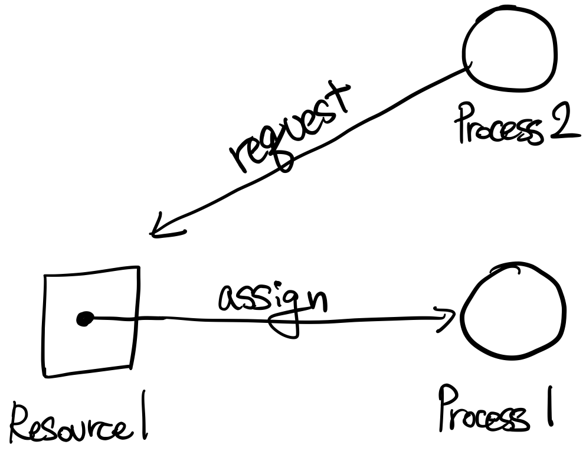
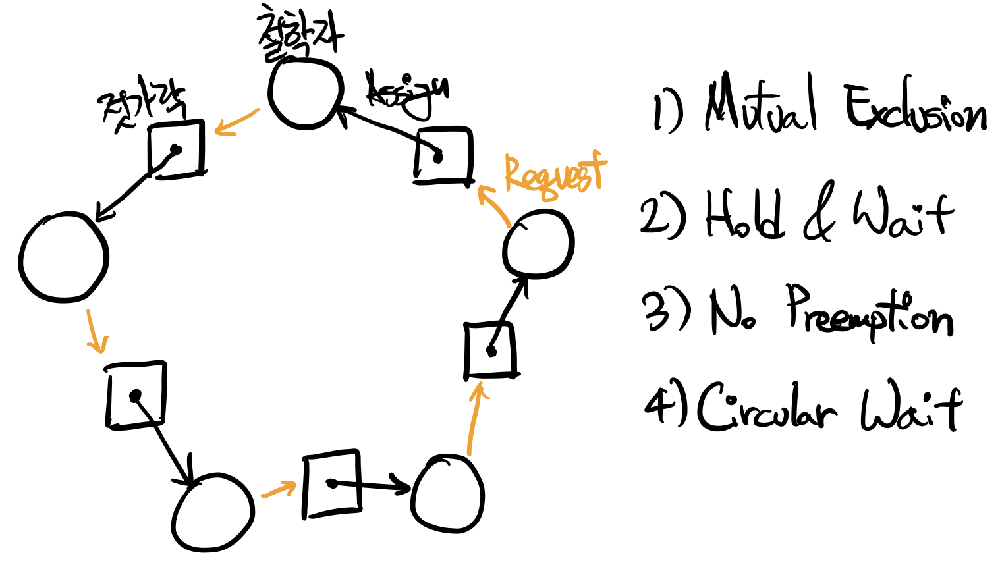

# 3-5. 교착 상태, Deadlock

`프로세스1`이 `자원1`과 `자원2`를 필요로 한다고 가정해 봅시다. 그리고 `자원1`은 할당받았지만, `자원2`를 할당 받지 못하여 대기하고 있습니다. 반대로 `프로세스2` 또한 `자원1`과 `자원2`를 모두 필요로 하는데, `자원1`이 `프로세스1`에게 할당되어 대기하고 있습니다. 이러한 상황에 우리의 프로세스들은 **교착 상태**(**Deadlock**)에 빠질 가능성이 있습니다.

 

 

## 3-5-1. 교착 상태의 조건

### 교착 상태의 필요 조건

교착 상태가 발생하려면 다음 네 가지 조건들이 필수적으로 발생해야 합니다. 물론 교착 상태가 발생하는 것은 분명 나쁜 일이며, **이 조건들이 모두 만족되더라도 발생하지 않을 수 있습니다**. 각각의 조건들 마다 Dining Philosopher Problem에서의 조건들을 예시로 들겠습니다.

1. 상호 배타, Mutual Exclusion

   젓가락은 동시에 사용될 수 없다.

2. 보유 및 대기, Hold & Wait

   왼쪽 젓가락을 보유했지만, 오른쪽 젓가락이 `release()` 되기를 기다림

3. 비선점, No Preemption

   강제로 사용중인 젓가락을 뺏을 수 없다.

4. 환형 대기, Circular Wait

   각자 왼쪽 젓가락을 보유하며, 그 모습이 원형의 형태를 띈다.

 

### 자원, Resource

동일 형식(Type)의 자원이 여러 개 있을 수 있으며, 각각의 자원들은 Instance라고도 합니다.

i.g., CPU 2개, 프린터 3개 등 여러 개의 동일 자원이 존재할 수 있다.

 

### 자원의 사용

1. 요청, Request
2. 사용, Use(Assigned)
3. 반납, Release

 

### 자원 할당도, Resource Allocation Graph

자원 할당도는 다음 두 가지를 가시적으로 표현한다.

- 어떤 자원이 어떤 프로세스에게 할당되었는가?
- 어떤 프로세스가 어떤 자원을 할당 받기 위해 기다리고 있는가?

자원 할당도에는 다음 세 가지 지표가 있습니다.

- 사각형: 자원
- 원: 프로세스
- 화살표: 할당

다음 그림은 자원 할당도의 예시 입니다.

 

다음 그림은 Dining Philosopher Problem을 자원 할당도로 표현한 것입니다.

