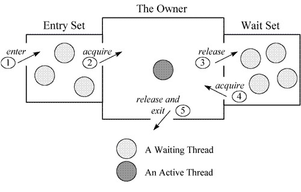

# 3-7. 모니터, Monitor

모니터는 세마포 이후의 프로세스 동기화 도구이며, 보다 고수준의 개념입니다. 하지만 초기값을 고려하지 않아도 되는 등, 사용 방법이 간단합니다.

 

 

## 3-7-1. 모니터의 구조

- 공유 자원과 공유 자원으로 접근하는 함수로 구성
- `배타동기`, `조건동기` 두 가지의 Queue가 존재
- 공유 자원에는 최대 1 개의 쓰레드만 진입 가능
- 진입 쓰레드가 `조건동기`로 블록되면, 새 쓰레드가 진입 가능
- 새 쓰레드는 `조건동기`로 블록된 쓰레드를 깨울 수 있다.
- 깨워진 쓰레드는 현재 쓰레드가 나가야 재진입할 수 있다.

 

 

### 모니터의 일반적인 사용

1. Mutual Exclusion
2. Ordering

