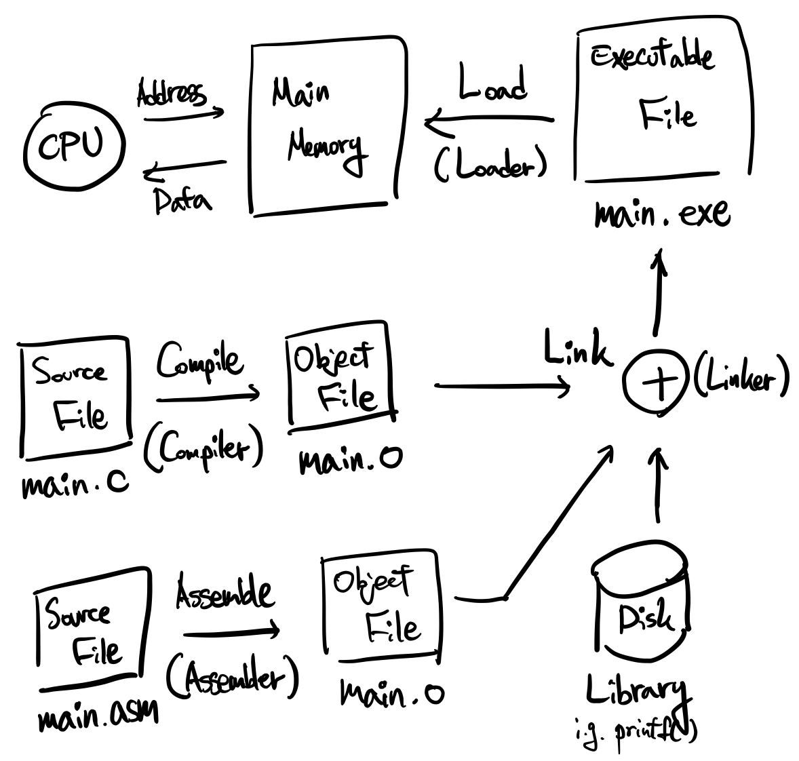
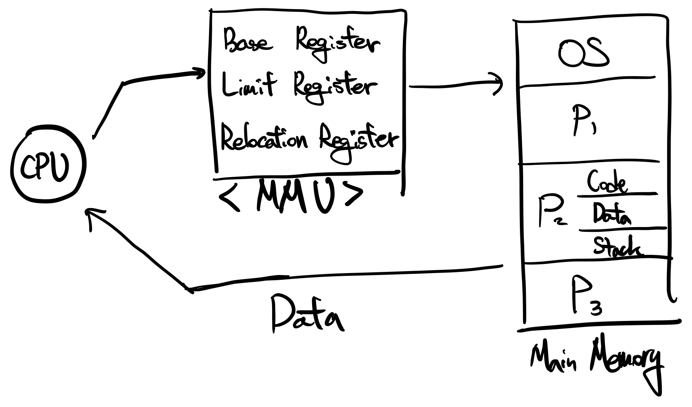

# 4-2. 메모리 주소, Address of Memory

CPU는 주소(Address)를 Main Memory에 전송하고, Main Memory는 해당 주소에 존재하는 Data를 CPU에게 반환합니다.

 

 

## 4-2-1. 프로그램 개발

### 원천 파일, Source File

**High Level Language**(i.g., C, C++, Java), 혹은 **Assembly Language**

 

### 목적 파일, Object File

**Compiler**에 의한 **Compile**, 혹은 **Assembler**에 의한 **Assemble**의 결과물

 

### 실행 파일, Executable file

**Linker**에 의한 **Link**의 결과물

**Loader**가 **Executable File**을 Main Memory에 **Load**합니다.

 

 

## 4-2-2. 프로그램 실행

프로세스의 메모리 = `Code` + `Data` + `Stack`

- `Stack`
  1. 함수 호출 시 돌아와야 할 주소를 저장
  2. Local Variable 저장

OS는 다음과 같은 사용자의 역할을 대신해 준다.

- 메모리의 어느 주소에 프로세스를 Load 할 것인가?
- 다중 프로그래밍 환경에서는 어떻게 할 것인가?

 

 

## 4-2-3. MMU 사용

MMU에는 총 세 가지 레지스터가 존재합니다. 1~2번은 이전에 설명한 내용이니 생략하겠습니다.

 

### 1. Base Register

 

### 2. Limit Register

 

### 3. Relocation Register

i.g., CPU가 0번 주소의 데이터를 요청했다. 하지만 Relocation Register가 주소를 조작하여 500번 주소의 Data를 CPU에게 반환한다. 그리고 CPU는 그 사실을 알지 못한다.

 

 

## 4-2-4. 주소 구분

주소를 **논리 주소(Logical Address)**와 **물리 주소(Physical Address)**로 구분합니다.

 

### 논리 주소, Logical Address

CPU가 사용하는 주소입니다. CPU는 Main Memory에 논리 주소를 전송하여 데이터를 요청합니다.

 

### 물리 주소, Physical Address

실제로 Main Memory에서 사용하는 주소입니다. CPU가 전송한 논리 주소는 MMU에 의해 Relocate 되고, Relocate 된 물리 주소 형태로 Main Memory에서 사용됩니다.

 

### 논리 주소와 물리 주소로 구분되는 이유

CPU는 프로세스를 작업하면서 언제나 같은 작업에 대해서는, 언제나 같은 주소로 메인 메모리에게 데이터를 요청합니다. 하지만 메인 메모리에 적재된 프로세스의 주소는 언제나 다를 수 밖에 없습니다. **같은 프로세스를 실행할 지라도, 아까 적재했던 주소값에는 다른 프로세스가 적재되어 있을 수 있습니다**. 따라서 MMU는 CPU에게 적절한 데이터를 반환하기 위해 **Relocation Register**를 사용하여 **Address Translation**을 진행합니다.

