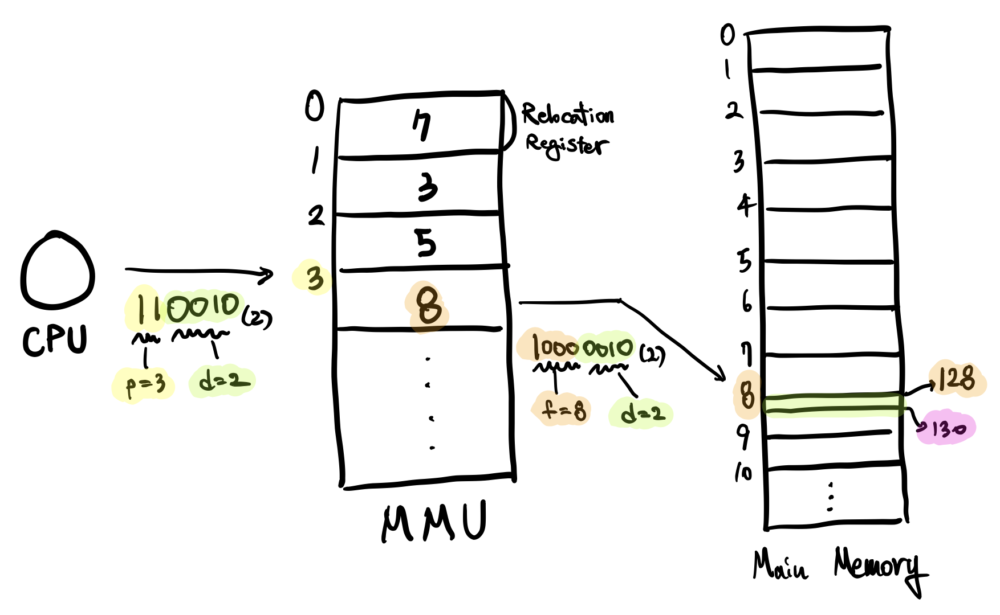

# 4-5. 페이징, Paging

프로세스와 메인 메모리의 공간을 **일정 크기**로 잘라서 관리합니다. 프로세스를 나누는 단위를 **페이지(Page)**라고 하며, 메모리 공간을 나누는 단위를 **프레임(Frame)**이라고 하고, **페이지와 프레임의 크기**는 같습니다. 보조 기억 장치에서 프로세스를 메인 메모리로 로드할 때, 프로세스를 페이징하여 페이지를 프레임에 할당하게 됩니다.

페이지를 프레임에 할당하는 작업에 있어서, 이전 4-2-3에서 언급했었던 MMU의 **Relocation Register**가 중요한 역할을 합니다. 프로세스의 각 페이지들은 각각의 Relocation Register를 통과하여 각각의 프레임 주소로 할당됩니다. 여기서 MMU는 여러 Relocation Register들이 합쳐진 **페이지 테이블(Page Table)**이 됩니다.

<br>

## 4-5-1. 주소 변환, Address Translation

CPU는 메인 메모리로 논리 주소(Logical Address)를 전송하는데, 전송하는 과정에 MMU를 거치면서 물리 주소(Physical Address)로 변환됩니다. 물리 주소는 보조 기억장치로부터 아무렇게나 올려진 메모리 조각들을 찾아 다닐 수 있습니다.

<br>

### 주소의 구성

**논리 주소**는 두 부분으로 구성됩니다.

- `p`
  - 페이지 테이블의 번호
- `d`
  - 변위, Displacement
  - 오프셋, Offset

**물리 주소** 또한 두 부분으로 나눠집니다.

- `f`
  - 메인 메모리의 번호
- `d`
  - 논리주소의 `d`와 동일한 값

<br>

### `p`와 `d`의 크기

CPU가 보내는 주소를 2진수로 표현했을 때, 이는 총 `m` bit 입니다. 그 중 하위에 존재하는 `n` bit는 `d`(Displacement) 역할을 하며, 주소 상위의 `m-n` bit는 `p`(페이지 번호) 역할을 합니다.

<br>

### 예시

- 가정
  - 페이지 크기 = 16 Byte
  - 논리 주소 = 50

16 = 2^4이므로, `n = 4`입니다. 만약 페이지 크기가 1 KB라면 `n` 값은 `10`입니다.

CPU에서 전송한 주소는 50이며, 50을 이진수로 표기하면 `110010`(이진수)입니다. 따라서 `n` 개의 이진수로 표시되는 `d` 값은 `0010`(이진수)이며, `m-n` 개의 이진수로 표시되는 `p` 값은 `11`(이진수)인 `3`(10진수)입니다.


`p` 값은 페이지 테이블의 주소값이며, 페이지 테이블 주소의 값으로 변환됩니다. `p`로 부터 변환된 `f` 값은 `8`이며, 물리적 주소는 `10000010`(이진수)가 됩니다. 물리적 주소는 `d`와 `p`를 분리하여 계산하지 않으며, 해당 값의 주소인 `130`으로 직접 접근합니다.



<br>

<br>

## 4-5-2. 페이징의 작은 문제점

### 내부 단편화, Internal Fragment

내부 단편화란, **프레임이 가득차지 않아 발생하는 Memory Loss**를 말합니다. 페이지 사이즈 및 프레임 사이즈가 16 byte라고 가정했을 때, 만약 프로세스의 마지막 페이지가 1 byte일 경우 15 byte라는 프레임 공간이 낭비되게 됩니다.

물론 메모리에 낭비 공간이 생성되지만, 최대 낭비 공간이 `Frame size - 1`이며 영향력이 크지 않습니다.

<br>

<br>

## 4-5-3. 페이지 테이블, Page Table

### 페이지 테이블의 저장 공간

페이지 테이블을 구성할 수 있는 공간에는 세 곳이 있습니다.

1. **CPU Register**

   CPU의 기억 장치인 Register에 구성합니다.

   - 장점: 빠른 속도
   - 단점: 매우 제한된 저장 공간

2. **Main Memory**

   Main Memory의 OS 영역에 저장합니다.

   - 장점: 모든 **테이블 엔트리**를 저장할 수 있는 충분한 공간
   - 단점: 왕복 2회의 처리(메모리 주소를 알기 위한 메모리 접근)가 필요하여 속도 저하

3. **TLB, Translation Look-aside Buffer**

   High Speed SRAM으로 별도의 SRAM Chip을 구성합니다.

   **현재의 운영체제들이 사용하는 방법**입니다.

   - 장점: Main Memory 보다 빠른 처리 속도, CPU의 Register 보다 여유로운 용량

<br>

### Hit Ratio

Page Table은 일부만 MMU에 존재하며, 나머지는 OS 메모리 영역에 존재합니다. 만약 필요한 Relocation Register가 MMU에 존재하지 않을 경우 OS 메모리 영역에서 탐색합니다.

CPU가 논리 주소를 MMU에 전송했을 때, **필요한 Relocation Register가 MMU에 존재하여 바로 응답할 수 있는 비율**을 Hit Ratio라고 합니다. 현재 우리가 사용하는 OS의 경우, Hit Ratio는 주로 95% 이상입니다.

<br>

### TLP 사용 시 유효 메모리 접근 시간(Effective Memory Access) 계산

- `Tm`: 메인 메모리를 읽는 시간
- `Tb`: Look-aside Buffer
- `h`: Hit Ratio 

```
Tm = 100ns
Tb = 20ns
h = 80%
Teff = h * Tb + (1-h) * (Tb + Tm)
```

<br>

### 페이지 테이블의 기능 - 보호, Protection

페이지 테이블은 해킹과 같은 나쁜 프로세스의 시도로부터 컴퓨터를 보호하는 기능을 수행합니다.

보호 기능은 MMU를 거쳐야만 메모리에 접근할 수 있습니다. 그리고 MMU에는 페이지 테이블 엔트리 마다 `r`, `w`, `x` 세 가지 비트가 있습니다.

- `r`: Reader
- `w`: Writer
- `x`: Executer

아래는 페이지 테이블과 보호 기능에 대한 예시입니다.

| Page Number | Frame Number | r    | w    | x    |
| ----------- | ------------ | ---- | ---- | ---- |
| 0           | 8            | 1    | 0    | 0    |
| 1           | 3            | 0    | 0    | 1    |

첫 번째 열의 주소는 메모리를 읽을 수 있는 권한은 있지만, 쓰거나 실행하려는 경우 Interrupt가 발생되어 프로세스가 종료됩니다. 두 번째 열의 주소는 메모리의 프로세스를 실행할 수 있는 권한이 있지만, 읽거나 쓰려고 시도하면 Interrupt가 발생합니다.

<br>

### 페이지 테이블의 기능 - 공유, Sharing

페이지 테이블은 메모리의 낭비를 일부 방지할 수 있는 기능이 있습니다.

같은 프로그램을 쓰는 복수 개의 프로세스가 있다고 가정해 봅시다. 그 예로 Web Browser, Word Processor 등을 동시에 여러 개 작업하는 경우들이 있습니다.

프로세스는 메모리 공간을 (Code, Data, Stack)으로 나누어서 사용합니다. 그런데 어떤 프로그램들은 복수 개로 별도 실행하고, 다른 작업들을 할 지라도 동일한 **Code** 내용을 사용할 수 있습니다. 이러한 경우 메모리 상에 Code 내용이 세 곳에 저장하지 않고, 페이지 테이블에서 동일한 Frame Number를 사용한다면 중복되는 Code 내용을 없앨 수 있습니다.

하지만 프로그램 중복 실행 시 Code 영역이 달라지지 않는 **non-selfmodifying code**(=**reentrant code**)(=**pure code**), **코드 실행 시 스스로 내용이 달라지지 않는 코드**일 경우에만 공유 기능이 사용됩니다.

