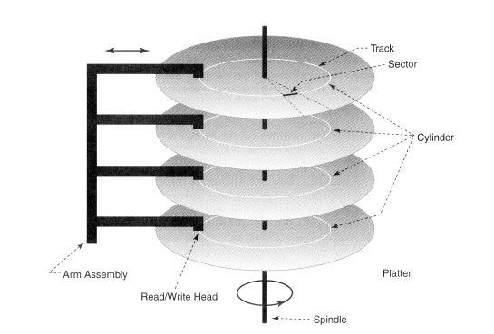

# 6-1. 파일 시스템, File System

컴퓨터 시스템의 자원 관리, 운영체제의 관리 대상은 다음 세 가지 입니다.

- CPU 프로세스 관리, Process Managemant

  - CPU 스케쥴링, CPU Scheduling
  - 프로세스 동기화, Process Synchronization

- 주기억장치, Main Memory Unit

  - 페이징, Paging
  - 가상 메모리, Virtual Memory

- 보조기억장치, Auxiliary Memory(Storage) Unit

  파일 시스템, File System

 

### 하드 디스크 HDD, Hard Disk Drive

그 중에서 이번 6장에서 다룰 내용은 보조기억장치 및 하드 디스크(HDD)입니다. 하드 디스크의 구성은 다음과 같습니다.

- **트랙, Track**

  - **실린더, Cylinder**: 하드 디스크는 여러 층의 트랙들로 되어 있으며, 실린더는 다른 층들이지만 같은 위치인 섹터들(기둥 형태)의 집합

- **섹터, Sector**

  주로 512 Bytes로 사용된다.

  - **블록, Block**: Sector들의 모임이며, 파일 시스템에서는 디스크 공간을 블록 단위로 관리

    i.g., 메모장에 1 Byte의 내용만 작성하여도 4 KB의 공간이 사용된다.

- **헤더, Header**

  디스크의 헤더에는 코일이 감겨 있으며, **회전하는 디스크 트랙 위의 목표하는 블록 및 섹터로 위치를 이동하여 전자기장을 형성하고, 데이터를 읽거나 씁니다**.

- **디스크, Disk**

  : Pool of free blocks

블록 단위를 사용하는 이유는, **섹터처럼 작은 단위로 사용할 경우 디스크의 읽기/쓰기 작업을 너무 빈번하게 진행**해야 하기 때문입니다.

각각의 파일에 대해 free block을 어떻게 할당할 것인가를 결정하는 것이 **파일 할당(File Allocation)**입니다.

