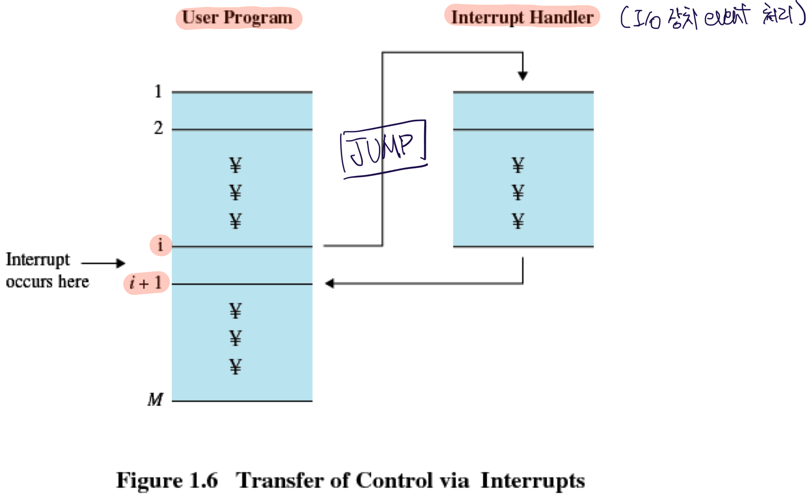

# Computer System Overview

컴퓨터의 전원을 처음 킬 때에는 bootstrap program이 실행된다.

- Bootstrap Program
  - Firmware인 ROM(Read Only Memory) 혹은 EPROM에 저장되어 있다.
  - Initializes all aspects of system
  - OS kernel을 load & start execution

Computer의 기본적인 요소들은 다음과 같다.

- Processor
- Main Memory
- System bus
  - Data를 주고 받는 통로
- I/O Modules

  

## Processor

CPU 구성 3가지

- ALU, Arithmetic Logic Unit
- CU, Control Unit
- Register
  - Internal Register
  - Control and Status Register
  - User-visible Register

### Internal Register for data I/O

- Main Memory의 데이터를 `LOAD`, `STORE` 에 사용되는 Registers
  - MAR, Memory Address Register
    - 다음에 `LOAD`/`STORE` 할 데이터의 주소를 저장
  - MBR, Memory Buffer Register
    - `LOAD` 한 데이터를 저장
    - `STORE` 할 데이터 저장
- I/O로 부터의 `LOAD`와 `STORE`
  - CPU는 I/O와의 직접적인 작업이 불가하며, Main Memory에 등록된 I/O buffer의 주소를 이용하여 작업
    - I/O address register
    - I/O buffer register

### User-visible Register

- C언어 등을 이용하여 Assembly language로 조작 가능한 register
  - loop optimizer 등 compiler에게 맡기지 않고, 직접 최적화 가능
- Aplication program과 system program 모두 조작 가능한 영역
- Tpyes of registers
  - Data
  - Address
    - Index
    - Segment pointer
    - Stack pointer

### Control and Status Registers

- PC, Program Counter
  - 다음으로 `FETCH` 할 명령어의 주소를 기록
  - `FETCH` 할 때 마다 값을 +1 하여 다음 주소를 가리킴
- IR, Instruction Register
  - `FETCH` 된, 현재 실행할 명령어를 저장
- PSW, Program Status Word
  - Condition codes
    - 실행 결과의 상태를 저장하는 비트 - 문제 발생시 빠르게 대처하기 위함
      - Positive
      - Negative
      - Zero
      - Overflow
      - 등
  - Interrupt enable/disable
    - Interrupt에 의한 실행 중지를 허용/불허
  - Supervisor/User Mode
    - 현재 코드가 OS(Kernel) 코드 인지, Application 코드 인지 구분

### Instruction Execution

명령어 수행은 다음 두 단계를 반복하는 행위

- Read instruction from memory(`FETCH`)
- Execute each instruction

### IR, Instruction Register

FETCH 된 명령어를 저장하는 레지스터

- Instruction Categories
  - Processor-Memory
    - Processor와 memory 사이에서 데이터를 전송
  - Processor-I/O
  - Data processing
    - Arithmetic or logic operation on data
  - Control
    - Execution의 sequence를 교체(e.g., `JUMP`)

### Example of Program Execution

아래 그림에서 IR의 맨 앞 자리는 Instruction 종류를 의미한다.

- 1: `LOAD`
- 5: `ADD`
- 2: `STORE`

아래 그림은 명령어를 메모리로 부터 가져오고, 메모리로 부터 사용할 데이터를 가져와서 Accumulator(`AC`)에 저장하고 연산하는 과정이다.

  

## Interrrupt

I/O device로 부터 Interrupt 발생 시 현재 CPU가 진행중인 sequencing(`FETCH`-`EXECUTE`)을 잠시 중단하고, interrupt를 처리하게 된다. 대부분의 I/O 장치들은 processor보다 처리 속도가 느리다.

_Interrupt Handler: 특정 I/O device를 처리하는 프로그램이며, 보통 OS 내에 포함되어 있다._

Interrupt에 의해 실행이 중단될 때에는, interrupt 작업 후 다시 복귀하기 위해 PSW와 PC를 control stack에 저장하게 된다.

### Why Interrupt

Interrupt가 없다면, processor는 I/O 장치의 작업이 필요할 때 마다 I/O 장치의 작업이 종료될 때 까지 대기해야 한다. 하지만, Interrupt를 사용함으로서 다음과 같이 수행할 수 있다.

- System Call이 호출됐을 때 CPU가 I/O를 호출
- CPU는 다시 요구되는 명령어 sequence를 계속해서 실행
- 만약 I/O가 data를 주고 받을 준비가 되면, Device Controller가 CPU에게 Interrupt를 일으킴
- CPU는 작업을 중단하고, interrupt handler를 실행

즉, CPU의 작업 시간이 대폭 감소한다.

### DMA, Direct Memory Access

하지만, 여전히 CPU는 많은 시간을 뺏기게 된다. 컴퓨터는 I/O device를 믿을 수 없기 때문에 I/O device와 DRAM이 직접 데이터를 주고 받으며 작업하는 것을 허락할 수 없다. 따라서 CPU가 DRAM을 사용하여 I/O와 data를 다루게 되는데, 문제는 CPU가 word 단위(명령어 1개)로 밖에 작업을 못 한다는 것이다.

따라서 CPU 대신 DRAM에 접근할 수 있는, 새로운 장치를 만든 것이 DMA Controller이다. CPU는 DMA Controller에게 I/O device를 이용하여 작업을 처리할 것을 명령하고, 작업 종료 시 DMA가 Interrupt를 일으키며 CPU는 DMA의 status를 통해 작업이 어떻게 끝이 났는지 확인하게 된다.

 

### Multiprogramming

그런데 Inturrupt를 사용하더라도 문제는 발생한다. 만약 I/O 작업이 굉장히 오래걸리는 경우, CPU는 다음 I/O 작업을 맡기기 위해 이전 I/O의 작업을 기다려야 한다. 즉, interrupt를 사용하지 않는 것과 같은 양상을 보이게 된다. 따라서 CPU의 I/O 작업 대기 현상을 줄이기 위해 multiprogramming을 하게 된다.

Multiprogramming에서는 I/O device를 대기하는 상황, 혹은 우선 순위에 따라 프로그램을 실항하게 된다.

  

## Cache

Cache는 CPU와 DRAM 사이의 데이터 전송 overhead가 너무 크므로, 자주 사용되는 DRAM 데이터의 일부를 저장해 두는 중간 저장소이다. Cache는 DRAM 보다 빠르지만, 비싸고 용량이 작은 SRAM을 사용한다.

CPU는 data를 우선 cache에서 찾아본 후, 없다면 main memory에서 찾게 된다.

### Cache Design

- Cache size

  - Cache의 크기는 작을 수록 비용 대비 효율이 커진다.

    (덜 중요한 데이터까지 저장하게 되기 떄문에)

- Block size

  - 참조 지역성(Locality)에 의해 자주 사용하는 데이터는 주변에 있을 확률이 높으므로, block size가 클 수록 효율이 좋아질 수도 있다.
  - Cache size와 마찬가지로, 너무 크게 사용할 시 인기가 적은 data들이 더 많이 들어가므로 효율이 떨어지기도 한다.

- Mapping Fucntion

  - Block이 어느 slot에 들어갈 것인가
  - RA(Read Address) word의 탐색을 빨리 찾을 수 있어야 한다.

- Replacement algorithm

  - Swap-out 할 block을 내보냄
  - LRU(Least-Recently-Used): 가장 사용한지 오래된 block을 swap-out

- Write Policy

  - Cache의 data와 Main memory의 데이터 synchronization problem
  - Core 마다 존재하는 Cache들의 coherence problem

Main Memory와 Disk 사이의 속도 차이 개선을 위한 **Disk Cache**도 있다. 이는 Main Memory의 일부 공간을 Disk Cache로 사용하며, 이를 CPU와 DRAM 사이의 cache와 같이 사용한다.