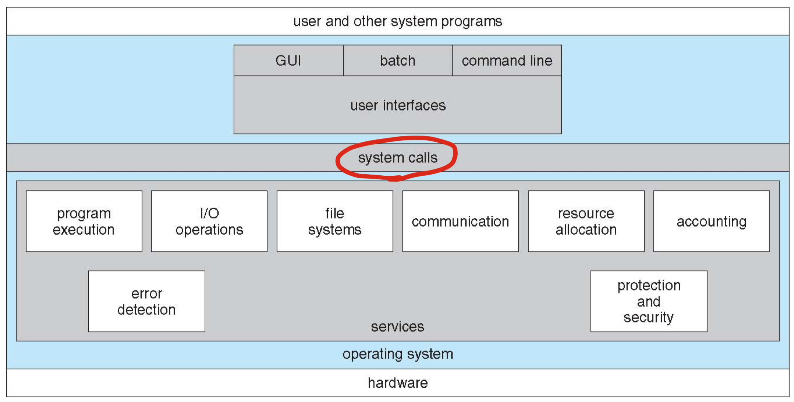
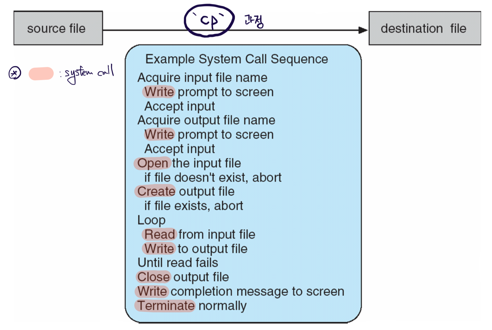
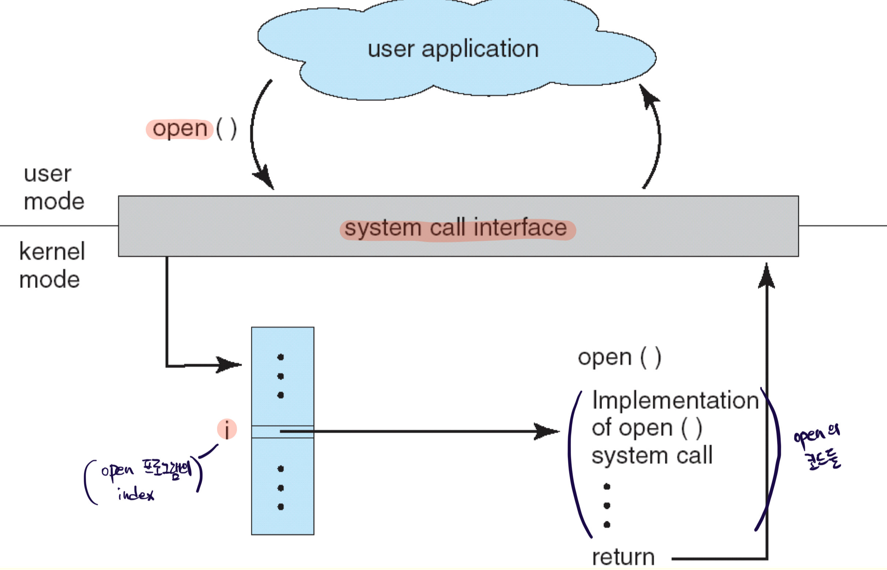
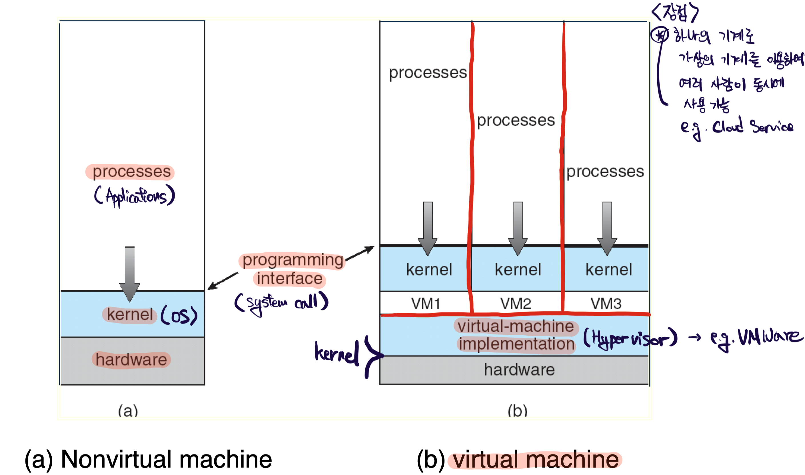
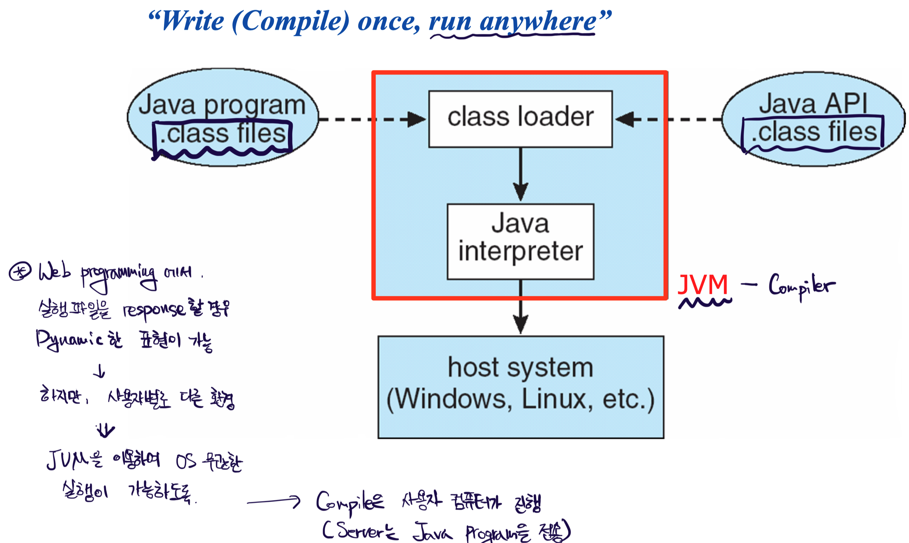

# OS System Overview

## OS Structure

### Multiprogramming

Multiprogramming은 CPU가 I/O device들로 인해 대기하는 현상을 없앰으로서, CPU가 항상 어떤 job을 수행하도록 한다. 어떤 job을 수행하는가는 Job Scheduling(=CPU Scheduling, =Process Scheduling)에 의해 결정되며, I/O에 의해 wait 상태가 될 때 마다 OS가 job을 switching 하게 된다.

### Timesharing (=Multitasking)

Timesharing은 CPU가 interactive 하게 작업할 수 있도록 하며, job들을 빠르게 switching 하여 여러 job들이 동시에 실행되는 것과 같은 효과를 보도록 한다. 또한, 이로 인해 여러 user가 동시에 하나의 컴퓨터를 혼자 사용하는 것 처럼 느껴지도록 한다.

이후 등장하는 virtual memory 또한 이러한 timesharing 환경을 더 효율적으로 사용하기 위해 사용된다. 여러 user/process 들이 동시에 사용/사용되는 만큼 더 많은 메모리 공간을 요구하게 되었고, virtual memory는 process들을 꼭 필요한 부분만 Main Memory에 사용하게 함으로서 더 많은 process들을 동시에 사용할 수 있도록 한다.

  

## OS Operations

- Interrupt driven by H/W
  - CPU가 무한하게 I/O의 입력을 기다리지 않도록 하기 위함
- S/W의 error 와 request는 다음을 야기한다.
  - Exception
  - trap(Exception Handling), 현재 하고 있는 다른 작업을 중단하고, 에러를 처리해야 한다.

### Dual-mode

Mode bit를 이용하여 user/kernel mode를 구분하는데, 이는 application이 마음대로 컴퓨터를 조작하는 것을 방지한다.

- User mode (mode bit = `1`)
- Kernel mode (mode bit = `0`)
  - 일부 instruction들은 kernel mode로 동작할 수 있는 권한이 있다.
  - System call은 kernel mode로 전환시키며, 작업 종료 후 user mode로 돌아온다.

  

## Process Management

Program은 passive entity이며, process는 active entity이다. 즉, process는 실행 중인 program이다. Process는 다음 네 가지를 묶어서 표현하는 **자료구조**이며, OS가 제공한다.

- CPU
- Memory
- I/O
- Files

위 네 가지는 program을 실행하기 위해 필요한 정보들이며, process 종료 시 해당 자료구조는 삭제된다. 자료구조를 삭제할 때에는 할당 받은 자원을 반납하는 과정이 필수적이다.

### Process의 실행과 종료

`(더블 클릭하여 실행)-(process라는 자료구조 생성)-(필요 자원/정보 할당)-(메모리 로드)-(termination 후 삭제)`

### Program Counter

Single-threaded process는 하나의 PC를 보유하며, 다음으로 실행할 instruction의 위치를 저장한다. 따라서, Multi-threaded process는 thread 별로 하나의 PC를 보유해야 한다.

### Process management's Activities

- System/User process의 생성과 삭제
- 중단과 재개
- Process Synchronization
- Process Communication
- Deadlock Handling

  

## Memory Management

### Activities

- 현재 사용중인 메모리의 어느 부분이, 그리고 누구에 의해 사용되는지 추적
- Process와 Data를 어떻게 할당 (Swap)
- 메모리 공간의 할당 및 해제
  - 새로운 프로세스 / 종료된 프로세스 / 동적 할당 / 등

  

## Starage Management

OS는 CPU가 write 하고 싶은 데이터를 넣어서 `file`이라는 공간에 넣어서 주면, 알아서 disk에 저장하는 방법을 제공한다. 여기서 `file`이라는 것은 logical storage unit이며, physical property를 추상화한 개념이다.

### File-System Management

File은 주로 directory에 포함되며, OS에 의해 접근 권한이 정해진다.

- OS activities of File-System
  - File과 directory의 생성과 삭제
  - 권한 조정
  - Secondary Storage(HDD/SSD)로 파일을 mapping
  - Backup files on stable(non-volatile) storage media(DRAM은 volatile)
- Mass-Storage Management's activities (HDD/SSD)
  - Free-space management - 빈 공간 tracking
  - Storage allocation
  - Disk scheduling - Header의 움직음을 최소화

  

## I/O Subsystem

I/O는 다양한 회사들이 제작하며, 그만큼 다양한 사용법이 다양하다. 따라서 OS는 사용자가 이를 고려하지 않고도, 모두 똑같이 사용할 수 있도록 peculiarity를 숨겨주어야 한다.

- I/O Subsystem's responsible for
  - Buffering
    - I/O는 매우 느리므로, I/O가 작업을 마무리 하기 전까지 CPU에서 전송한 데이터를 임시로 저장
  - Caching
    - 자주 사용되는 I/O의 데이터를 caching
  - Spooling
    - I/O 간 데이터 공유 장소
  - General device-driver interface
  - Drivers for specific H/W devices

  

## Protection & Security

- Protection
  - Process 혹은 user로 부터 권한을 관리하여 OS의 자원을 보호
- Security
  - Internal/External attack으로 부터 시스템을 보호(e.g., virus)
- 우선 사용자를 확인
  - user ID
  - group ID
- Privilege escalation: user ID가 더 많은 권한을 얻을 수 있도록
  - e.g., Spool 영역은 원래 user의 영역이 아니며, user program 또한 사용할 수 없다.
  - 따라서 이런 어쩔 수 없는 경우에 한해 OS가 잠시 권한을 상승시켜준다.

  

## System Calls

OS의 service를 이용하기 위한 programming interface이다. 주로 high-level language인 C/C++로 제작되어 있으며, 주로 프로그램들은 직접 호출하기 보다는 API(Application Program Interface)를 이용하여 접근한다. System call보다 API를 주로 사용하는 이유는 **Portability**와 **Ease of use** 때문이다.

- Win32 API for Windows
- POSIX API for POSIX-based Systems(UNIX, Linux, OS X)
- Java API for JVM(Java Virtual Machine)

아래 그림은 shell에서 `cp`라는 명령어를 실행했을 때, system call이 발생하는 과정이다.

아래는 `open()`이라는 명령어로 file을 열 때 발생하는 과정이다.

위와 같이 system call은 indexing 되어 저장되어 있으며, index를 호출함으로서 사용된다.

### Types of System Calls

- Process control
- File management
- Device management
- Information maintenance
  - e.g., `ps` 명령어 - process ID 조회
- Communications
- Protection

  

## Virtual Machine

- Virtual Machine: 물리적인 H/W 처럼 보이는 가상의 H/W
  - underlying bare H/W와 동일한 interface의 vm을 제공
  - OS host는 해당 process가 자신만의 processor와 memory를 갖는 것으로 여기게끔 조치
  - 각 guest는 underlying computer의 복사본을 사용

아래는 JVM의 작동 원리를 그림으로 표현한 것이다.

