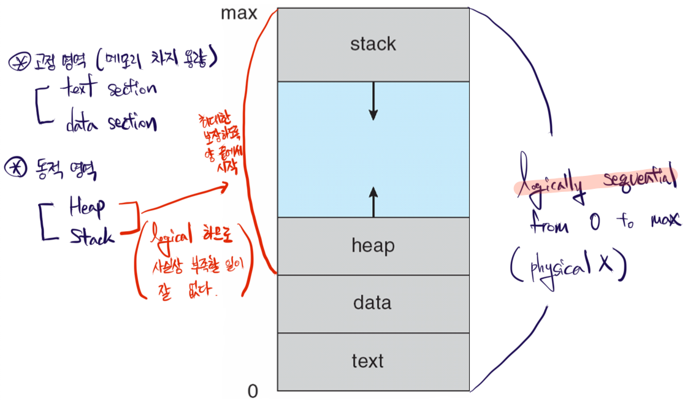
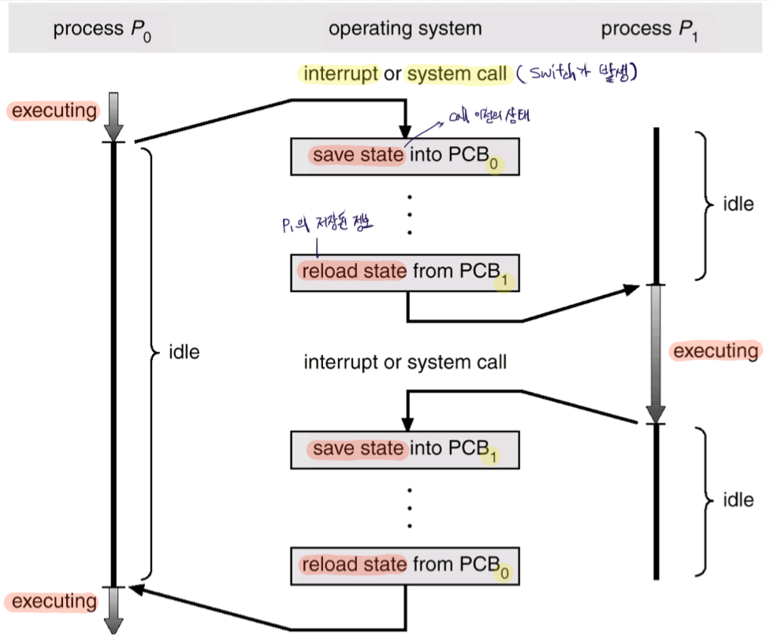
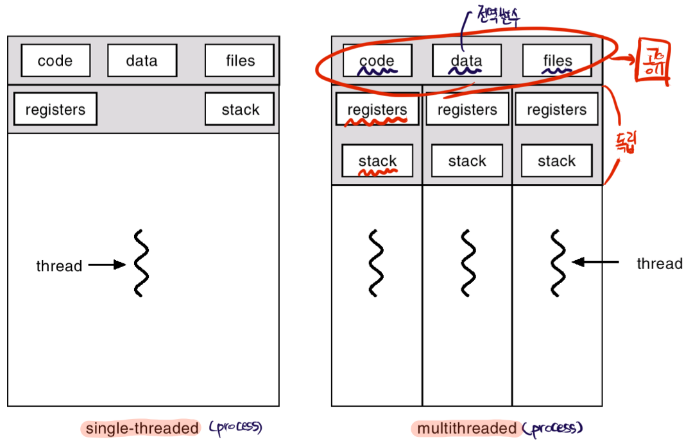

# Process and Thread

Process의 정의: Program in execution

Process는 분기, `JUMP`와 같은 요소가 없다면 sequential 하게 실행되며, 다음 내용들을 포함한다.

- **Text section**: program code
- Values of **Program Counter** & **Registers**
- **Stack**
  - parameter
  - return address
  - local variables
  - etc
- **Data section**: process 전체에서 접근 가능한 변수들
  - static variables
  - global variables
- **Heap section** for dynamic allocation

### Process State

- new
  - 실시간 시스템의 경우에만 존재
  - 다른 process의 작업 종료에 지장이 생길 것 같으면, new 상태로 대기
- running: 실행중인 상태
- waiting: I/O를 대기하는 상태이며, interrupt 발생 시 해제
- ready: processor가 할당되기를 대기하는 상태
- terminated: Instruction이 끝났지만, 해제되지 않은 상태

### PCB, Process Control Block

Kernel의 자료구조 중 하나이며, process를 관리하기 위한 자료구조이다. Linux의 경우 `task_struct`이며, 운영체제 마다 다르다. PCB는 다음을 포함한다.

- Process state
- Program counter
- CPU registers
- CPU scheduling information
  - e.g., priority
- Memory-management information
  - e.g., 메모리 상의 Heap, Stack 영역의 주소
- Accounting information
  - e.g., 얼마나 실행 되었는가
- I/O status information
  - e.g., `open`한 파일 목록

PCB는 context switching이 계속해서 발생하는 상황에서, process를 올바르게 관리하기 위해 사용된다. 아래 그림은 process $P_0$에서 작업하던 중, process $P_1$을 실행하고, 다시 $P_0$으로 돌아오는 과정을 표현한 것이다.

  

## Scheduling Processes

### Process Scheduling Queues

PCB들은 아래 queue들에 저장이 되는데, 저장된 공간은 상황에 따라 달라지며, 옮겨진다.

- Job queue
  - 모든 PCB들의 주소를 가지고 있는 열
- Ready queue
  - Processor가 할당되길 기다리는 process들의 PCB 주소가 위치한 열
- Device queues
  - I/O device를 사용하기 위해 대기하고 있는 PCB 주소들의 열

즉, **queue에서 대기하는 것은 `process의 메모리상의 주소`가 아니라, 해당 process의 `PCB의 주소`**이다.

### Schedulers

- Long-term Scheduler (=Job Scheduler)
  - Ready queue에 들어갈 job(PCB)를 선정
  - Degree of Multiprogramming을 결정하게 된다.
  - seconds/minutes 주기
- Short-term Scheduler (=CPU Scheduler)
  - 실행할 process(PCB)를 고르고, CPU를 할당
  - **Time Quantum**이 매우 짧으므로, 매우 빈번하게 작동(Short-term)
  - milliseconds 주기
- Medium-term Scheduler
  - Suspend 된 process들에 대해 swap-out/in 하는 scheduling
  - Suspend 된 process가 있을 때, Memory 부족 시 해당 process를 swap-out
  - 재개 시 swap-in
  - **주로 user에 의해 suspend 된 process**

### Process bounded

- I/O-bound Process
  - I/O 작업에 많은 시간/자원을 사용하는 process
  - 많고, 짧은 CPU bursts
- CPU-bound Process
  - Computation에 더 많은 시간/자원을 사용하는 process
  - 적고, 매우 긴 CPU bursts

### Context Switch

CPU는 짧은 시간 간격(Time Quantum)으로 여러 process들을 동시에(동시로 보이게끔) 처리한다. 그럴 때 마다 old process의 state를 PCB에 저장하며, new process의 state를 불러오는 context switching이 발생한다. Process의 context는 PCB에 기록된 process의 정보를 말하며, context switching은 다음과 같은 오버헤드들이 있다.

- Switching 동안 아무것도 할 수 없다.
- H/W의 도움이 필요하다.
  - S/W만으로는 빠른 속도로 작업하는 것이 불가능
- Context가 바뀌므로, old process가 사용하던 cache를 모두 제거하고 새로운 cache를 생성해야 하므로 **Cache Flushing**이 발생
  - Context switching 이후의 cache는 hit rate이 매우 낮다.

### Process Creation

우리는 shell에 `ls` 명령어를 통해 `ls` process를 실행했을 때, 우리가 그 process를 실행시켰다고 생각한다. 하지만, 이 또한 shell process가 `ls` process를 실행시킨 것으로, process는 주로 또 다른 process에 의해 생성된다.

Process는 컴퓨터 부팅을 하고, OS가 load되어 시작하면서 부터 자식 process들을 만들며 tree 형태를 이룬다. Process는 다음과 같은 특성을 갖는다.

- 각 process는 pid(process identifier)를 갖는다.
- 자식 process는 부모의 resource를 공유를 받거나, 일부만 공유를 받거나, 혹은 아예 공유 받지 못하기도 한다.
- 일반적으로 부모와 자식은 concurrent 하게 실행되며, 부모는 자식이 종료될 때 까지 종료되지 않는다.
- 자식은 생성될 때 부모의 address를 복사하며, program이 load 되면 주소를 분리 하기도, 안하기도 한다.
  - 그대로 주소를 사용해도 무방한 경우들이 있다.
  - **주소 뿐만 아니라 내용들도 모두 복사하며, program이 load될 때 교체**된다.

UNIX 시스템에서 `fork` system call은 새로운 process를 생성하며, `exec` system call은 `fork` 뒤에 사용되어 해당 process의 메모리 공간을 new program으로 교체한다. `exec` system call이 호출되지 않으면, 부모와 계속해서 같은 주소/내용을 보유하게 된다.

  

## Thread

Thread는 **lightweight process**라고도 하며, CPU utilization의 basic unit이다. Traditional(=heavyweight process)는 단일 thread 환경을 말한다. Thread는 다음으로 구성된다.

- Program Counter
- Register set
- Stack space

Thread들 간에는 다음 세 가지를 공유한다.

- Code section
- Data section
- OS resources
  - e.g., opened files, signals

### Benefits of Multi-threads

- Responsiveness, 응답성
  - CPU가 기다려야 하는 시간을 감소시켜, 실행이 더 많이 되도록 한다.
- Resource Sharing
  - 여러 thread가 아니라, 여러 process를 사용하게 되면 필요한 정보들을 process 개수 만큼 복사해야 한다.
  - Thread의 경우 공유할 수 있으므로 보다 효율적
- Economy
  - Process의 context switch 보다 thread의 context switch에 더 적은 overhead 발생
- Scalability
  - 하나의 process는 여러 개의 Core에서 작업이 불가하다.
  - 하지만, core 별로 thread를 같은 process에 할당하는 것은 가능하다.

### Kernel/User Thread

- Kernel-supported Thread
  - Kernel이 생성한 thread
  - Kernel이 thread를 관리
- User-level Thread
  - Library call을 이용하여 조작할 수 있다.
  - Kernel이 아니라 process로 인식되며, kernel로 요청하지 않고 직접 조작하므로 매우 빠르다.