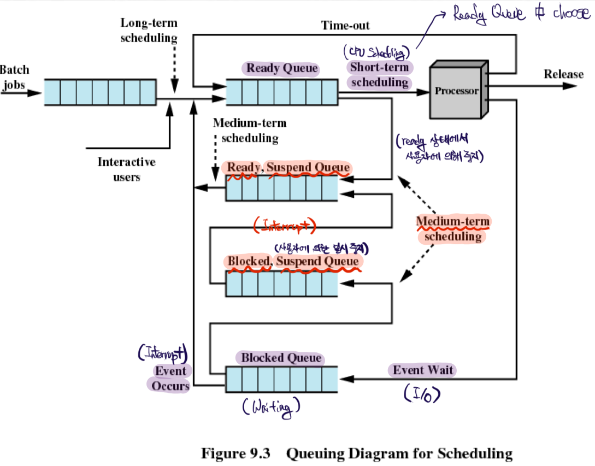

# CPU Scheduling

Scheduler로는 Short/Medium/Long-term Scheduler 세 가지가 있으며, CPU Scheduler는 그 중에서도 Short-term에 해당한다. 그리고 Short-term Scheduler는 Ready Queue에서 어떤 process(PCB)를 실행할 지 milliseconds 주기로 선택하고, processor를 할당하는 작업을 수행한다.

보다 자세히 설명하자면, CPU Scheduler가 일하게 되는 순간은 다음과 같다.

1. 어떤 process의 state이 running에서 waiting으로 바뀔 때
2. 어떤 process가 종료될 때
3. 어떤 process의 state이 running에서 ready로 바뀔 때
4. 어떤 process의 state이 wating에서 ready로 바뀔 때

1번과 2번의 경우에만 일하는 CPU Scheduler는 nonpreemptive하게 작업하는 경우이며, 모든 경우에 일하는 경우는 preemptive 하게 작업을 수행하는 것이다.

### Dispatcher

Dispatcher module은 CPU를 control 하기 위해 사용하는 것이며, 다음과 같이 사용된다.

- Switching context
  - Context Switching
  - **대부분의 overhead**
- Switching to user mode
  - Mode Switching
  - 작은 overhead
- 중단됐던(e.g, context switching에 의해) process의 재시작 위치로 jump

  

## Scheduling Algorithms

### Criteria

- **CPU utilization** (중요)
  - CPU 활용률
  - Multiprogramming의 목적
- **Waiting time** (중요)
  - Ready queue에서 기다리는 시간의 합
- Throughput
  - 단위 시간당 완료하는 process의 개수
- Turnaround time
  - 프로그램 시작 후 종료하는데 까지 걸리는 시간
- Response time
  - 사용자가 하는 작업에 의해 첫 응답을 받는데 까지 걸리는 시간
  - e.g., 카톡에 'ㄱ'을 입력했을 때 모니터에 표기되기 까지의 시간

### Algorithms

- FCFS, First-Come First-Served
  - Fairness (유일한 강점)
  - Convoy Effect (큰 단점)
    - 금방 끝날 작업인데, 앞의 큰 일에 의해 처리되지 못하는 현상
    - Waiting time이 길어진다.
- SJF, Shortest-Job-First
  - Optimal
  - Nonpreemptive
- SRTF, Shortest-Remaining-Time-First
  - SJF의 preemptive 버전 - 더 짧은 실행 시간의 process가 오면 교체
  - 얼마나 걸릴지 예측하는 방법의 예시 - 이전 수행 시간을 참고하여 EMA(Exponential Moving Everage)
  - But, 실행 시간이 일정하지 않을 수록 성능 떨어짐
- Priority Scheduling
  - 보통 혼자 사용되지 않고 혼합되어 사용됨
  - 만약 우선 순위를 burst time으로 설정하면 SJF와 동일
  - 문제 두 가지
    - Priority를 어떻게 설정할 것인가?
    - Starvation
      - low priority가 계속해서 실행되지 않음
      - Aging은 starvation을 겪는 곳에서 solution으로 흔히 사용됨
      - Aging - 시간이 지남에 따라 priority 감소(낮은게 우선)
- RR, Round Robin
  - Time Qunatum이라는 시간마다 process를 switch
  - 보통 SJF에 비해 turnaround가 크지만, 더 작은 response
  - `(n-1)q` 시간 내에 다시 자신의 차례가 온다는 upper bound를 제공
    - large `q` == FIFO
    - too small `q` => context switching이 너무 자주 발생하게 되면, overhead가 너무 커져 성능 저하
- Multilevel Queue
  - 여러개의 Ready Queue 각각에 다양한 Scheduling 지정이 가능
    - e.g., I/O-bound Job들에는 RR을, CPU-bound Job들에는 FCFS를 사용하도록 queue를 분리
  - Time sllice를 사용하여 queue 별 CPU 점유 시간을 지정함으로서, 특정 queue가 겪을 수 있는 starvation을 방지
  - 비현실적 - 실제로 process가 실행될 때, 어떤 queue가 적절한지 알 수 없다.
- Mulilevel Feedback Queue
  - Multilevel Queue들 간에 process가 이동할 수 있다.
  - 비현실적인 Multilevel Queue와 달리, 실행을 하면서 점차 적절한 queue로 이동

### Real-Time Scheduling

매우 복잡한 스케쥴링 방법이며, Real-time OS에서 사용된다.

- Hard real-time systems
  - Deadline을 정해두고, 무조건 완수하도록 schedule
- Soft real-time computing
  - 특정 critical process들에게 우선순위를 부여하는 완화된 형태
  - e.g., 동영상 플레이어 높은 순위, MS Word에는 낮은 순위