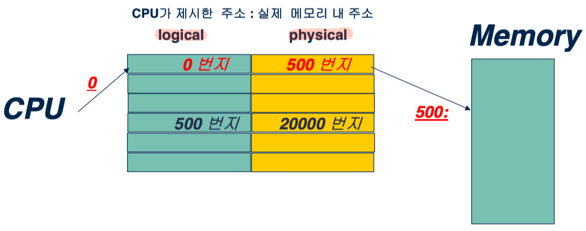
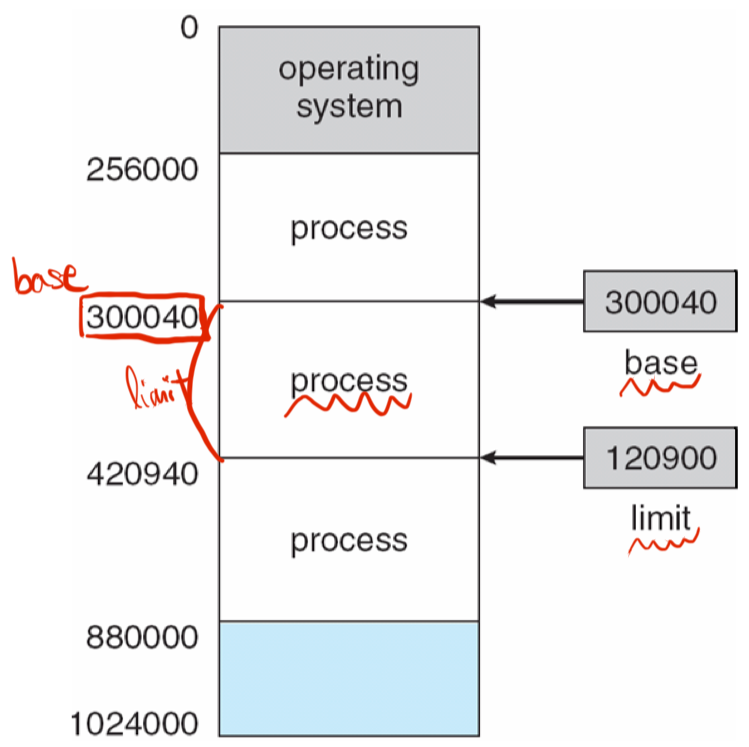
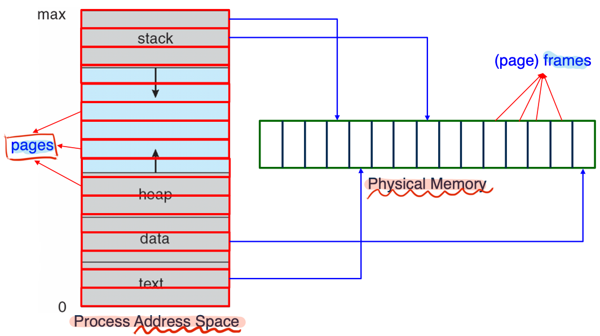
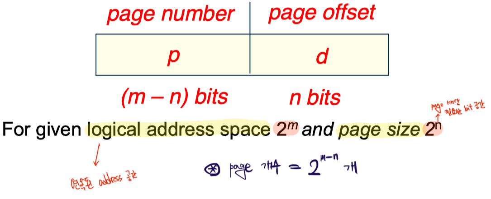
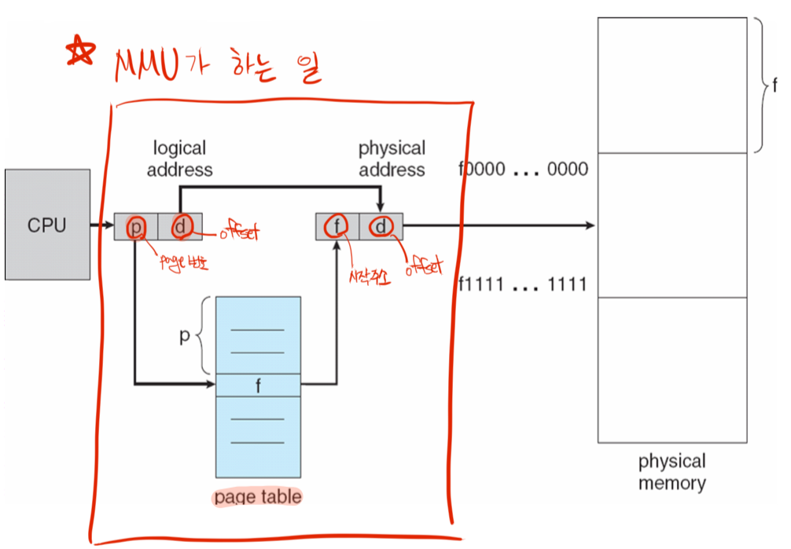
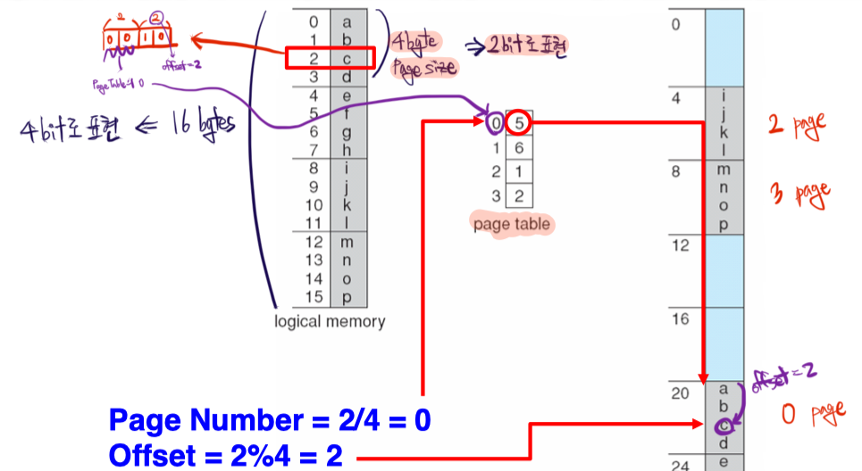
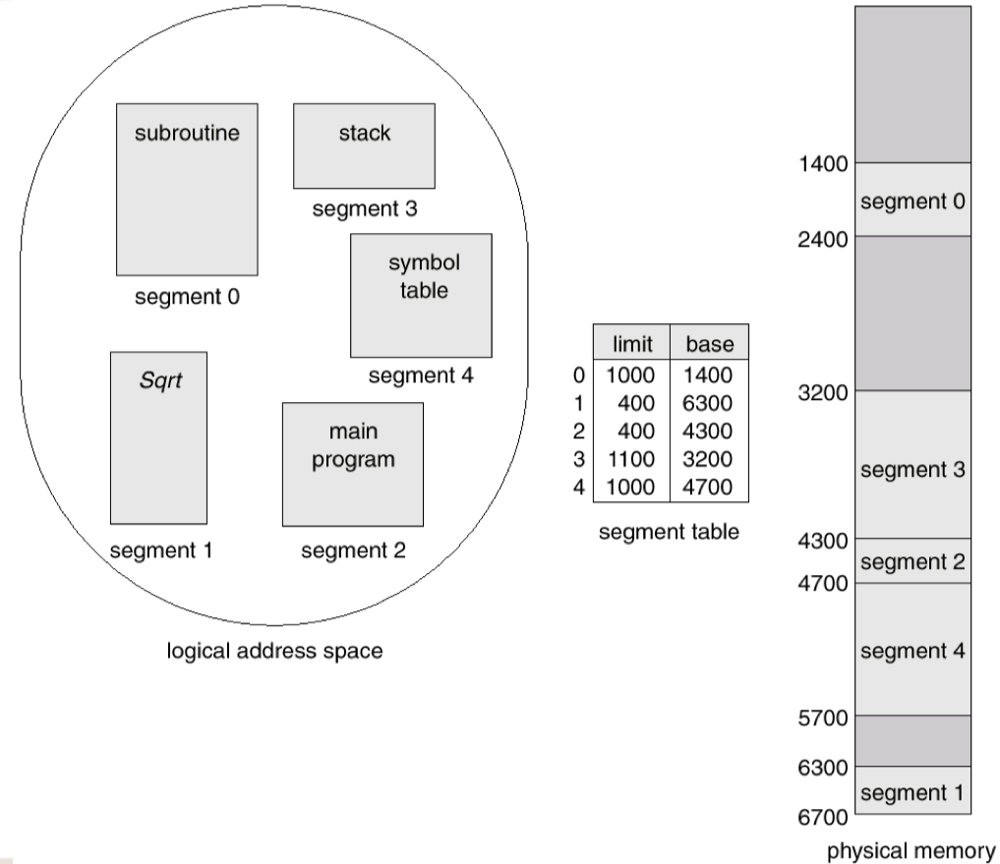
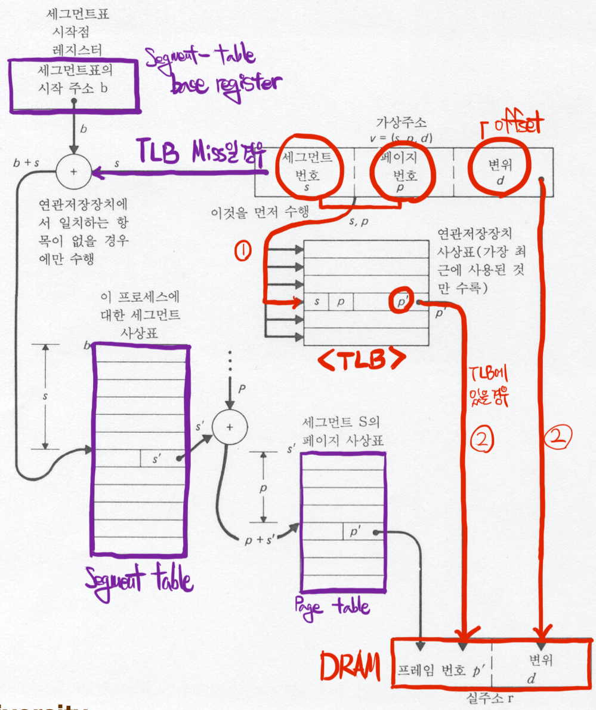

# Memory Management

Memory management는 크게 두 가지로 나뉜다.

- 주소를 어떻게 관리할 것인가?
- Virtual Memory

### Binding of (Instructions & Data) to Memory

여기서 말하는 binding은 program의 변수를 메모리 상의 주소로 mapping 시키는 것이다.

- Compile time binding
  - Multiprogramming 이전에는 다른 프로그램의 메모리 주소를 고려할 필요가 없었으므로 문제가 없었다.
  - 하지만 여러 프로그램들이 사용됨에 따라, 주소를 이동시켜야 하는 상황에서는 매번 컴파일 하는 것이 문제가 된다.
- Load time binding
  - Program을 메모리에 load 할 때 결정하는 방법
  - 상대 주소(**logical address**)를 설정하도록 하고, load 하면서 시작 주소(**physical address**)를 알게되면 그 때 상대 주소를 이용하여 bind
  - 하지만 여전히 메모리의 위치를 이동할 수 없다.
- Execution time binding
  - 항상 상대 주소를 사용
  - CPU가 주소를 참조하려 할 때 **Address Mapping Table**을 이용하여 **physical address**를 계산
  - 그런데 이 작업은 overhead가 크기 때문에 **H/W의 지원이 필수**적
  - **MMU**, Memory Management Unit은 **base(relocation) register과 limit register**를 사용

### Address Mapping Table

**CPU는 항상 logical address만을 사용**하며, logical address는 **PCB**에 기록된 내용을 토대로 physical address로 변환된다.

위 그림은 `base register == 300040`, `limit register == 120900`으로 설정된 process를 보여주며, base register는 process의 **시작 주소**를, limit register는 process를 메모리 공간상에서의 **길이**를 의미한다.

### MMU, Memory-Management Unit

Logical(Virtual) address를 physical address로 maaping하는 **H/W device**이다. `(Relocation register) + (logical address) = physical address`의 형태로 계산한다. 개발자는 logical address를 이용하여 개발하는 것으로 충분하며, physical address의 경우 MMU에 의해 자동으로 계산된다.

_**단, 위에서 설명한 physical address 계산 방식은 Continuous Allocation에서만 가능하다!**_

### Continuous Allocation

Resident Operating System인 OS의 kernel code는 주로 low memory 공간에 할당되며, user process들은 high memory에 할당된다. 이 때, Continuous Allocation은 같은 process의 내용은 연속된 공간의 메모리에 할당하는 것으로, 낮은 주소로 부터 높은 주소로 끊이지 않게 할당하는 것을 말한다.

그런데 process가 실행되고 종료되면, process가 사용하던 메모리 공간은 다시 반납되고, 그렇게 비어버린 메모리 공간을 **Hole**이라고 표현한다.

### Dynamic Storage-Allocation Problem

Hole을 어떻게 채우면 공간을 효율적으로 사용할 것인가에 대한 문제이다.

- First-fit
  - 할당 가능한, 처음 탐색된 곳에 할당
- Best-fit
  - 가장 크기가 유사한 hole에 할당
  - 다른 process가 들어올 수 없을 만큼 작은, 쓸모 없는 공간이 군데 군데 생긴다.
- Worst-fit
  - 가장 큰 hole에 할당
  - 무조건 나쁜 것은 아니다. 남는 공간에 다른 process들을 추가적으로 할당할 수도 있기 때문이다.

### Fragmentation

- External Fragmentation
  - 전체 메모리 공간 중 비어있는 공간의 총합이 new process를 할당하기 충분
  - 하지만 작은 공간들로 흩어져 있어 할당할 수 없는 상황
- Internal Fragmentation
  - new process가 요구한 공간 보다 더 큰 공간을 할당
  - 따라서 남는 공간이지만, 이미 할당된 공간이므로 다른 process에게 할당시킬 수 없다.
  - 하지만, **Internal Fragmentation은 정말 작은 공간**이며, External Fragment가 더 큰 문제
- Compaction
  - Memory 공간의 hole들을 모아(logical 하게) 하나의 큰 블록을 형성
  - 모든 메모리 주소를 필요로 하므로 매우 큰 overhead

  

## Paging

Memory 공간을 일정 단위(Frame)로 잘라서 사용하는 것으로, noncontiguous 하게 사용한다.

1. DRAM을 같은 크기의 블록(Frame)으로 분할
2. Application의 address space 또한 Frame과 같은 크기로 분할(=Page)
3. Page를 Frame에 할당(연속된 Frame이 아니어도 무관)
4. Page Table로 관리

이로 인해 빈 공간들 또한 모두 page 단위이므로, 짜투리 공간(Hole)의 개념이 사라진다. 물론 process 별로 마지막 page에서는 Internal Fragmentation이 발생하게 된다.

### Page Table

Page table은 **Main Memory에 저장**되며, 다음과 같은 내용을 포함한다.

- PTBR, Page-table base register
  - page table의 pointer
- PTLR, Page-table length register
  - page table의 크기를 저장

그런데 Page Table은 기존의 방법보다 더 많은 overhead가 발생한다. 왜냐하면 첫 번째 접근은 page table에서 page/offset의 주소를 가져오며, 실제로 주소에 접근하기 위해서는 두 번째 접근이 필요하기 때문이다. 따라서 이를 개선하기 위해 **TLB**(Translation Look-aside Buffer)와 같은 **Associative memory**를 사용한다. TLP는 cache처럼 Page Table의 일부를 저장하는 것으로, DRAM 보다 빠른 성능의 H/W를 이용한다. TLB는 LRU에 기반한 알고리즘을 사용하여 hit rate을 높힌다.

**_TLB는 context switching_ 시 함께 flush된다._**

### Associative Memory

- General Memory
  - e.g. DRAM
  - give address
- Associative Memory
  - e.g., Phone book
  - give field of record
  - 특수한 메모리로, parallel search를 지원한다.

### Hierarchical Paging

32bit 운영체제의 경우 Page Table의 주소를 담은 또 다른 Page Table이 별도로 필요하다. 그리고 64bit 운영체제의 경우 4단계 Page Table을 사용한다. 원래는 보다 높은 계층을 요구하지만, Page Table이 4 계층을 넘어서면 비효율적이므로 48bit 만을 주소로 사용한다.

  

## Segmentation

Paging은 Address Space를 무작정, 크기단위로 분할하게 된다. 하지만 이렇게 자를 경우 symantic이 있는 sequence를 무시하게 되며, 한 page 안에 필요한 정보가 모두 있지 않는 경우가 발생한다.

따라서 의미 단위로 분할하는 segmentation이 제안됐으며, 전체 address space는 sement들의 집합으로 구성된다.

위에서 설명한 paging의 logical address structure(|page-number|offset|와 유사하게 사용되며, `|segment-number|offset|`와 같이 사용된다.

- STBR, Segment-table base register
- STLR, Segment-table length register

Segmentation은 Internal Fragmentation은 발생하지 않지만, paging이 해결했던 중요한 문제인 **External Fragmentation을 야기**한다.

### MULTICS - Sementation with Paging

MULTICS는 **sement들에 paging을 적용**함으로써 External Fragmentation을 해결한다.

