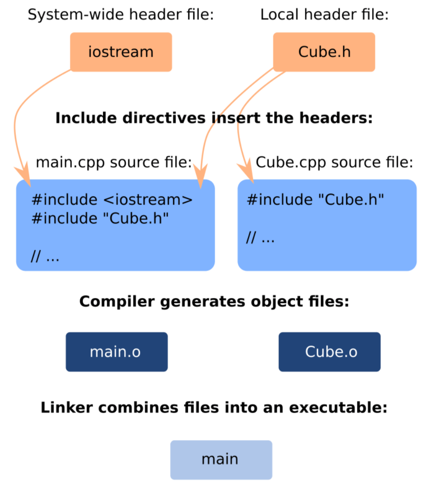

# C++ Intro

C++는 객체지향 프로그래밍 언어(OOP, Objective Oriented Programming)입니다.

<br>

### 0-1. Strongly typed programming language

```cpp
// type name = value
int value = 42;
```

The type of a variable defines the contents of the variable. Every type is either:

- **Primitive**, 오직 6가지가 존재(`unsigned int` 같은것은 우선 제외)
  - `void`
  - `bool`
  - `char`
  - `int`
  - `float`
  - `double`
- **User-defined**
  - Two veryt common user-defined types
    - `std::string`
    - `std::vector`
  - 개발자가 `Cube`라는 class에 `cube`라는 함수를 정의했을 경우
    - `Cube::cube`

<br>

### 0-2. `main` 함수

Convention 중 하나는, main() 함수를 정의할 때 int 타입으로 정의하는 것입니다. `int` 타입으로 선언하여 프로그램이 무사히 끝마쳐졌을 경우 0을 반환하도록 하며, 에러가 발생했을 경우에는 에러 메세지를 반환합니다.

<br><br>

## 1. OOP - Encapsulation

Encloses data and funtionality into a single unit(called a class)

C++에서는 data와 funtionality를 Pirvate/Public으로 나누어 보호

- `public`: members can be accessed by client code
- `private`: members cannot be accessed by client code, only used within the class itself

<br>

### 1-1. Header file `.h`

`.h` 파일은 implementation 파일인 `.cpp`로부터 클래스의 interface만을 분리시켜 정의합니다. 즉, 멤버 변수와 멤버 함수가 어떤 내용인지, 어떻게 사용되는지는 implementation(`.cpp`)에서 다루며, 헤더 파일은 그저 선언만 합니다.

- Declaration of all the member variables/funtions

`#`을 이용하여 선언하면, 언제나 가장 먼저 불러와서 읽은 후 아래 내용을 진행한다는 것을 의미합니다. 아래 `#pragma once`를 정의해 주면  한번만 컴파일 한다는 것을 의미합니다. 헤더 파일의 기능은 선언이며, 컴파일은 한 번만 진행되면 됩니다. 이는 여러 사용자가 사용하게 될 경우에도 똑같습니다.

```c++
// Cube.h
#pragma once

class Cube {
  public:
  	double getVolume();
  	void setLength(double length);
  private:
  	double length_; // _를 변서 뒤에 붙이는 것은 Google Style
};
```

**위 코드블록에서 `Cube` class를 선언한 것 과 같이, 헤더 파일은 선언만 해주며, 직접적으로 `getVolume()`, `setLength()`와 같은 멤버 함수에 대한 코드가 들어가지는 않는다!**

<br>

### 1-2. Implementation file `.cpp`

우리가 class와 다른 코드들을 통해 실행하고자 하는 모든 로직이 포함되는 파일입니다.

```c++
// Cube.cpp
#include "Cube.h"

double Cube::getVolume() {
	return length_ * length_ * length_;
}
void Cube::setLength(double length) {
	length_ = length;
}
```

이후 실질적인 코드 실행을 하는 `main.cpp`를 정의해줍니다.

```cpp
#include <iostream>
#include "Cube.h"

int main() {
  Cube c;

  c.setLength(3.48);
  double volume = c.getVolume();
  std::cout << "Volume: " << volume << std::endl;

  return 0;
}
```

<br>

<br>

## 2. C++ Standard Library, `std`

C++ Standard Template Library(stl)라고도 부릅니다.

`std` provides a set of commonly used functionality and data structures to build upon.

<br>

### 2-1. iostream

```c++
#include <iostream>
// cout: console out
std::cout << "Hello, world" << std::endl;
```

<br>

### 2-2. Standard Library 2 Global Namespace

모든 standard library의 functionality들은 `std` 라는 namespace를 사용합니다. 만약 자주 사용된다면, `using` 명령어를 사용하여 global space로 import할 수 있습니다.

`using std::cout;`

명령어를 넣어주기만 한다면, `std::cout <<`과 같은 형태가 아니라, `cout <<` 형태로도 사용할 수 있습니다.

```cpp
#include <iostream>

using std::cout;
using std::endl;

int main() {
  cout << "Hello, world!" << endl;
  return 0;
}
```

<br>

<br>

### 2-3. Specifyed Namespace

앞에서 `Cube`라는 클래스를 생성해서 사용했는데, 'cube' 라는 단어는 매우 흔히 사용됩니다. 따라서 `Cube` 클래스를 namespace에서 특정짓는 작업을 해보겠습니다. 여기서는 `uiuc`라는 이름으로 지정합니다.

```cpp
// Cube.h
#pragma once

namespace uiuc {
  class Cube {
    public:
      double getVolume();
      double getSurfaceArea();
      void setLength(double length);

    private:
      double length_;
  };
}
```

```cpp
// Cube.cpp
#include "Cube.h"

namespace uiuc {
  double Cube::getVolume() {
    return length_ * length_ * length_;
  }

  double Cube::getSurfaceArea() {
    return 6 * length_ * length_;
  }

  void Cube::setLength(double length) {
    length_ = length;
  }
}
```

```cpp
// main.cpp
#include <iostream>
#include "Cube.h"

int main() {
  // 지정한 namespace를 사용하여 Cube의 객체를 선언
  uiuc::Cube c;
  c.setLength(2.4);
  std::cout << "Volume: " << c.getVolume() << std::endl;

  double surfaceArea = c.getSurfaceArea();
  std::cout << "Surface Area: " << surfaceArea << std::endl;

  return 0;
}
```

<br>

<br>

## 3. From Source files to Executable file

