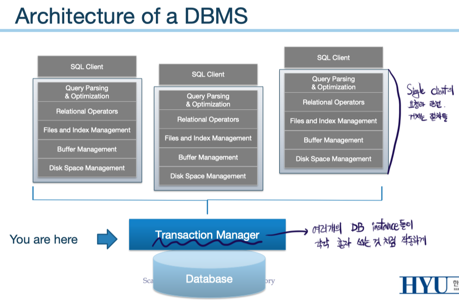

## Transaction

Transaction System은 Database System에서의 backend system이다. 그리고 transaction들의 처리를 담당하는 주요 주제는 다음 두 가지이다.

- Concurrency Control
  - 여러 가지 사용자의 요청을 효율적으로/올바르게 처리
  - Disordered process를 통해 동시에 사용하는 것 처럼 느끼도록 작업
- Crash Recovery
  - 장애 발생 시 복구
  - 어떤 fail에 대해서도 올바른 결과가 나올 수 있도록 조치

### Concurrent Execution

여러 개의 transaction들이 동시에 수행함으로서 얻는 이득은 다음과 같다.

- Throughput argument
  - 동시 가용 processor의 수와 disk utilization이 상승
  - 이를 모두 활용할 시 TPS(Transactions Per Second)가 증가
- Latency argument
  - 사용자 입장에서도, 여러 작업이 빨리 수행된다고 느낌
  - 따라서 자신의 작업이 처리되기 까지의 대기시간 또한 감소

### Transaction 처리 도중 발생 가능한 문제

모든 문제들은 다음 두 조건을 만족할 때 발생할 수 있다.

1. 2명 이상의 user
2. 적어도 1명이 write를 시도

위 두 조건을 만족할 때, 발생할 수 있는 문제의 유형은 다음과 같다.

- **Lost Update**
  - 둘 중 하나의 요청이 무시되는 문제
  - 같은 field의 값을 write 했지만, 뒤 시점에 저장된 내용만 반영
  - ww-conflict
- **Inconsistent Reads**
  - 한 user가 값을 수정하고, 다른 user가 값을 읽어들일 때, 읽는 시점에 따라 값이 변화
  - rw-conflict
- **Dirty Reads**
  - 한 user가 값을 수정했고(transaction 종료 x), 다른 user가 수정한 값을 읽어들였지만, 수정한 user가 transaction을 abort
  - 하지만 읽어들인 user는 abort 이전의 data를 보고 있다.
  - rw-conflict
- **Phantom Phenomenon**
  - 여러 transaction들이 concurrent 하게 진행되고 있을 때, 다른 transaction에 의해 이전의 read와 다음의 read 내용이 달라지는 현상
  - (두 read는 모두 같은 transaction 내에서 진행)
  - 이 문제에 대해서는 뒤의 locking으로 해결

  

## Transaction

- 정의
  - 많은 operation들의 sequence인 atomic unit of work
  - A sequence of `read`s and `write`s of database objects
  - **All or Nothing**
  - Xact 혹은 Txn이라고도 표기

### ACID Guarantee

ACID는 **xact들이 concurrency를 통해 성능을 향상시키도록 보장**하고, xact 후 **올바른 결과를 내는 것에 도움**을 준다. 올바른 결과를 내는 것은 앞에서 나열한 Lost Update/Inconsistent Reads/Dirty Reads 문제들을 방지하는 것이다.

- **Atomicity** (중요)
  - All or Nothing
- **Durability** (중요)
  - If commits, effects persist
  - 완료된 xact들은 어디에든 저장되고, 반영되어야 한다.
- Consistency
  - Xact 전후로 일관성이 유지되어야 한다.
  - 만약 사용자가 integrity constraints 지정 시 요구됨
  - e.g., table 내의 총액 합 = 100만원
- Isolation
  - Xact 진행 도중 다른 xact의 개입이 있으면 안된다.
  - Xact들은 동시에 실행되는 듯 하지만, 서로간에는 그 내용을 모른다.

특히, Atomicity와 Durability는 xact가 **commit** 혹은 **abort**로만 끝나게끔 하는 주요한 역할을 한다. 이후 등장하는 `Undo`와 `Redo`는 각각 aborted/failed xact에 대해(Atomicity 보장), commited xact에 대해(Durability 보장) 진행하는 recovery 작업이다.

