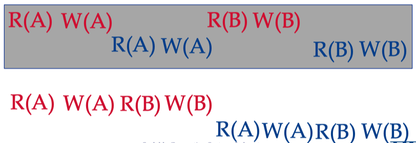
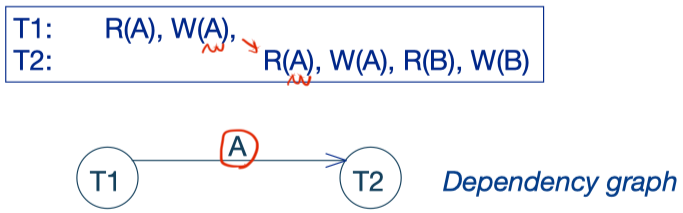
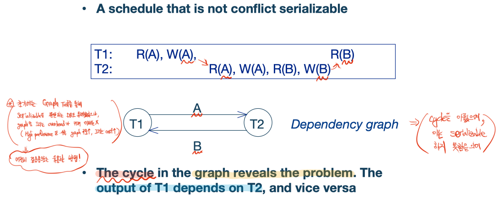

# Schedule

Transaction들을 문제 없이 실행할 수 있는 가장 Naive한 방법은, 한 번에 하나의 xact만 실행하는 것이다. 물론 매우 안전하지만, 매우 느려 사용할 수 없는 방법이다. 실용성을 위해 **execution들은 interleaved 되어야 한다**.

### Serializable Schedules

Serializable Schedule을 정의하려면 몇 가지 개념이 더 필요하다.

- Schedule
  - Transaction들의 집합
- Serial schedule
  - xact들이 모두 순차적으로 나열된 형태(not interleaved)
- Equivalent
  - 두 schedule들이 서로 equivalent 하려면 다음 조건들을 만족해야 한다.
    - 같은 xact들로 구성
    - 각 xact들은 그 내부까지 같은 순서의 action(`SELECT`, `INSERT`, `UPDATE`)들로 구성
    - 두 schedule 모두 종료됐을 때 DB의 **final state**(active, failed, aborted, commited, ...)가 동일
- Serializable
  - 어떤 schedule S가 또 다른 어떤 serial schedule과 equivalent
  - 즉, serial schedule로 변형시킬 수 있는 schedule을 말함

  

## Conflict Serializable Schedules

### Conflict Operations

- Conflict의 조건
  - 두 ops가 각기 다른 xact에 속함
  - 같은 object에 대해 작용
  - 적어도 하나의 op가 `write`

### Conflict Serializable

- 두 스케쥴들이 Conflict Equivalent
  - 같은 action들을 포함
  - Conflict가 발생하는 action들의 쌍이 같은 순서로 나열되어 있다.
- 어떤 스케쥴 S는 Conflict Serializable
  - S는 어떤 다른 schedule과 conflict equivalent
  - Serializable schedule들이 모두 conlict serializable한 것은 아니다.

정리하자면, schedule S는 consecutive non-conflicting operation들을 swap 하여 serial schedule로 만들 수 있다면, conflict serializable 하다. 아래 그림에서 회색 박스가 초기 상태이며, 아래의 변경된 형태가 xact-1과 xact-2의 op들을 swap 하여 serial한 schedule을 만든 것이다.

### Dependency Graph

Conflict Serializable을 일일이 확인할 수 없으므로, graph를 그려서 순환 형태가 나타날 시 불가하다고 판단할 수 있는 도구이다. 그래프의 node는 xact를 의미하며, edge는 conflict를 의미한다.

