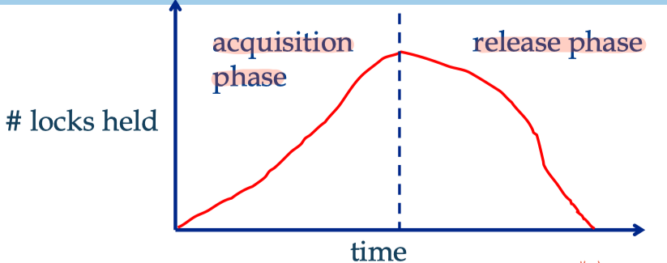
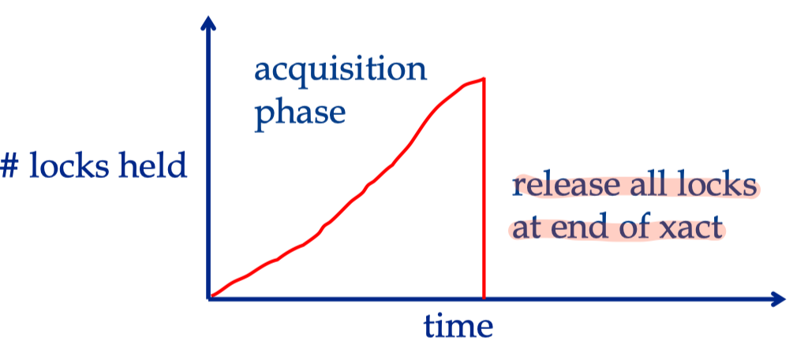
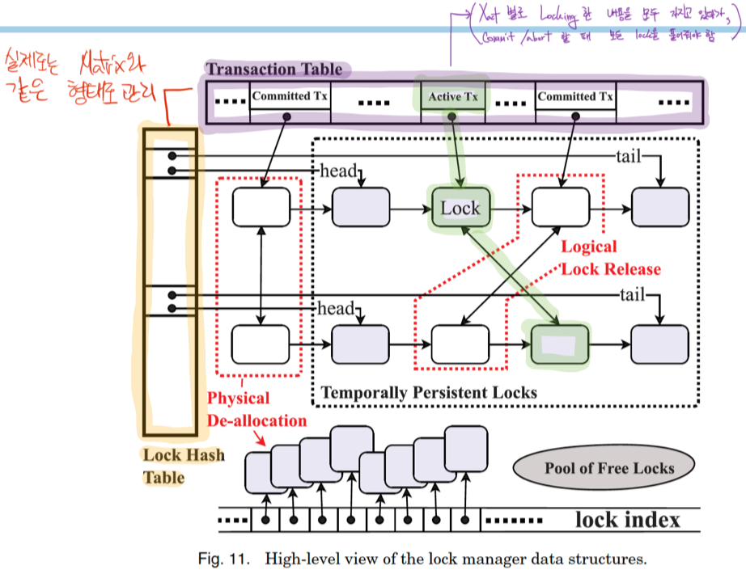
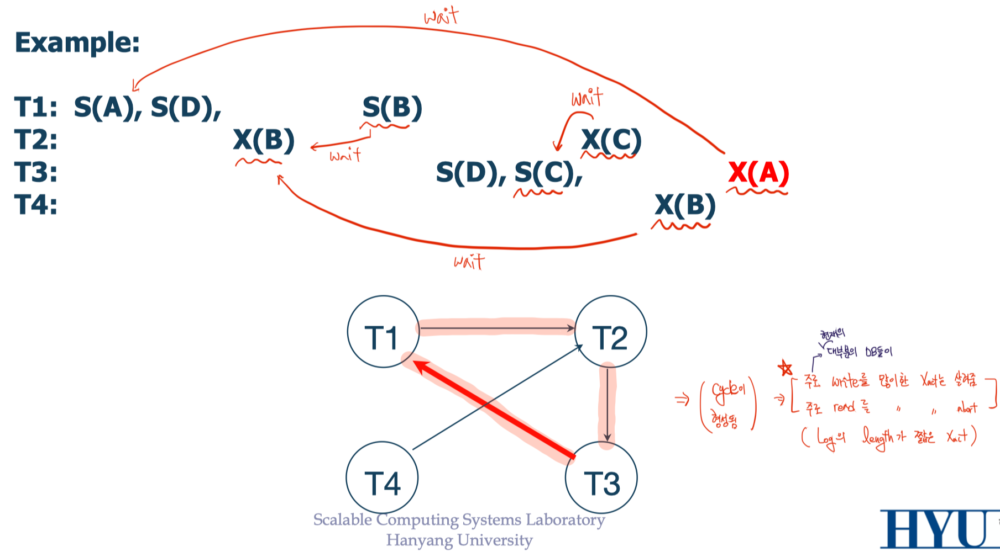

# Locking

- Concurrency Control
  - Pessimistic CC
    - Conflict 발생을 전제로 작업
    - 사용하는 DB의 일부를 lock한 후 작업
  - Optimistic CC
    - Conflict가 발생하지 않을 것으로 가정 후 선작업 후검사

  

## 2PL, Two Phase Locking

2PL은 xact 별로 최대 두 개의 phase를 갖는 것으로, 필요한 lock을 설정하는 phase와 unlock 하는 phase만 존재한다.

- 2PL의 원칙 두 가지
  - Xact는 `read` 작업 이전에는 Shared(`S`) lock을, `write` 작업 이전에는 Exclusive(`X`) lock을 설정
  - **Lock을 해제하기 시작한 뒤로는 어떤 lock도 다시 걸 수 없다!**

2PL은 conflict serializability를 보장하지만, **cascading aborts** 발생

- Conflict Serializability 보장
  - Locking을 통해 conflict를 방지하고, non-conflict한 경우 swap이 가능하므로 conflict serializability를 보장
  - Locking으로 인해 앞 xact의 conflict ops가 locked, 혹은 뒤 xact의 op가 wait 상태
- **Drity Reads**를 방지하기 위해 dependency가 있는 모든 xact들을 abort

### Strict Two Phase Locking

Strict 2PL은 2PL과 모두 동일하지만, unlock을 모두 한 번에 진행하는 것에 차이가 있다. 이는 **cascading aborts를 막기 위함**인데, 앞의 xact가 한번에 unlock하여 T2가 conflict 구간을 사용하기 전에 모두 unlock 한다면 함께 abort할 필요가 없어지기 때문이다.

  

## Lock Management

_현재 C(Central)LM으로 인해 발생하는 overhead는 모두 개선된 상태이며, locking 자체에서 오는 한계를 벗어나고자 Optimistic CC에 대한 연구가 진행중이다._

Lock/Unlock request들은 모두 LM에 의해 이루어진다. LM은 **hash table**을 보유하고 있으며, 이는 `| PID | TID | X/S |` 꼴의 linked-list로 구현되어 있다.

### Lock Upgrade

Xact의 Shared lock은 요청 하에 Exclusive lock으로 변하는 **Lock Escalation**이 가능하다.

### 실사용

실제로 Lock Hash Table과 Tansaction Table은 matrix와 같은 형태로 관리되며, linked-list로 구현됐으므로 연쇄 작용들이 가능하다.

e.g., 어느 xact의 작업이 모두 종료되면, 해당 xact에 관련된 lock들을 모두 삭제

  

## Deadlock

### Deadlock Avoidance

Deadlock은 xact들 간에 lock이 released 되길 서로 기다리는 상태이다. Deadlock을 회피하는 방법으로는 두 가지가 있다.

- $T_i$가 $T_j$의 lock에 access 하고자 할 때,
  - Wait-Die
    - 만약 $T_i$의 우선순위가 더 높다면, $T_i$가 기다리거나 $T_i$를 abort
  - Wound-Wait
    - 만약 $T_i$의 우선순위가 더 높다면, $T_j$를 abort 하거나 $T_i$가 wait

위 두 방법은 deadlock을 회피할 수 있지만, dead lock이 걸리지 않을 상황에서도 abort되는 현상이 발생한다.

### Deadlock Detection

Deadlock Detection은 실제로 발생했을 때 abort 대상을 선정하는 것으로, 현재 DB들이 사용하는 방식이다. 주기적으로 **waits-for graph를** 그리고, cycle을 이루는지 확인한다.

그런데, grpah를 그리는 동안에는 Lock Hash Table을 수정할 수 없으므로(mutex), **adaptive periodical check**을 진행한다. Adaptive 함은 no dead lock이라고 판별이 될 시, period 주기를 늘리는 등의 유연함을 말한다.

