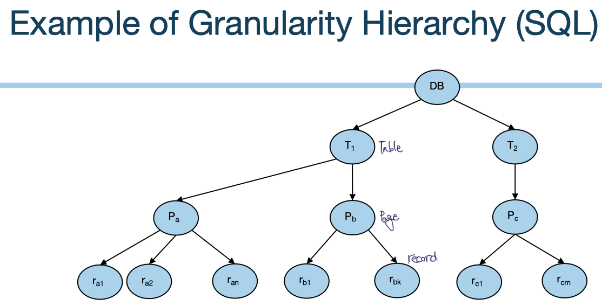
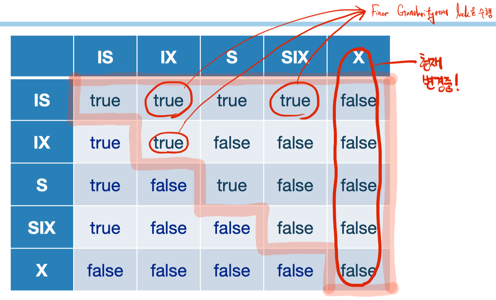
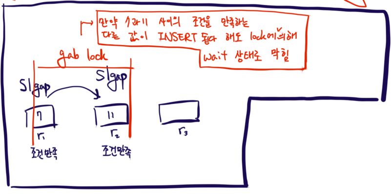

# Granularity

보다 효율적으로 Concurrency Control을 하기 위해 Locking에 Granularity를 적용한다.

  

## Multiple Locking Granularity

위 그림은 Database의 계층을 나타내며, 상위/하위 계층에서 lock을 설정했을 때의 장단점은 아래와 같다.

- Fine Granularity (lower in tree)
  - High concurrency
  - High locking overhead
- Coarse Granularity (higher in tree)
  - Low concurrency
  - Low locking overhead
  - Embedded DB의 경우 규모가 작으므로, Coarse가 유리

### New Lock Modes/Protocol

위에서 등장하는 모든 층에서 Lock을 설정할 수 있도록 하며, **Intent lock**이라는 새로운 protocol을 사용한다. 기존에는 `DB > Table > Page > Record(Tuple)` 순서로 매번 확인하며 lock을 탐색했다. Granularity에 따라 multiple 하게 locking을 하는 것은, 상위 구조에서도 locking이 걸려 있음을 확인하고, 이에 따라 더 빠른 판단을 할 수 있게 하기 위함이다.

기존에 사용했던 lock mode들인 `S`/`X` 외에 아래 세 가지가 추가된다.

- `IS`: Intent to get `S` lock(s) at finer granularity
- `IX`: Intent to get `X` lock(s) at finer granularity
- `SIX`: `S`와 `IX`를 동시에 사용

이러한 규칙에서 사용되는 세 가지 모드들은 아래와 같이 사용된다.

- `S`와 `IS`를 사용하려면, `IS` 혹은 `IX`를 parent node에 설정
- `X`, `IX`, `SIX`를 사용하려면, `IX`  혹은 `SIX`를 parent node에 설정

### Lock Compatibility Matrix

위 표는 현재 설정된 Intent lock들에 대해, 다른 xact의 intent들이 어디까지 동시 사용이 허용되는가를 보여준다.

  

## Phantom Phenomenon

Phantom problem은 여러 transaction들이 concurrent 하게 진행되고 있을 때, 다른 transaction에 의해 이전의 read와 다음의 read 내용이 달라지는 현상이다. 이는 일반적인 2PL로는 해결할 수 없으며, **next key locking** 혹은 **grab locking**으로 해결할 수 있다.

next key locking은 gap 이전 key에 gab 처리를 하는 것이며, gab locking은 gab 이후에 처리를 하는 것으로, 다르지만 같은 기능을 한다.

이외에 **Index Locking**과 **Predicate Locking**을 이용하는 방법들이 있지만, 두 방법 모두 overhead가 커서 사용되지 않는다.