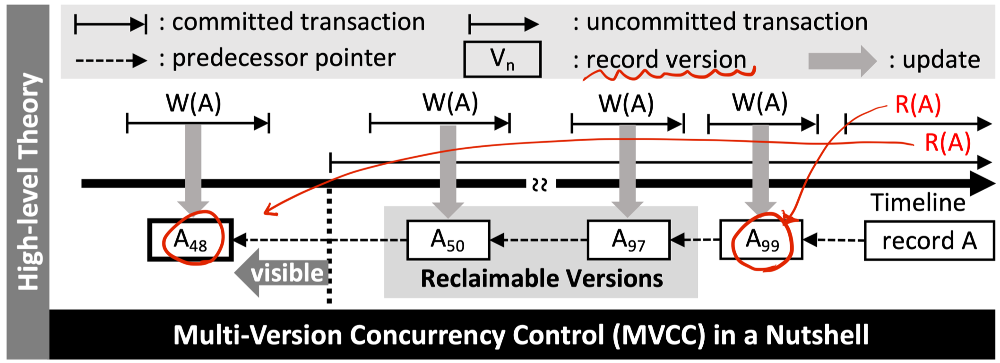

# Optimistic CC

Pessimistic CC는 locking-based CC이며, Strict 2PL을 사용한다. Optimistic CC는 locking을 사용하지 않으며, 다시 두 가지로 나뉜다.

- **BOCC**, Backward-oriented Optimistic CC
- **FOCC**, Forward-oriented Optimistic CC

### Locking의 단점

- Lock managemet overhead
- Deadlock detection/resolution
- 자주 사용되는 object(Hot Record)들에 대해 lock을 설정하고 사용하기 위한 대기

  

## OCC

OCC는 'conflict가 빈번하게 일어나지는 않는다'라는 것을 전제로 개발된다. OCC의 전체 과정은 세 단계로 구분된다.

1. read phase
   - private workspace로 copy 하여 xact 수행
2. validation phase
   - OCC는 lock을 거는 대신, 우선 xact를 수행한 후 **`commit`**을 하기 직전, 전/후 xact들과의 conflict 여부를 검사한다.
     - BOCC
       - 현재 xact가 시작되기 전에 이전 xact가 먼저 종료
       - (현재 xact의 `RS`과 이전 xact의 `WS`의 교집합이 공집합) + (이전 xact의 validation이 현재 xact의 validation 보다 빨리 수행됨)
     - FOCC
       - (현재 xact의 `WS`과 다음 xact의 `RS`의 교집합이 공집합) + (해당 RS가 현재의 read set)
       - Conflict 시 어느 것을 abort할 것인지는 policy에 따라 달라짐
       - Wait and retry도 가능
3. write phase
   - `commit` or `abort`

  

## SI, Snapshot Isolation

**_SI는 PCC와 OCC 모두에서 사용 가능하다._**

Serializable Isolation은 xact 간에 절대적으로 간섭이 불가능하다. 물론 IS 간섭을 허용한다는 의미가 아니며, Database 자체를 snapshot 처럼 복사하여 xact 마다 고유의 DB를 갖음으로서 간섭이 불가능하게 만든다.

SI는 **MVCC(MultiVersion Concurrency Control)**를 활용하는 대표적인 경우이다. MVCC는 xact가 (begin - commit)의 구간을 가진다고 했을 때, begin 시점을 기준으로 그 이전 시점까지의 commit된 record 버전만을 사용하도록 한다. 즉, DB 자체를 multi-version으로 만들어 사용한다.

위 그림의 $A_i$들이 snapshot들을 의미하며, 각각 begin되기 이전에 생성되는 것을 알 수 있다.

### Reads with SI

Read는 locking에 block되지 않으므로, 매우 high-performance로 사용할 수 있다.

### Writes with SI

**FCW**(First-Commiter-Wins) rule에 의해, 같은 값을 읽고 commit을 하는 두 xact가 있다면, begin 시점과 상관 없이 **무조건 뒤에 commit한 xact를 abort**한다.

### SI의 장점

- Reading이 절대 block되지 않는다.
- No Dirty Read - xact 마다 version 존재
- No Lost Update - FCW rule
- No Inconsistent Read - xact 마다 version 존재
- No Phantom Phoenmenon - xact 마다 version 존재

### SI의 문제점

- **SI는 serializablility를 break**
  - ww-conflict 만을 FCW rule로 관리
  - **Write Skew Problem**
    - **rw-conflict에 대한 상황을 고려 불가**

### Write Skew Problem

만약 근무표를 짜고 있을 때, 둘 중 한명은 당직을 서야하며, 둘 다 설 필요는 없다.

그런데 현재 근무표에 두 명 모두 당직으로 설정되어 있었고, **두 명 모두에게 각각 xact가 실행**되며 둘 다 비번으로 설정되는 문제가 발생했다. 이는 rw-conflict를 고려하지 못했기 때문에 발생한 문제이다.

