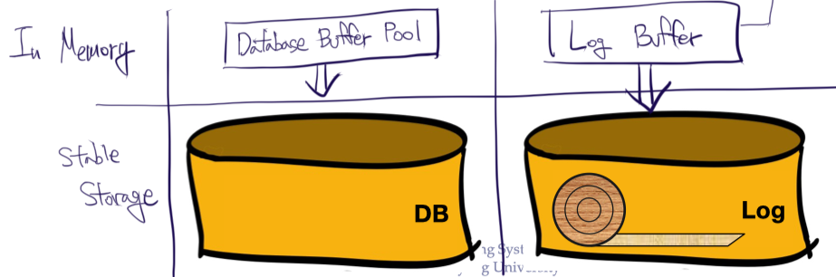
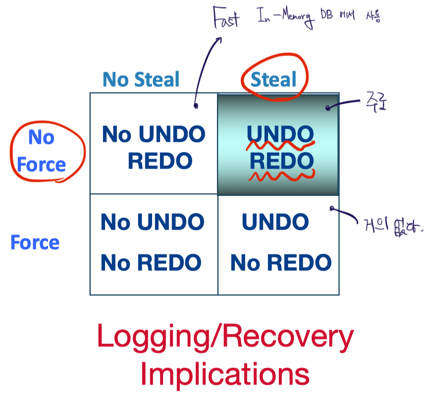

# Crash and Recovery

Database는 기본적으로 Volatile Memory(DRAM)에 Database Buffer(Cache), Log Buffer가 존재하며, Stable Storage(Disk)에 Stable Database와 Stable Log가 존재한다.

Database buffer에는 stable database로 부터 복사해온 page가 있으며, 속도의 차이로 인해 Buffer의 page가 stable DB의 page 보다 최신값을 보유할 때가 많다. Buffer의 xact가 모두 종료된 후 commit을 할 수 있다는 보장이 있다면, 그리고 buffer의 용량에 제한이 없다는 보장이 없다면 그렇게 하는 것이 안전할 것이다. 하지만 buffer의 용량은 매우 제한적이어서, 그리고 volatile memory에 crash가 발생할 수 있기 때문에 이러한 방법은 현실적이지 않다.

Buffer Management의 정책으로는 (NO) FORCE와 (NO) STEAL이 있다.

- FORCE
  - 모든 update가 DB disk로 **commit** 되도록 한다.
  - REDO logging 없이 **durability**를 보장
  - 단점
    - 매번 commit을 하는 행위는 Disk의 warp 단위를 무시하는 행위 - 공간 활용이 비효율적
    - Disk 작업은 매우 느리므로, throughput 감소
- NO STEAL
  - Uncommited update가 **replace**되는 것을 불허
  - UNDO logging 없이 **atomicity**를 보장
  - 단점
    - commit 될 때 까지 모든 xact를 계속 보유하고 있어야 한다. - Concurrency Control에 부정적 영향

물론 위 두 정책을 사용할 시, REDO와 UNDO를 사용하지 않아도 되므로, crash 발생시 매우 간단하게 recovery를 수행할 수 있다. 하지만 성능의 최적화를 위해, 복잡하더라도 아래의 정책을 사용하는 것이 일반적이다. 물론 기업마다, 혹은 상황에 따라 정책은 다양하게 사용되며, 아래는 일반적인 경우만을 포함한다.

- NO FORCE
- STEAL

정책을 위와 같이 사용하려면 log에 old와 new 값들이 모두 저장되어야 한다.

  

## Logging

Log는 REDO와 UNDO를 위한 log record의 순서있는 리스트이다. Log record는 보통 다음 내용을 포함한다.

`| LSN | prevLSN | XID | type | pageID | offset | lenght | old data | new data |`

- `LSN`(Log Sequence Number)는 unique 하며, 계속해서 증가
- `type`
  - Update, Commit, Abort
  - Checkpoint
  - CLR(Compensation Log Record)
  - End
- `old data`는 `UNDO`를, `new data`는 `REDO`를 위해 기록

### WAL, Write-Ahead Logging

WAL Protocol은 두 가지 규칙을 가진다.

- for UNDO, Atomicity
  - Buffer의 Data page가 DB disk로 저장(Stable DB의 page number가 buffer와 동일해짐)되기 전에 해당 log record들을 **flush**
- for REDO, Durability
  - Xact가 commit 되기 전에 모든 log record들을 **flush**

WAL을 사용함으로서 Steal/No-Force 정책을 수행할 수 있다.

  

## Checkpoint

Checkpoint를 설정하는 것은 **diry pages를 flush 하는 행위**이다.

- Checkpoint 주기가 줄어들면,
  - Recovery cost 감소
  - Xact throughput 감소
- 따라서 은행은 새벽 시간에 한해 1회 진행