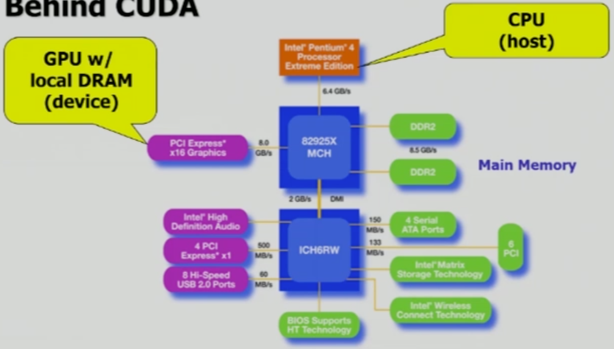

# CUDA Intro

CUDA, Compute Unifed Device Architecture

> General purpose programming model
>
> GPU: dedicated super-threaded, massively data parallel co-processor

CUDA Programming을 위해서는 driver를 설치해야 하며, driver는 compiler(NVCC, NVidia Cuda Compiler)과 linker를 모두 보유하고 있습니다. CUDA Programming으로 작성된 코드를 kernel code라고 하며, kernel code가 작성된 파일은 `.cpp` 혹은 `.c` 확장자가 아니라, `.cu` 확장자를 사용해야만 합니다. 컴파일 후 생성된 실행 파일 중, kernel 함수로 작성된 내용에 대해서는 GPU에서 실행하게 됩니다.

<br>

### H/W Structure



위 구조는 오래 전 메인 보드와 주변 기기의 연결 구조를 나타내지만, 현재도 큰 틀에서 봤을 때에는 유사한 구조를 갖고 있습니다. 두 개의 파란색 칩을 North-bridge, South-bridge라고 합니다. North-bridge에는 빠른 속도의 연동을 요구하는 CPU, GPU, Main Memory를 연결합니다. CUDA programming은 north-bridge의 세 가지 H/W 간의 구성을 고려해야 합니다.

- Host: CPU + Main Memory(DRAM)
- Device: GPU + Video Memory(VRAM)

<br><br>

## Memory

- Global memory는 모든 thread들이 공유하는 메모리 공간이며, 가장 큰 공간이다.

- 모든 CUDA library function들은 `cuda`로 시작한다.

- 모든 함수들은 error code 혹은 `cudaSuccess`를 반환한다.

  ```cpp
  // malloc 실패 시 종료하도록 하는 예제
  if(cudaMalloc(&devPtr, SIZE) != cudaSuccess) exit(1)
  ```

- Host와 Device는 direct한 데이터 이동이 불가능하므로, device 함수들의 `return` 자료형은 언제나 `void`이다.

<br>

### Allocation & Release

- CPU
  - `void* malloc(size_t nbytes)`
  - `void*memset(void* pointer, int value, size_t count) `
  - `void free(void* pointer)`
- GPU
  - `cudaMalloc(void** pointer, size_t nbytes)`
  - `cudaMemset(void* pointer, int value, size_t count)`
  - `cudaFree(void* pointer)`