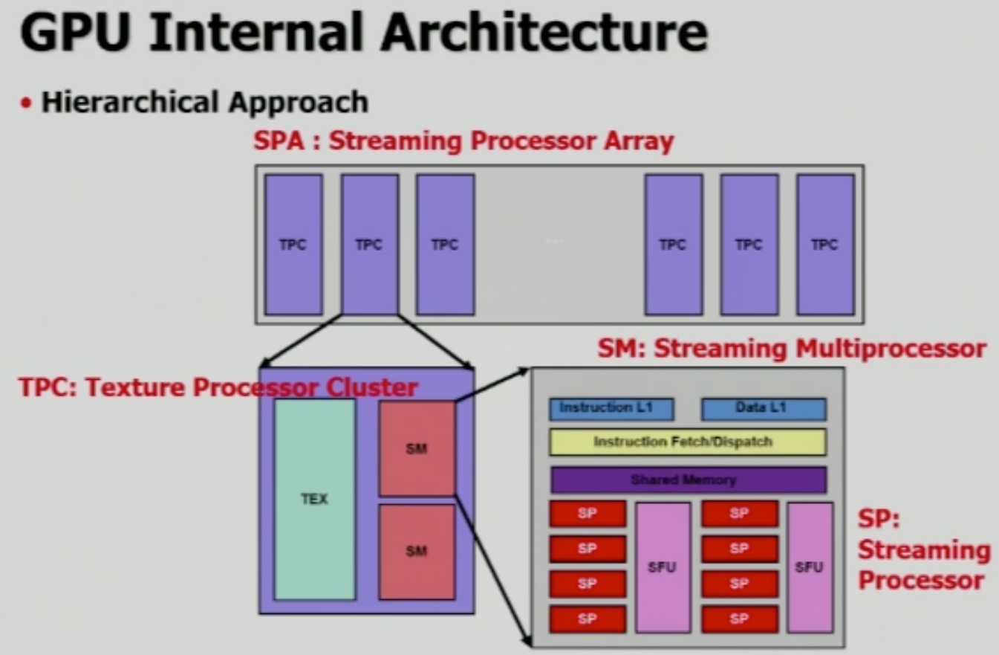
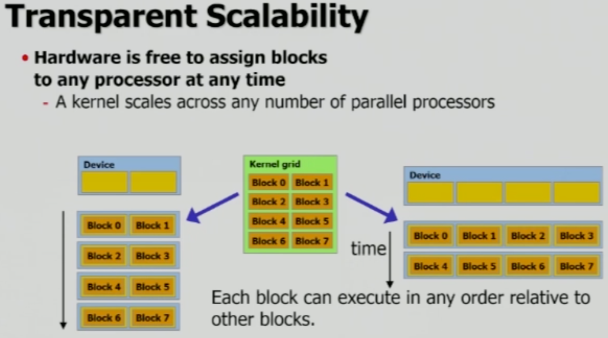

# CUDA Architecture & Process

## NVIDIA GPU Architecture

기본적으로, 그래픽카드는 위 그림과 같은 계층적인 구조를 이루고 있습니다. 그래픽카드는 SPA(Streaming Processor Array)라고도 불리며, TPC(Texture Processor Cluster)들이 배열 형태로 나열된 구조를 띕니다.

TPC는 기본적으로 3D Graphic 출력을 제공하는 기능을 하며, TPC는 위 GPU Architecture인 G80에서는 2개의 SM을 보유하고 있습니다. 물론 현재의 architecture들은 더 많은 SM(Streaming Multiprocessor)들을 보유하고 있으며, SM 내의 SP(Streaming Processor) 개수 또한 더 많아집니다.

- SPA, Streaming Processor Array

- TPC, Texture Processor Cluster

  - TEX: Texture Processor는 graphic 처리를 위한 장치
  - G80에는 SM이 2개 있으며, G80 이후에는 1개만 사용(효율적이라 생각), 현재는 여러 개를 cluster로 묶어서 사용

- **SM**, Streaming Multiprocessor

  - Multi-threaded processor core

  - **CUDA thread block을 처리하는 기본 단위**

    (반드시 SM을 이용하여 작업)

- **SP**, Streaming processor

  - **CUDA Core**
  - **Scalar ALU** for a single CUDA thread
  - 많은 SP들을 이용하여 병렬 처리
  - 예전에는 기술적인 문제로 SM 당 8개의 SP만을 보유 했으나, **현재는 일반적으로 SM 당 32개의 SP를 사용**

- SFU, Special Functions Unit

  - `sin`, `cosin`, `square` 등의 특별한 작업을 고속으로 처리
  - 현재는 SM 당 8개 이상의 SFU를 보유

 

### SM, Streaming Multiprocessor

[이미지 출처](https://medium.com/@smallfishbigsea/basic-concepts-in-gpu-computing-3388710e9239)

각각의 SP들은 CUDA Core라고 불리며, 계산을 수행하는 CPU에서의 ALU 역할을 담당합니다. Float, Double, Int 형을 담당하는 unit들은 각각 따로 존재합니다.

Pascal Architecture의 경우 SM 별로 2048개의 thread를 사용할 수 있는데, **물리적으로는 32개 thread 단위(Warp)의 time sharing 방식**으로 작동합니다. 이에 대해서는 아래에서 자세히 설명합니다.

 

### SP, Streaming Processor

[이미지 출처](https://www.researchgate.net/publication/283559088_Erratum_Accelerating_fibre_orientation_estimation_from_diffusion_weighted_magnetic_resonance_imaging_using_GPUs_PLoS_ONE_2015_106_e0130915_101371journalpone0130915)

SM은 여러 개의 SP들을 보유하고 있으며, SP(Core)는 4개의 thread로 구성되어 있습니다. 각 SP들이 보유하고 있는 thread들의 역할은 다음과 같습니다.

- SP Threads
  - `fetch`
  - `decode`
  - `execute`
  - `wirteback`

SP는 thread block의 thread가 담당하고 있는 작업을 직접적으로 처리하는 역할을 합니다. 그림에 등장하는 `Warp`는 thread block 내의 thread들을 32개씩 묶는 단위로, SM의 작업 단위를 의미합니다. 그림이 설명하는 GPU Architecture의 경우, 32개의 `Core`(SP)를 사용하여 32개의 thread들(`Warp`)을 동시에 작업할 수 있습니다. Warp에 대해서는 아래에서 자세히 설명합니다.

 

### CUDA Thread Block

Thread Block은 개발자들이 선언하는 단위로, Pascal Architecture의 경우 1~1024개의 thread를 갖도록 할 수 있습니다. Thread Block은 SM 별로 할당 되는 것이며, **SM의 경우 하나의 Kernel Program을 작업**합니다. 즉, **1024개의 모든 thread들은 모두 같은 작업을 수행하며 병렬 처리**를 하고 있는 것입니다.

  

## How SM Works

**SM들은 kernel grid에 속하는 block들을 나누어 담당**하여 처리합니다. 위 그림의 Device 내부에 색칠된 노란색 네모 상자들이 각각 SM을 의미하며, 왼쪽 Device의 경우 SM 별로 4 개의 block을 처리 해야 합니다. 그리고 오른쪽 Device의 경우 4개의 SM들이 있기 때문에, 만약 그림의 SM들이 모두 동일한 성능을 가졌다고 한다면, 우측의 Device가 왼쪽의 Device 보다 두 배 빠른 속도로 일을 처리할 수 있습니다.

- 참고 사항 - **Scalability**
  - Warp 단위, 혹은 Block size를 무한대로 키우지 않고 작게 나누어 병렬처리 하는 이유는 **모든 H/W에서 사용할 수 있게 하기 위함**
  - 하나의 SM과 소수의 SP만을 보유할 수 있는 제한된 H/W에서도, 같은 방식으로 CUDA를 사용할 수 있다.

 

### Warp

SM은 물리적으로는 32 개의 Core만을 가지고 있으며, 실질적으로 동시에 작업하는 것은 32개의 thread 뿐입니다. 하지만 더 높은 효율을 위해 1024개의 thread 들을 32개의 thread들로 구성된 Warp 단위로 분할하고, **여러 개의 warp들을 time sharing을 통해 동시에 실행하는 것 처럼 보이는 병렬 처리를** 합니다. 32 개의 thread로 구성된 warp들은 **32개의 core를 사용하여 물리적인 병렬 처리가 가능**합니다.

 

### Warp Scheduling

[이미지 출처](https://medium.com/@smallfishbigsea/basic-concepts-in-gpu-computing-3388710e9239)

Warp Scheduler는 위 그림과 같이 작업을 수행합니다. Thread block 내의 지정된 특정 warp에 대해, 특정 instruction을 수행하도록 지시합니다. 그런데 GPU의 작업 속도는 memory read/write 보다 훨씬 빠릅니다. 따라서 특정 warp를 작업하던 중 해당 warp가 계산이 아닌 메모리 관련 작업을 수행하게 되면서 대기 상태가 될 경우 손해가 발생합니다. **매우 빠른 속도로 작업하는 Core가 대기 상태의 warp를 기다려 주는 것은 너무나 큰 손해**이므로, 다음 warp로 이동하여 작업을 하는 time sharing 방식을 사용합니다.

위 그림의 경우, 다음과 같은 과정을 거쳤습니다.

1. 8번 Warp에서 11번 instruction을 수행하던 중 대기 상태로 전환
2. 2번 Warp에서 42번 instruction을 수행하던 중 대기 상태로 전환
3. scheduled warp들을 모두 수행하던 중 각각의 warp들이 대기 상태로 전환됨
4. 처음에 중단됐었던 8번 Warp의 다음 작업인 12번 instruction을 수행

- 참고 사항
  - 모든 warp들은 동일한 수의 instruction을 수행한 후(동일 작업 시간)에 메모리 작업을 수행
  - 이는 block 내 모든 thread 들은 모두 같은 kernel program을 실행하므로, 같은 instruction을 수행하기 때문이다.

 

### Bank

Bank는 thread가 **Shared Memory의 데이터를 읽고 쓸 때 사용하는 데이터 저장 단위**입니다. Bank는 CPU의 Cache line과 유사한 개념인데, CPU cache의 경우 메인 메모리에서 block 단위(GPU thread block과 무관)로 데이터를 load한 뒤, block과 같은 사이즈의 cache line으로 저장합니다.

