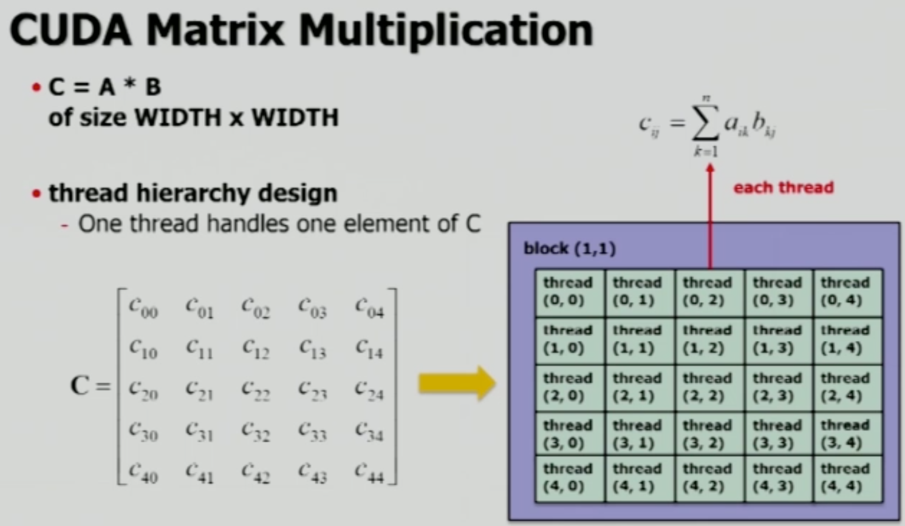

# Matrix Multiplication

[출처: KOCW 백낙훈 교수님, 병렬프로그래밍 강의](http://www.kocw.net/home/search/kemView.do?kemId=1322170)

두 개의 5x5 정방 행렬의 행렬곱을 CPU와 GPU로 구현하여 비교한다.

<br><br>

## CPU's Matmul

### Initialization

```c
int i, j;
const int WIDTH = 5;
int a[WIDTH][WIDTH];
int b[WIDTH][WIDTH];
for(i = 0; i < WIDTH; i++) {
	for(j = 0; j < WIDTH; j++) {
    a[i][j] = i + j;
    b[i][j] = i + j;
  }
}
```

<br>

### Matmul

Matmul 결과를 저장하는 `c` 배열의 row `i`, column `j`의 값은, `a`의 `i`번째 row의 모든 값들과 `b`의 `j`번째 column의 모든 값들을 내적(dot product)한 결과값이다.

```c
// matmul result를 넣을 c 초기화
int c[WIDTH][WIDTH] = {0};
int k, _sum = 0;
for(i = 0; i < WIDTH; i++) {
  for(j = 0; j < WIDTH; j++) {
    _sum = 0;
    for(k = 0; k < WIDTH; k++) {
      _sum += a[i][k] * b[k][j];
    }
    c[i][j] = _sum;
  }
}
```

<br><br>

## GPU Matmul

먼저 계산하는 행렬들의 형태에 따라 thread의 구조를 먼저 설정해야 한다. 위에서 5x5의 행렬을 사용했으므로, 동일하게 5x5 크기의 thread를 설정한다.



각 thread는 $C_{ij} = \sum^n_{k=1}a_{ik}b_{kj}$ 계산을 담당하게 된다. 즉 결과값 저장 행렬 C의 `C[i][j]` 요소의 계산을 thread 하나가 처리한다.

<br>

### Initialization

CUDA Programming에서 중요한 점은, GPU 상에 공간을 할당하기 위해 `malloc` 함수를 사용해야 하며, 이는 **2차원이 아닌 1차원 배열의 공간을 할당**하게 된다.

- 행렬은 다음 두 가지 방법으로 표현될 수 있으며, matmul에서의 좌측 행렬의 경우 Row-major가 표현되기 쉬우며, 우측 행렬은 Col-major가 유리하다.
- Row-major
  - `a[i * WIDTH + k]`
    - `k` 값이 더해지며 필요한 바로 다음 값
  - `b[k * WIDTH + j]`
    - 다음 필요한 값은 `WIDTH` 거리에 위치
- Col-major
  - `a[k * WIDTH + i]`
    - 다음 필요한 값은 `WIDTH` 거리에 위치
  - `b[j * WIDTH + k]`
    - `k` 값이 더해지며 필요한 바로 다음 값

<br>

### Matmul

```c
#include <cstdio>

__global__ void mulKernel(int *c, const int *a, const int *b, const int WIDTH) {
  int i = threadIdx.i;
  int j = threadIdx.j;
  // blockdim을 사용해도 되지만, 그냥 여기선 WIDTH 사용
  int w = i * WIDTH + j; // [y][x] = y * width + x
  int _sum = 0;
  for(int k = 0; k < WIDTH; ++k) {
    _sum += a[i * WIDTH + k] * b[k * WIDTH + j];
  }
  c[w] = sum;
}

int main() {
  dim3 dimBlock(WIDTH, WIDTH, 1);
  mulKernel<<<1, dimBlock>>>(dev_c, dev_a, dev_b, WIDTH);
  /*
  1 grid = 1 block
  1 block = WIDTH * WIDTH 개수의 threads
  */
}
```

