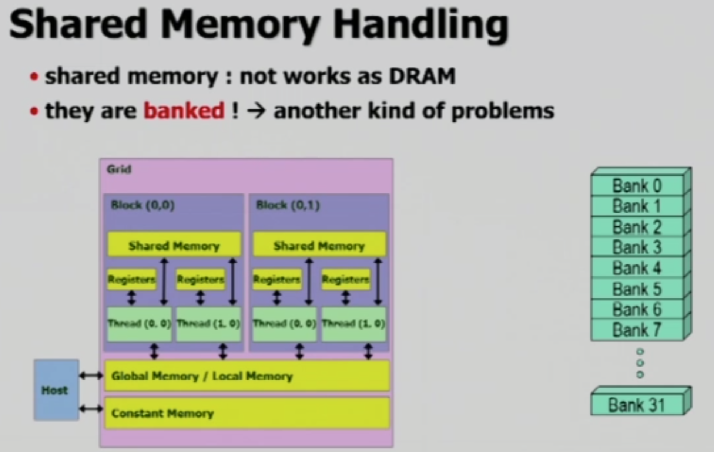
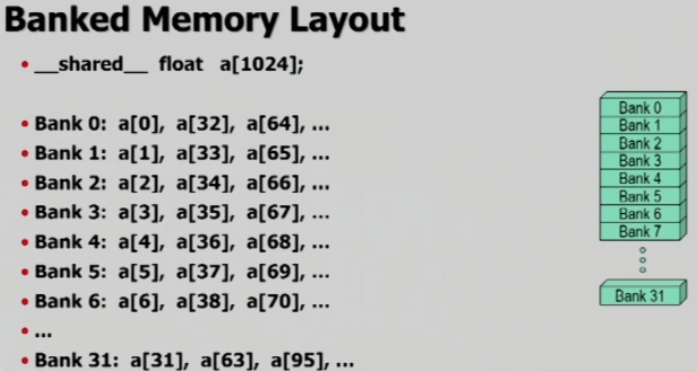
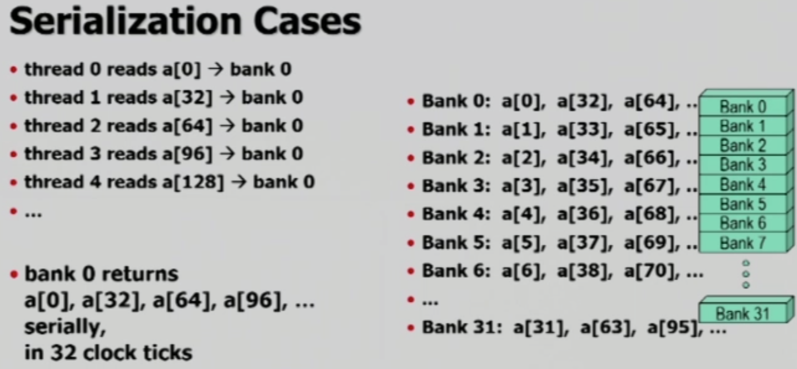
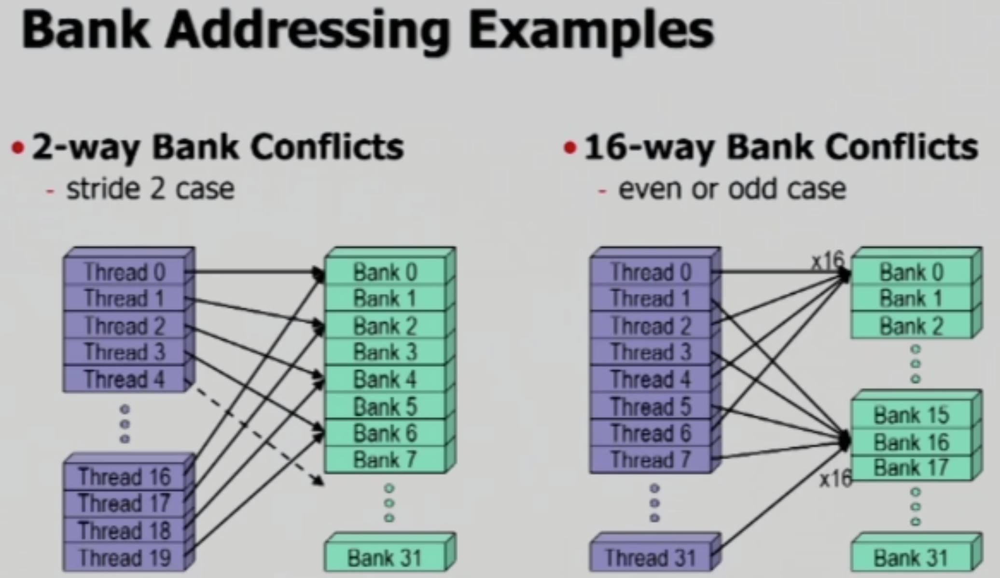

# Bank Conflict

Bank Confict는 thread들이 memory의 데이터를 읽을 때 발생하는 문제입니다.

 

### Shared Memory & Bank

Shared memory는 DRAM과 다르게 bank 형태로 데이터를 저장하며, **bank의 개수는 32 개**입니다. 과거에는 16 개를 사용했으며, 과거와 현재 모두 **bank 당 32 bits(4 bytes)** 크기를 가지고 있습니다. 만약 thread 하나가 bank 하나의 값을 읽는 데에는 1 clock이 소모됩니다.

위와 같이 1024 개의 요소를 가진 배열이 있을 경우, **다음 요소가 다음 bank에 저장 되도록** 순서 있게 할당됩니다. 일반적인 main memory 또한 bank 개념을 사용하긴 하지만, bank의 개수가 2개 혹은 3개 정도입니다.

 

## Bank Conflict

Bank Conflict는 **2 개 이상의 thread가 같은 bank를 읽어들이려 할 때 발생**하는 상황이며, 여러 상황들 중에서도 **thread들이 bank 내의 서로 다른 값을 요구하는 상황**만을 bank conflict 라고 합니다.

 

### Bank Broadcast Cases

모든 thread가 같은 bank의 값을 요구하지만, **만약 요구하는 값들이 모두 같은 값이라면** broadcasting을 이용하여 1 clock에 모든 thread들이 읽게 할 수 있습니다. 즉, 이와 같은 상황은 bank conflict가 아닙니다.

 

### Bank Serialization Cases

Bank conflict는 위와 같은 상황에서 발생합니다. 왼쪽을 보면, 여러 thread 들이 모두 bank 0에 저장된 요소들을 읽어들이려 하고 있습니다. 하지만 bank는 한 번에 하나의 thread만 읽을 수 있으므로, 많은 대기 시간이 필요합니다. 정확하게는, **같은 bank의 값을 요구하는 thread의 개수가 16 개 라면 16 clock이 소모**됩니다.

그런데 serialization case는 매우 발생하기가 쉽습니다. 하나의 예를 들자면, `stride=2`인 경우 아래 그림의 왼쪽과 같은 형태로 요청을 하게 됩니다.

그림의 오른쪽 그림은 짝수의 경우 bank 0을, 홀수의 경우 bank 16을 읽도록 한 경우입니다.

  

## Tricks to Avoid Band Conflict

- Read일 경우, **모든 값들을 broadcasting 하도록 조작**
  - 모든 값들의 index가 0이도록 코드를 조정
  - **이론상 가장 빠른 실행 속도**
  - Test 용도로 사용 가능
    - 만약 변경 전과 속도가 같다면, 현재 shared memory를 효율적으로 잘 사용하고 있다는 증거(개발된 kernel이 낼 수 있는 가장 빠른 속도)
    - 느려졌다면, bank conflict가 존재했었다는 것이며, **알고리즘 상으로 해결할 수 없을 수도 있으니, 무조건 해결 가능한 것은 아니다!**
- **Write일 경우 broadcast 사용 불가**
  - 같은 원소를 사용할 때 충돌이 발생
  - 서로 다른 bank를 작업해야 하므로, 모든 array의 index를 `threadIdx.x`로 변경하여 서로 다른 bank를 작업하도록 조치하는 것이 최선

 

### Constant Memory Broadcasting

_이 부분은 bank conflict를 해결하기 위함이 아닌, global memory에서 broadcasting을 활용할 수 있는 방법에 대한 내용입니다._

Constant memory는 global memory에 있으며, constant-cache path를 이용하여 빠르게 read할 수 있는 공간입니다.  크기는 64KB이며, read only입니다.

Constant memory의 경우 모든 warp의 thread들이 같은 주소를 읽도록 할 때 1 clock만을 소모하며, 가장 빠른 속도로 읽습니다. 따라서 **global memory를 사용할 때 broadcasting을 사용하여 빠르게 읽고 싶다면, constant memory를 활용**하면 됩니다.