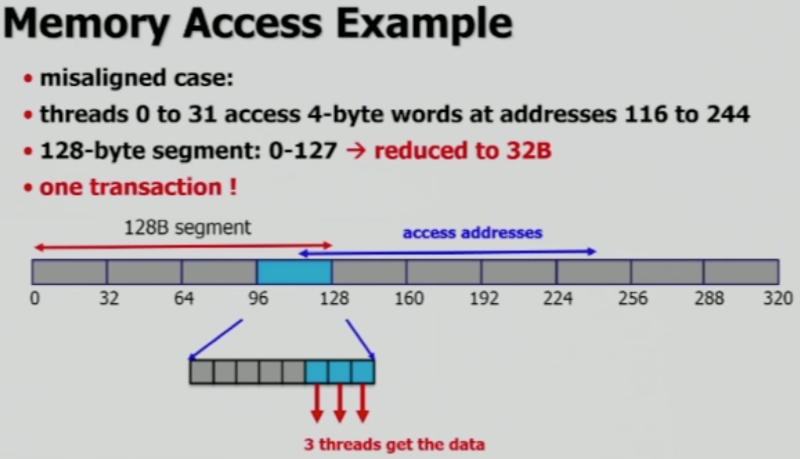
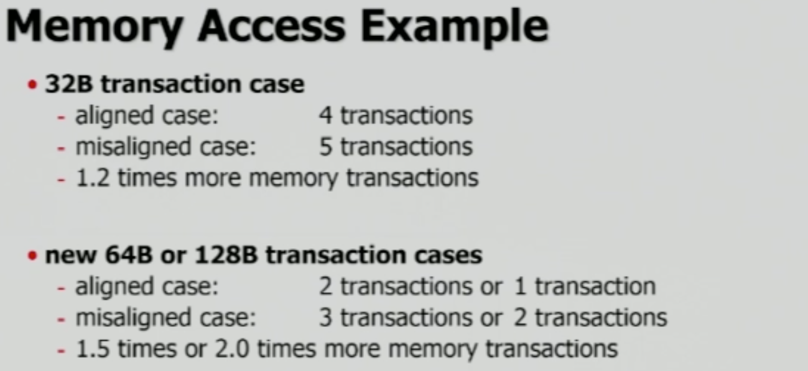
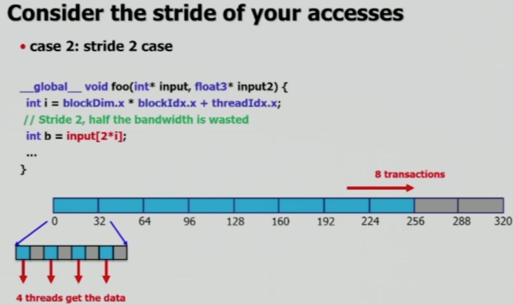
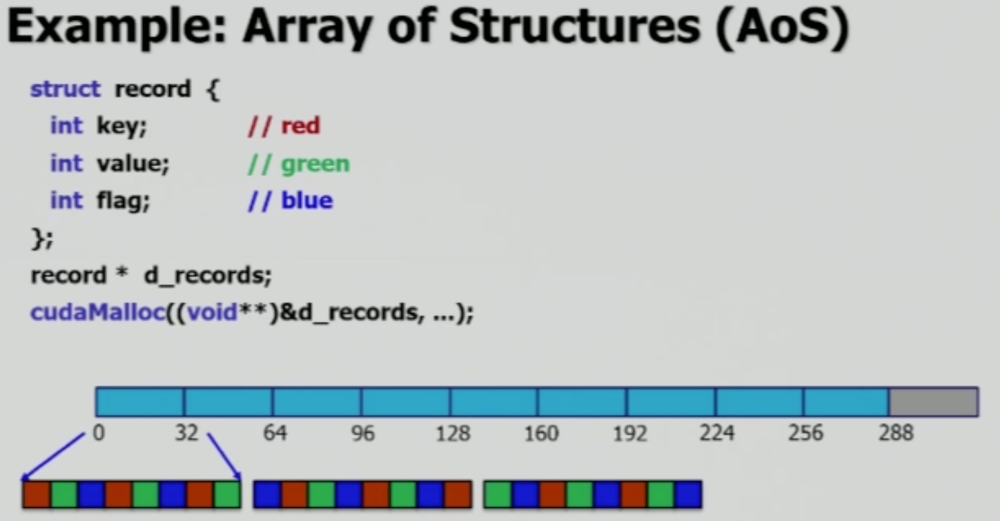
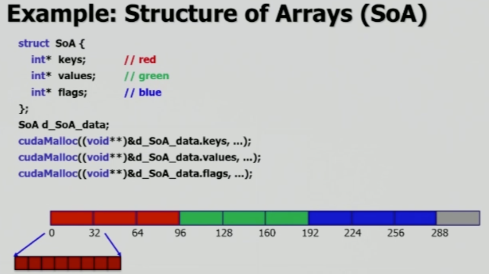

# Memory Coalescing

Memory Coalescing에 영향을 주는 요인들로 다음을 알아봅니다.

- Misaligned data
- Data Structure
  - Stride
  - Array of structures
  - Structure of arrays

Memory Coalescing은 메모리 단위를 조절하여 효율적으로 read/write가 가능한 형태를 만드는 것입니다. 그러기 위해서는 먼저 메모리가 어떻게 저장되고, 읽히는가를 알아야 합니다. 현재 컴퓨터의 메모리들은 bit 혹은 byte 단위를 사용하여 메모리를 다루는 것이 아니라, **chunk**라는 단위를 사용합니다.

  

## Chunk

### Main Memory's Chunk Size

우리는 보통 사용할 메모리를 byte 단위로 계산을 하지만, 실제로 main memory의 데이터를 저장할 때 byte 단위가 아니라 **chunk** 단위를 사용합니다. 모든 컴퓨터 구조에서 off-chip memory에 접근할 때에는 chunk 단위를 사용합니다. 이는 single word만을 필요로 할 때에도 마찬가지이며, single word를 읽기 위해서도 해당 word가 포함된 chunk 전체를 읽어야 합니다.

Main memory의 chunk는 과거 32 bytes로 사용됐으며, 현재 사용되고 있는 컴퓨터 구조에서는 64 혹은 128 bytes를 사용합니다. 즉, 우리가 사용하는 main memory는 chunk 단위인 128 bytes를 기준으로 공간을 분할하여 저장합니다.

(그냥 참고: CPU의 경우, 현재 사용중인 64 bit(8 bytes) 체제는 8 bytes를 chunk boundary로 사용합니다)

 

### CUDA's Chunk Size

이는 warp 또한 마찬가지입니다. CUDA의 thread들은 32개의 단위로 묶여 warp를 구성하며, 각각의 thread가 float data를 읽으며 총 32개의 float를 read 혹은 write 하게 됩니다. 즉, 4 bytes의 `float`를 thread 별로 하나씩 작업해야 하므로 warp는 총 128 bytes를 다루게 됩니다.

이는 warp size를 왜 더 크게 하지 않는가는 이와 관련이 깊습니다. **Warp가 갖는 thread의 개수를 32개로 정함으로서  메모리로 부터 데이터를 load 하는 단위인 chunk와 동일하게 맞출 수 있고, 따라서 더 효율적으로 데이터를 다루게 됩니다**.

CUDA의 경우 현재 128 bytes를 chunk 단위로 사용하지만, `cudaMalloc()`의 경우 미래의 기술 발전을 고려하여 256 bytes를 boundary로 사용합니다.

 

### Memory Transaction Size

Memory Coalescing에 대해 자세히 알아보기 전에, 먼저 알아야 할 개념이 하나 더 있습니다. **Memory Transaction Size는 장치간에 메모리를 전송할 때 한 번에 전송할 수 있는 데이터의 크기**로, 이는 H/W마다 다릅니다. CUDA의 경우 사용하는 GPU의 GDDR RAM에 따라 다릅니다.

아래 영문 설명 출처 - [stackoverflow](https://stackoverflow.com/questions/11908142/clarifying-memory-transactions-in-cuda)

_32 byte transactions is a warp sized read of an 8 bit type, 64 byte transactions is a warp sized read of an 16 bit type, and 128 byte transactions is a warp sized read of an 32 bit type._

  

## Misaligned Memory

Misaligned 된 메모리 공간은 효율적인 data read/write를 방해합니다. Transaction size는 32 bytes로 임의 설정하여 예시들을 살펴보겠습니다.

 

### Properly Aligned Memory

첫 번째로, Main memory의 공간이 잘 분할되어 메모리 주소가 `(0-127, 128-255, ...)`처럼 chunk 단위로 align 되었고, 이에 맞게 데이터들이 잘 저장되어 있다고 보겠습니다. CUDA는 warp 단위로 data를 읽으며, warp는 32개의 thread로 구성되어 있고, 128 bytes의 main memory 데이터, 즉, CUDA의 chunk로 데이터를 읽어오려면 32 bytes의 **transaction**을 4회 진행해야 합니다. 만약 메모리 주소 `(128-255)` 구간의 데이터를 읽어서 thread에 할당한다고 하면,  **매 transaction 마다 8개의 float data(32 bytes)를 읽게 되고, 8개의 thread들이 float 데이터를 하나 씩 할당**받습니다.

이러한 경우, 순차적으로 32개의 thread들이 `float` 데이터를 갖게 되고, 위에서 설명한 대로 boundary를 128 bytes로 설정해도 아무런 문제가 없습니다.

 

### Misaligned Memory

그런데 이렇게 완벽하게 데이터를 읽어올 수 없는 misaligned 된 경우들이 있습니다. 그런데 만약 main memory에 저장된 데이터가 misaligned 되었고, 읽어오려는 데이터가 메모리 주소 `(116-244)`에 존재하는 경우 transaction에서의 낭비가 발생합니다. `(96-127)` 주소의 데이터를 읽어내고, `(96-115)` 까지의 데이터는 버린 채, `(116-127)` 주소의 데이터만을 3 개의 thread에 할당하게 됩니다. 그렇다고 맨 뒤의 `(224-255)` 구간을 읽지 않아도 되는 것은 아닙니다. 해당 구간을 읽은 뒤, 맨 뒤의 3 개 float에 해당하는 데이터는 버리고, 5 개의 thread에 대해 값을 할당하게 됩니다. 즉, **transaction 횟수가 기존의 4회에서 5회로 증가**하게 된 것입니다.

Misaligned에 의한 transaction 손해는 transaction size가 커질 수록 커집니다. 전체 read 시간으로 봤을 때, 손해를 보는 transaction cost의 비율이 증가하기 때문입니다.

  

## Data Structure

데이터를 어떻게 저장하고, 어떻게 연산하는가는 연산 성능에 매우 큰 영향을 미칩니다.

 

### Stride

Stride는 배열에서 사용할 다음 요소의 index가 현재 요소의 index와 얼마나 떨어져 있는가를 포현합니다. Stride 값이 1일 경우, warp의 thread들이, 즉, 32개 thread들이 필요로 하는 데이터들이 배열안에 차례대로 위치해 있으며, 앞서 말한 대로 128 bytes 크기의 메모리 공간을 그대로 읽기만 하면 됩니다.

그런데 stride 2 이상일 경우 transaction 횟수가 두 배 이상으로 변합니다.

Stride가 3일 경우 transaction 또한 3 배로 증가하며, 매우 비효율적인 데이터 transfer가 필요합니다. 즉, **데이터를 저장할 때에는 연산 방식을 고려하여, 적절한 방식을 사용하는 것이 중요**합니다.

 

### AoS & SoA

AoS(Array of Structures)는 위 그림과 같이 **배열 내에 구조체들을 차례 대로** 저장한 형태입니다. SoA(Structure of Arrays)는 아래 그림과 같이 구조체의 **같은 변수들 끼리 묶어서** 다시 큰 구조체 하나로 만든 개념입니다.

두 방법 중 어느 것이 효율적인가는 상황마다 다를 것입니다. 그런데, 보통 CPU를 사용한 계산에서는 AoS가 효율적이며, GPU의 경우 보통 SoA 방식이 효과적입니다. 왜냐하면 GPU에서 AoS 방식을 사용할 경우, 예를 들어 같은 `red` 끼리 계산을 해야만 하는 상황이 있을 때, AoS 형태로 저장된 데이터는 `stride=3`인 형태로 계산을 하는 것과 같습니다. 그리고 이로 인해 매우 비효율적인 transaction이 발생합니다.