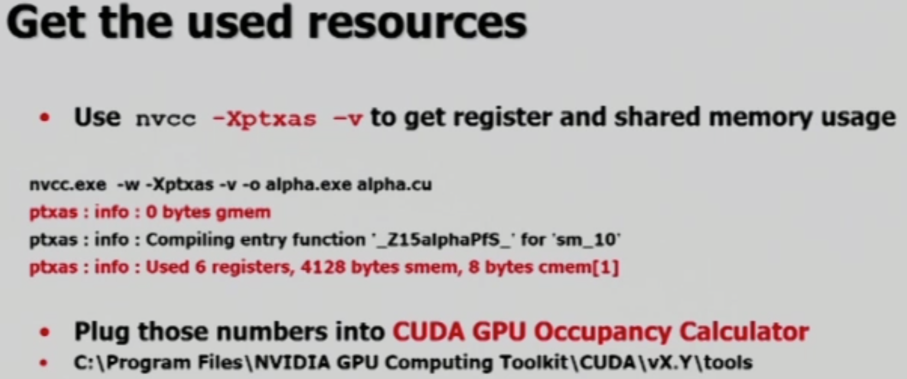

# Occupancy

CUDA programming에서 가장 중요한 것은, 계속해서 측정하여 bottleneck을 해결하는 것입니다. 그리고 그 과정에서 크게 신경써야 할 것은 occupancy입니다. Occupancy는 **CUDA Streaming Multiprocessor 내에 얼마나 많은 thread block을 할당할 수 있는가**, 즉, 얼마나 병렬화할 수 있는가를 의미합니다.

 

### Thread Shecduling

CUDA는 overhead가 거의 없도록 time sharing이 warp scheduling되어 있습니다. 현재 warp를 수행하던 중, global memory access와 같은 cost가 있는 작업이 수행되면, 다음 warp를 실행합니다.

따라서 모든 warp들이 global memory access와 같은 작업으로 인해 **stall** 되어 있는 상황이 곧 SM의 성능이 가장 떨어지는 상황입니다. 이러한 **최악의 상황을 최대한 피하기 위해 occupancy를 최대화** 해야 합니다.

  

## Efficient Occupancy

Occupancy는 **limits of register and shared memory**를 고려해서 결정합니다.

1. Register usage per thread

   Register가 소비하는 thread의 개수

2. Shared memory per thread block

   Block이 사용하는 shared memory의 크기

즉, register와 shared memory의 한계를 파악하고, 그 허용 가능한 능력을 최대한 활용해야 합니다.

그림의 왼쪽과 오른쪽은 두 종류의 kernel을 예시로 든 내용입니다. 그림을 설명하기 전에 가장 이상적인 상황을 생각해 보자면, thread block을 많이 사용해도 register 또한 모두 수용할 수 있으며, shared memory를 적게 사용할 수 있는 경우입니다.

위 그림에서 더 위험한 kernel은 오른쪽 그림입니다. 오른쪽의 경우 왼쪽의 kernel 보다 적은 thread block을 사용했으며, 이는 time sharing 방법으로 함께 처리할 warp의 개수가 적음을 의미합니다. 그리고, stall로 인해 높은 latency를 가질 확률이 높습니다(block 당 thread 개수가 왼쪽/오른쪽이 동일하다는 전제 하에).

그림으로도 알 수 있듯이, **register와 shared memory는 block 단위로 할당**되며, block의 size는 개발자가 설정합니다. 가장 쉽게 설명할 수 있는 occupancy 손해의 예는 다음과 같습니다. 만약 shared memory의 size가 500이며, 설정한 block들의 size가 200 씩입니다. 그런데 500의 크기에는 두 개의 block들만을 할당할 수 있으며, 100의 공간은 낭비가 되게 됩니다. 따라서 100 사이즈의 block을 갖도록 수정하면 **가용 shared memory를 모두 활용**할 수 있게 됩니다.

 

### Check Register & Shared Memory

우리는 `nvcc`를 이용하여 쉽게 확인해 볼 수 있습니다. `ptxas`가 출력하는 마지막 line을 확인해 보면, `alpha.cu` 코드는 global memory를 사용하지 않으며, thread 당 6개의 register와 4128 bytes의 shared memory, 그리고 8 bytes 정도의 constant memory를 사용함을 알 수 있습니다.

 

### Check Occupancy

Occupancy Calculator는 맨 아래 경로에 접속 시 사용할 수 있으며, 엑셀 형태로 되어 있습니다. 이는 CUDA 사이트에서도 다운로드 가능합니다.

위 그림은 Occupancy Caclulator를 사용하는 예시 화면입니다.

위 그림은 `maxrregcount`(max register count)를 이용하여 thread 별로 사용하는 register 개수를 줄이는 코드입니다. 물론 kernel을 직접 수정하는 것이 가장 좋은 방법일 수 있으나, 불가할 경우 사용할 수 있습니다.

그런데 위 `Xptxas` 코드 사용과 비교했을 때 20 bytes의 local memory가 추가적으로 사용된 것을 알 수 있습니다. 이는 원래 register에 저장할 데이터들을 잠시 local memory에 저장하기 위해 사용된 것입니다.

여기서 설명하지는 않지만, 강의 내용에서 occupancy calculator를 실행했을 때 thread block이 register의 개수 제한으로 인해 적게 사용되는 상황이었고, 따라서 block 별 register 사용 개수를 적게 만들어 thread block의 개수를 증가시켰습니다. 하지만 이로 인해 local memory가 추가적으로 사용되는 효과가 발생했습니다. Register는 1 clock으로 작업을 진행할 수 있지만, local memory는 5 clock을 소모합니다. 그리고 어떤 것이 효율적인가는 직접 실험하여 확인해야 합니다.

  

## Kernel Launch Overhead

Kernel launching에도 overhead가 발생합니다. 따라서 여러 kernel을 합쳐 하나의 큰 grid로 만들어 해당 overhead를 최소화 할 수는 있지만, 이 또한 어떤 방법이 효율적인가는 실험을 통해 확인해 봐야 합니다.

Kernel launch overhead는 GPU 마다 다르며, 경우에 따라 어떤 kernel을 실행할 것인지를 CPU or GPU가 체크하는 작업 또한 어느것이 효율적일 지는 경우 마다 다릅니다.

중요한 것은, kernel 자체의 효율은 **launch 횟수가 적으며, 한 번에 처리할 양이 많은 경우**가 가장 고효율입니다.