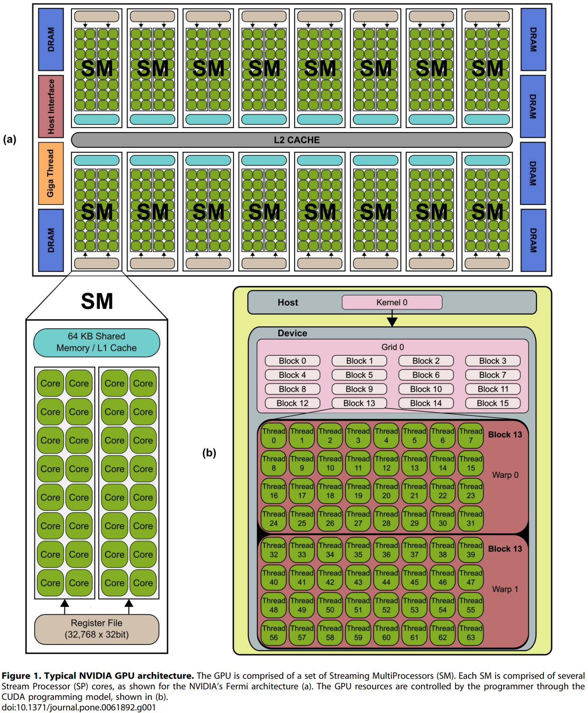
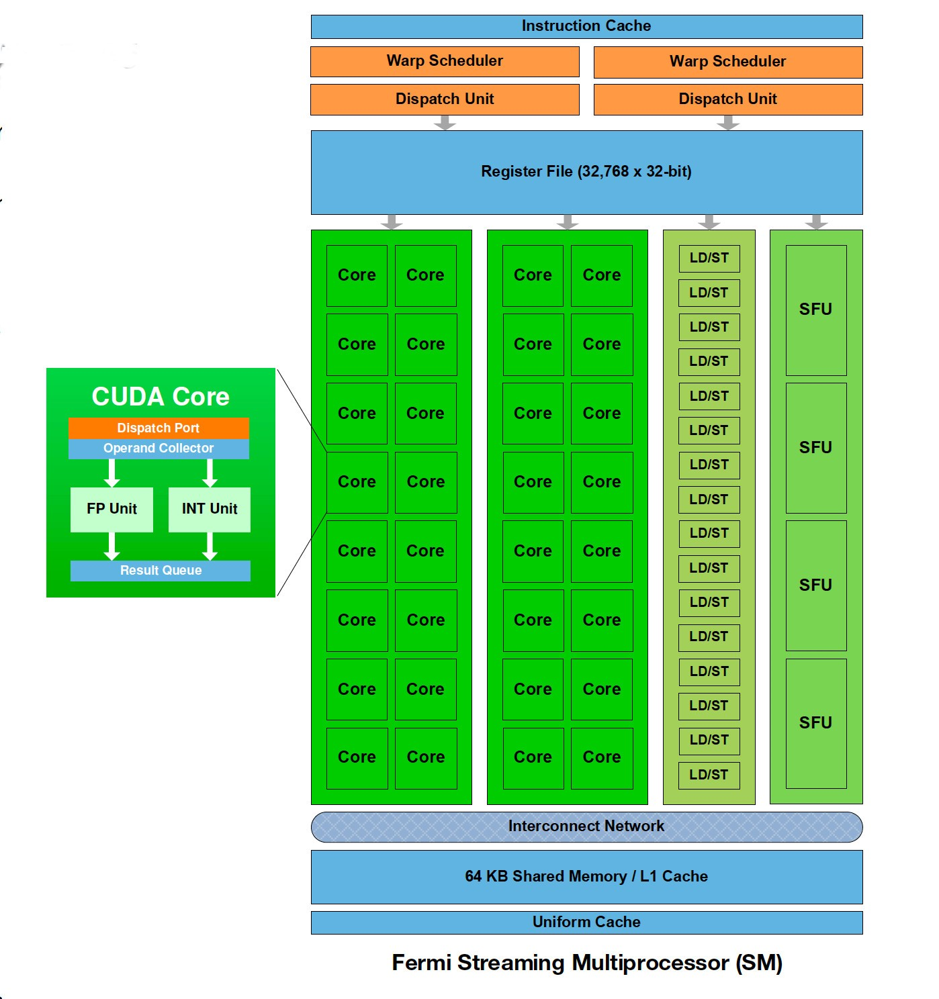
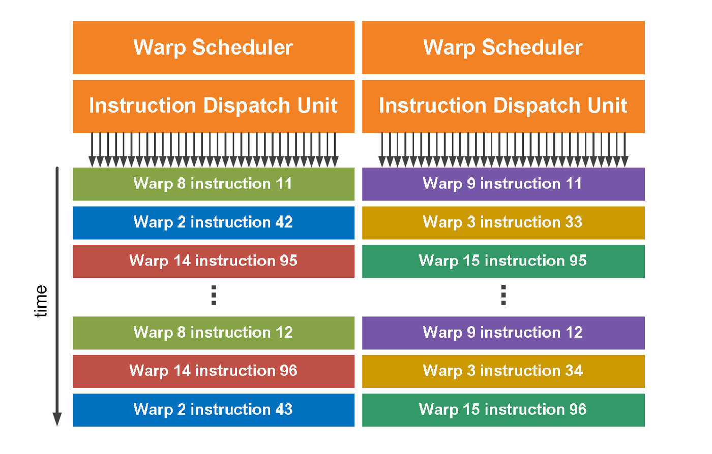

# CUDA Architecture & Process

## NVIDIA GPU Architecture

[이미지 출처](https://www.researchgate.net/publication/283559088_Erratum_Accelerating_fibre_orientation_estimation_from_diffusion_weighted_magnetic_resonance_imaging_using_GPUs_PLoS_ONE_2015_106_e0130915_101371journalpone0130915)

SM은 여러 개의 SP들을 보유하고 있으며, SP(Scalar Processor)(Core)는 4개의 thread로 구성되어 있습니다. 각 SP들이 보유하고 있는 thread들의 역할은 다음과 같습니다.

- SP Threads
  - fetch
  - decode
  - execute
  - wirteback

SP는 thread block의 thread가 담당하고 있는 작업을 직접적으로 처리하는 역할을 합니다. 그림에 등장하는 `Warp`는 thread block 내의 thread들을 32개씩 묶는 단위로, SM의 작업 단위를 의미합니다.

림에 등장하는 GPU Architecture의 경우, 32개의 `Core`(SP)를 사용하여 32개의 thread들(`Warp`)을 동시에 작업할 수 있다.

 

### SM, Streaming Multiprocessor

[이미지 출처](https://medium.com/@smallfishbigsea/basic-concepts-in-gpu-computing-3388710e9239)

각각의 SP들은 CUDA Core라고 불리며, 계산을 수행하는 CPU에서의 ALU 역할을 담당합니다. Float, Double, Int 형을 담당하는 unit들은 각각 따로 존재합니다.

 

### Warp Scheduler

[이미지 출처](https://medium.com/@smallfishbigsea/basic-concepts-in-gpu-computing-3388710e9239)

Warp Scheduler는 위와 같이 작업을 수행합니다. Thread block 내의 지정된 특정 warp에 대해, 특정 instruction을 수행하도록 지시합니다.

 

### Bank

Bank는 Shared Memory에서의 데이터 저장 단위입니다. CPU의 Cache에 cache line의 경우, 메인 메모리에서 block 단위(GPU thread block과 무관)로 데이터를 load한 뒤 block과 같은 사이즈의 cache line으로 저장합니다.

즉, load한 데이터를 bank 단위로 저장하며, thread가 데이터를 읽을 때에도 bank 단위로 읽게 됩니다.