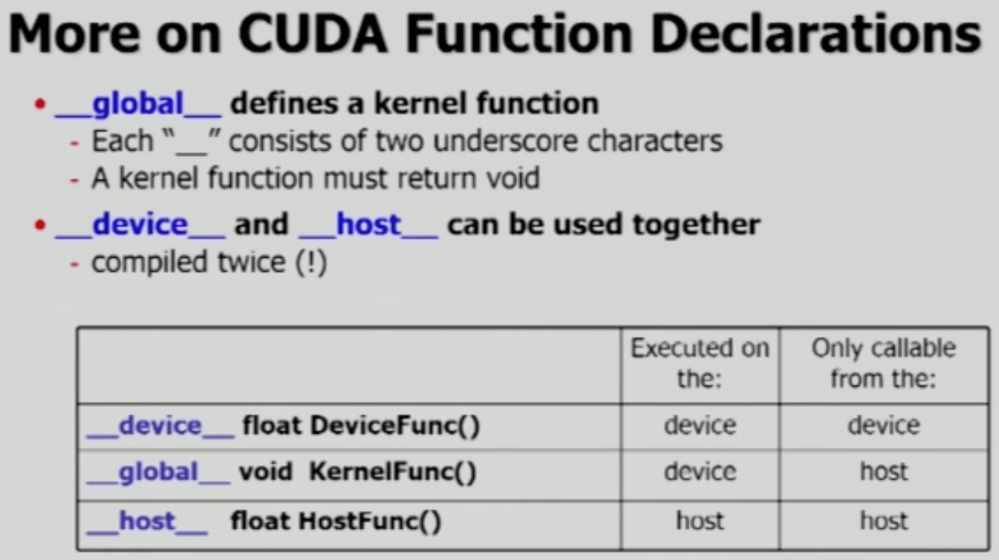
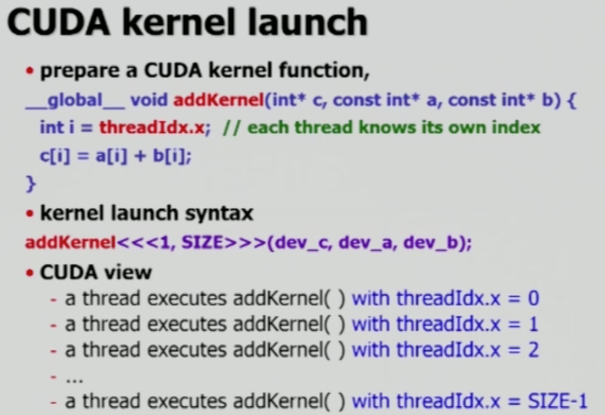

# Kernel

CUDA에서의 함수 선언은 크게 세 가지로 분류된다.

- `__device__`
- `__host__`
- `__global__`

`__global__` 함수는 CPU에 의해 호출되지만, 실행은 GPU에서 진행한다.  `__host__` 함수에서는 `__global__` 함수를 호출할 수 있으며, `__global__` 함수는 필요시 `__device__` 함수들을 호출할 수 있다(`__host__`는 생략하여 사용할 수 있다). 즉, `__global__` 함수가 중간 다리 역할을 한다.

  

## Kernel Launch

`threadIdx`는 각 thread 들의 index를 `x`라는 이름으로 사용할 수 있도록 한 것이며, `i`라는 변수로 사용되는 index 번호를 각 쓰레드들이 담당하게 된다. 즉,  동시에 실행할 수 있는 thread의 개수(H/W 제한) 내에서는 for문 없이 한번에 실행할 수 있다.

여기서는 indexing이 `i` 하나로 이루어져 있으므로 `threadIdx.x` 하나만을 선언했지만, matrix multiplication과 같이 두개 이상의 indexing이 필요한 경우 `threadIdx.y`와 같은 추가적인 인덱싱 변수를 선언해야 한다.

