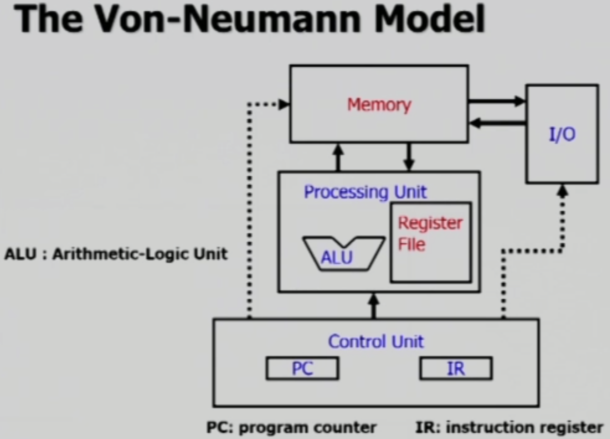
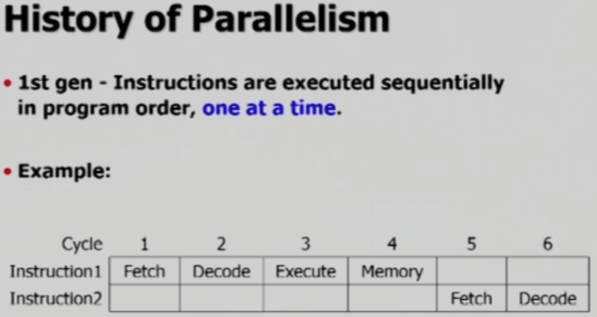
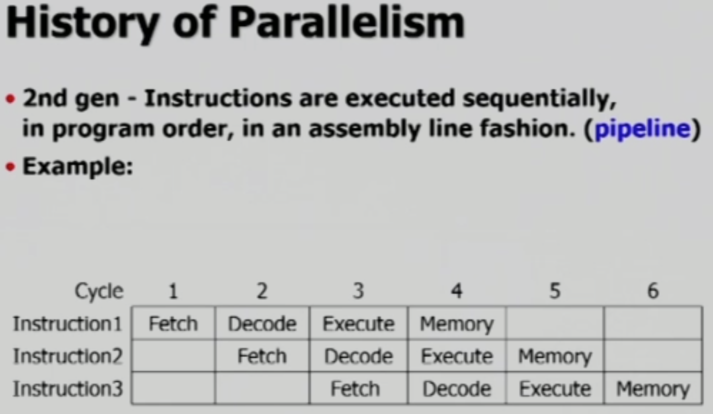
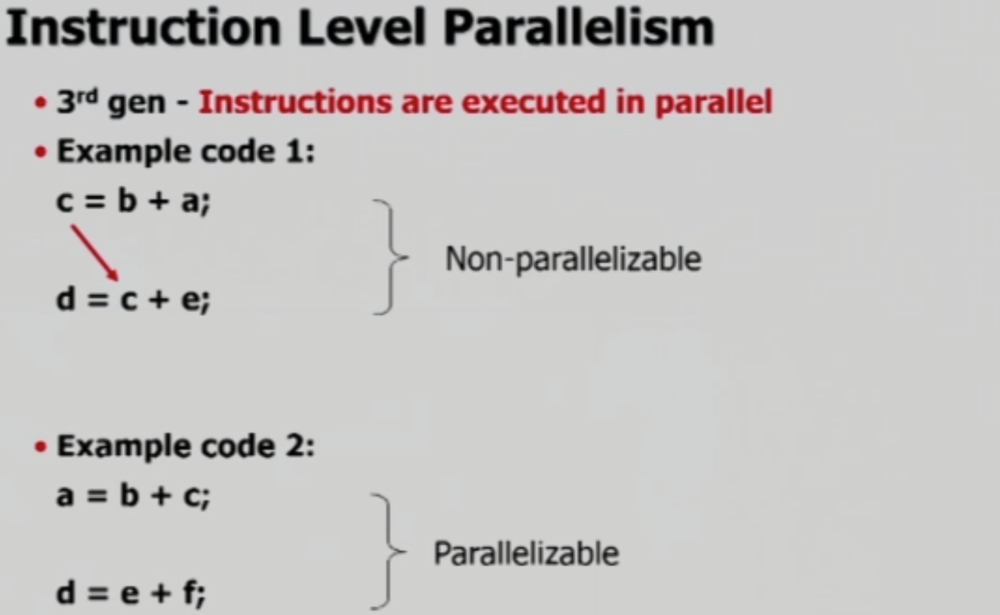
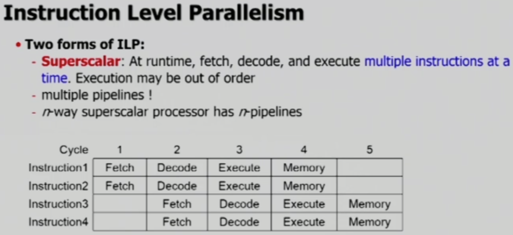
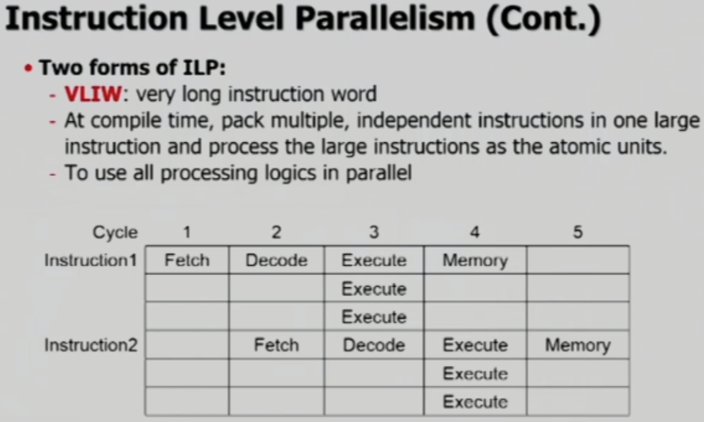

# CUDA Memory Hierarchy part-1

GPU는 CPU와 유사한 구조를 가지고 있기 때문에, 먼저 CPU에 대해 간단히 알아봅니다.

 

## CPU Architecture

CPU는 Von-Neumann 모델을 사용하는 구조입니다.

계산을 담당하는 Processing Unit이 있지만, 실질적으로 CPU를 조작하고 작동시키는 작업은 Control Unit이 담당합니다.

 

### Instruction Cycles

CPU가 Instruction을 수행할 때에는 3, 혹은 4개의 단계를 거칩니다.

- **Fetch**
  - Memory로 부터 instruction을 가져와서 IR(Instruction Register)에 저장
  - 경우에 따라 data를 함께 가져오기도 한다.
- **Decode**
  - IR의 instruction이 어떤 작업을 지시하는가를 해석
- **Execute**
  - ALU를 사용하여 계산하고, register에 저장
- (optional) **Memory Store**
  - (필요시) 계산 결과를 memory에 저장
- Instruction 예시
  - Only Register Instruction
    - 적은 용량, 빠른 속도
    - 1 clock per instruction
    - 1K registers per CPU
    - `ADD`
  - use Memory Store
    - 큰 용량, 느린 속도
    - 100 clocks per read/write
    - 8G bytes 이상 per CPU
    - `LDR`
    - `STR`
  - Cotrol Flow Instruction
    - `BRp` - PC에게 Instruction을 수정하도록

 

### CPU Parallelism 1st, 2nd gen

1세대 CPU에서는 병행 처리가 불가하던 시절에는 위 그림과 같이 **한 cycle에 하나의 instruction**을 수행했습니다.

2세대 CPU는 위와 같이 **Pipelining**이 가능합니다.

 

### CPU Parallelism 3rd gen

3세대 CPU는 Parallelizable한 상황(독립적인 계산)들에 대해 추가적인 병렬 처리를 합니다. 병렬 처리를 하는 방법으로는 두 가지가 있습니다.

- Superscalar
  - Pipeline을 n 개 사용하는 방법(multiple pipelines)
  - n-way superscalar processor

- VLIW(Very Long Instruction Word)
  - 진행하던 중 함께 사용해도 될 명령어들을 한 번에 계산하는 방법
  - `+`, `-`, `*`, `/`를 담당하는 ALU들을 동시에 사용(이전에는 한 cycle에 하나씩)
  - AMD CPU에서 사용중
  - Compiler가 많은 일을 해야 하는 단점