# CUDA Memory Hierarchy part-2

CUDA Memory Hierarchy part-1에서는 CPU의 메모리 구조를 확인해 봤었으며, part-2에서는 CUDA에 대해 본격적으로 알아봅니다.

  

## CUDA Memory

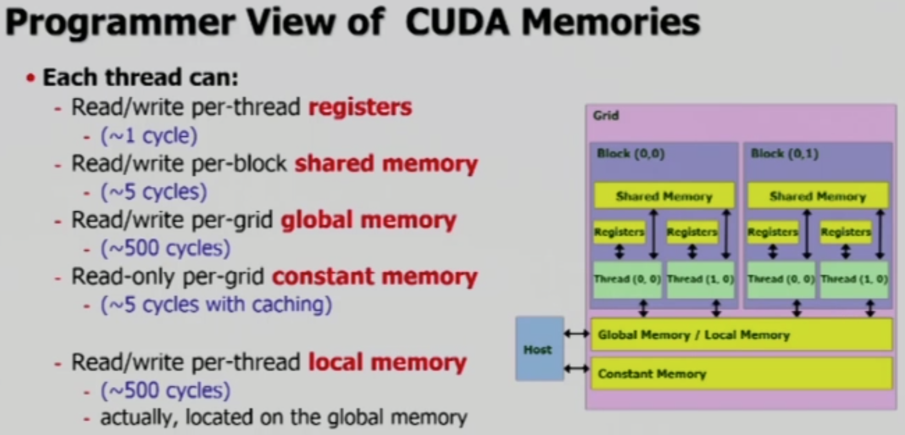

크게 봤을 때, CUDA Memory는 register, shared memory, global memory 총 세 가지로 구분됩니다. Shared memory는 register와 global memory 사이의 cache 역할을 합니다. 기본적으로, register와 shared memory는 **on-chip memory**이기 때문에 빠른 속도로 작업할 수 있으며, off-chip memory인 global memory는 **off-chip memory**이므로 처리 속도가 훨씬 느립니다.

Global memory는 VRAM에 위치하며, global memory는 그 일부를 다른 용도로 사용하게 됩니다. **Constant memory**의 경우 global memory와 동일한 구조이지만, cache를 붙여 빠른 속도로 read 작업을 수행합니다. **오직 read만 가능**합니다. **Local memory**의 경우 global memory의 일부를 **특정 thread에게만 할당**해 줌으로서, register에 담기 어려운 큰 데이터를 저장할 수 있도록 합니다. 두 메모리 모두 global memory의 일부이므로 VRAM이 맞습니다.

 

### Thread의 메모리

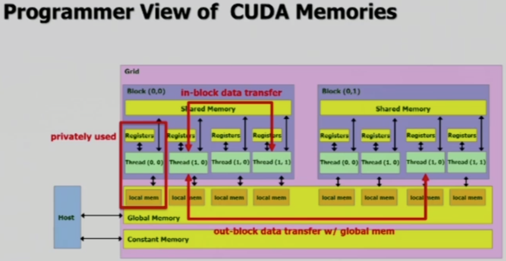

**Thread 별로 register를 할당 받아서 작업**을 진행하게 되는데, **만약 처리해야 할 작업이 배열과 같이 사이즈가 클 경우 local memory를 사용**하게 됩니다. Local memory는 해당 thread에게 private 하게 할당되며, 다른 thread가 사용할 수 없게 됩니다.

만약 **여러 thread가 데이터를 공유**해야 한다면, SM의 shared memory를 사용해야 합니다. Shared memory는 같은 block 내의 모든 thread들이 공유할 수 있습니다.

다른 Block의 thread 간에 같은 데이터를 공유하려면, global memory를 사용해야만 합니다. 하지만 여러 SM을 사용할 수 없는 경우, 혹은 block들 간의 동시성을 보장할 수 없기 때문에 global memory를 통신 목적으로 사용하기는 어렵습니다. 따라서 주로 main memory와 데이터를 한번에 많은 양을 주고 받는 목적으로 사용됩니다.

 

### Shared Memory

Shared memory는 register에 비해 훨씬 큰 용량과 global memory에 비해 훨씬 빠른 속도를 갖고 있으므로 매우 유용합니다. Shared memory를 CPU의 cache와 유사하다 했는데, 정확히 말하자면 **SPRAM(Scratchpad Memory)**라고** 합니다. SPRAM은 일종의 cache memory이며, **real-time calculation**을 지원합니다.

 

### Variable Declarations of CUDA Programming

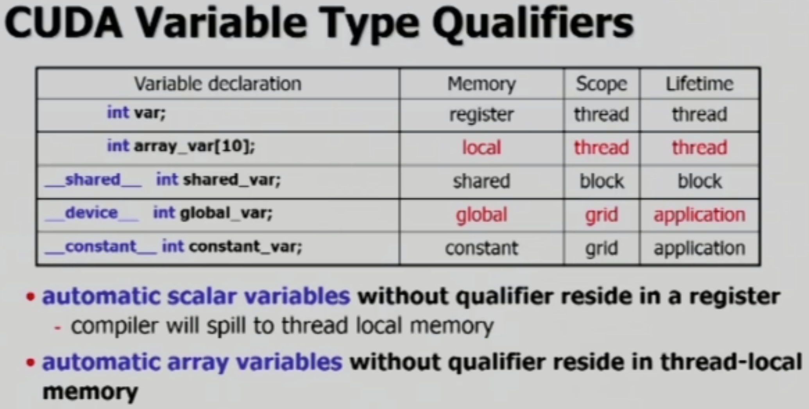

위 표를 봤을 때, 1~2 row에 있는 아무런 declaration 없이 사용하는 변수들의 경우 thread에 할당되며, thread의 life가 끝나면 함께 할당이 해제됩니다. 이러한 automatic scalar variables는 register에 할당되며, 배열인 automatic array variables들의 경우 local memory에 할당됩니다. 위에서 언급한 대로, local memory는 해당 thread 만을 위해 할당되며, 다른 thread의 사용이 불가합니다.

`__shared__`와 같이 특별히 선언하는 변수들은 해당 메모리 영역에 할당되며, 표와 같은 scope를 가집니다.

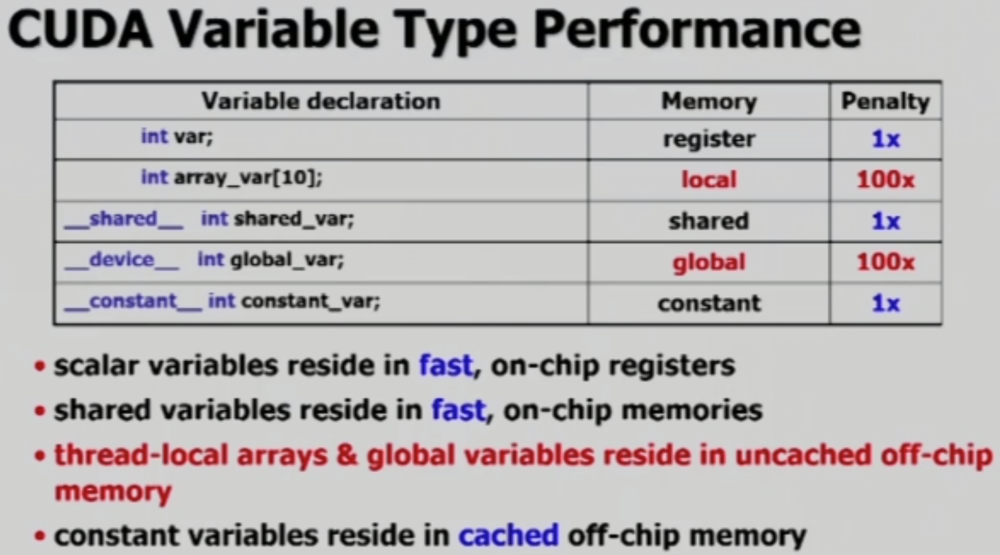

위 표는 각 변수 별 처리 속도를 비교한 내용입니다. 다음 그림은 상황에 따라 변수를 어떻게 선언해야 하는가를 보여줍니다.

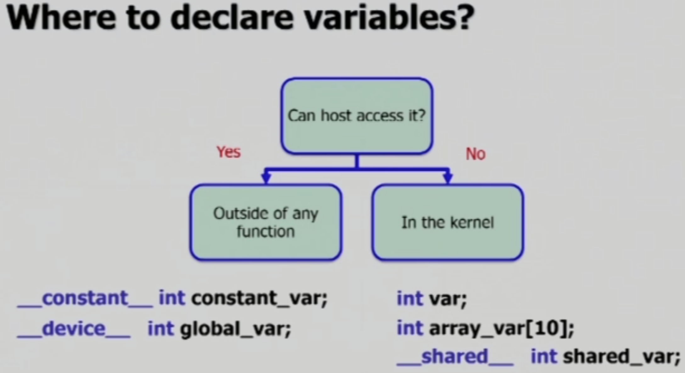

만약 host가 메모리에 접근해야만 하는 내용이라면 kernel 외에 선언하고, 그림의 왼쪽과 같은 형태로 선언해야 합니다. 하지만 그렇지 않은 경우, 오른쪽과 같이 선언하여 private 하게, 혹은 block 내에서만 공유가능하도록 하여 더 빠르게 작업할 수 있도록 합니다.

 

### Code Example

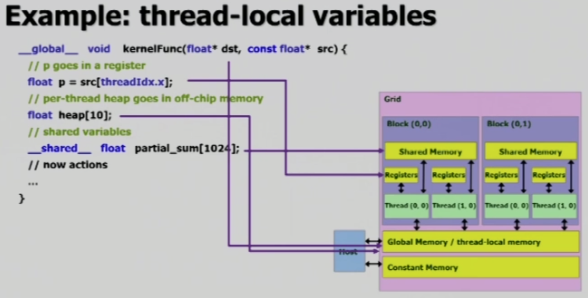

위에서 언급한 대로, 위 두 개 변수들인 automatic scalar variable과 automatic array variable은 각각 register와 local memory로 할당이 됩니다. 그런데 중요한 점은, 코드에 작성한 대로 각각이 하나의 변수로 설정되는게 아닙니다. 만약 어떤 SM이 1024개의 thread를 구동한다고 했을때, 그리고 `p` 혹은 `heap`을 담당하게 될 경우, `p` 혹은 `heap`이 각각 1024개로 **복사되어 각 thread 들에 할당**됩니다. 반면에 `__shared__`로 선언한 경우, **shared memory에 하나**만 복사되어 할당되고, **모든 thread들이 공유**합니다.

  

## Race Condition, 경쟁 상태

Race condition에 대한 문제는 여러 thread들이 동일 데이터에 대해 작업을 할 때 발생합니다. 실제로 어떤 thread가 먼저 작업을 시작하고, 먼저 종료하는가는 실행할 때 마다 달라집니다. 그리고 작업한 결과 또한 실행할 때 마다 달라집니다. 따라서 작업 순서를 고려하여 예방할 수는 없으며, 다음과 같이 조치할 수 있습니다.

- Barriers
  - shared 변수에 적용
  - e.g., `__syncthreads`
- Atomic operations
  - shared/global 변수에 적용
  - e.g, `atomicAdd`

 

### Barrier Synchronization

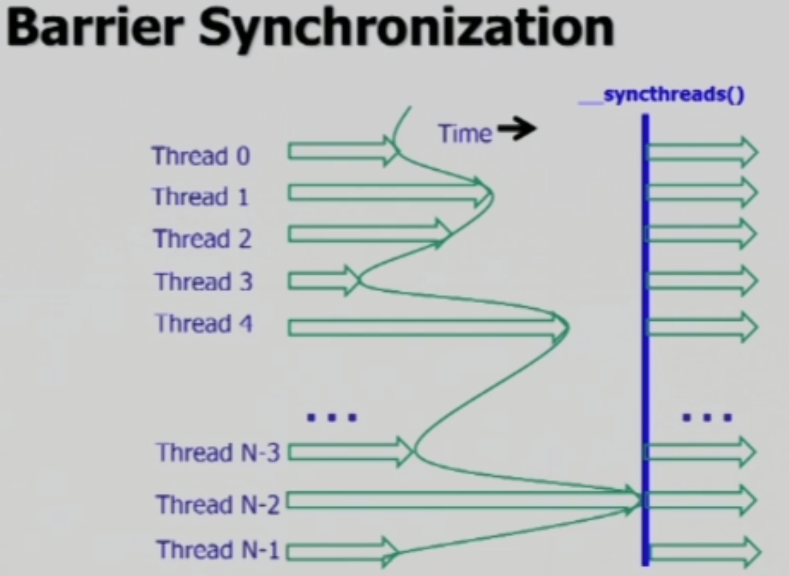

`__syncthreads()`는 CUDA의 API function입니다. 만약 실행 코드 뒤에 `__syncthreads()`가 선언되어 있을 경우, block 내의 모든 thread들이 실행 종료될 때 까지 다음 작업을 실행하지 않습니다. 그리고 모든 작업이 완료되면, 다음 작업을 일괄적으로 시작합니다.

이는 **tiled algorithms를 다룰 때 굉장히 효율적**입니다. 필요한 부분의 예로, 다음을 들 수 있습니다.

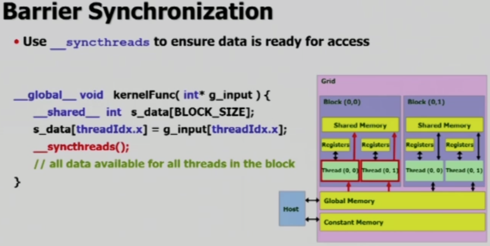

위 코드는 global memory의 데이터를 shared memory로 옮기는 작업을 합니다. 만약 `__syncthreads()`가 없을 경우, 작업이 일찍 끝난 thread가 아직 데이터 load가 완료되지 않은 배열을 사용하여 다음 작업을 시작할 수 있습니다. 따라서 barrier synchronization을 이용하여 완전한 배열이 완성된 후 작업을 일괄적으로 시작하도록 합니다.

물론 일찍 끝난 thread들이 대기하게 되므로 program speed가 낮아지는 단점이 있으며, 잘 못 사용할 경우 dead lock까지 유발할 수 있습니다. 따라서 꼭 필요한 만큼만, 최소한의 개수로 사용해야 합니다.

  

## Examples

### Adjacent Difference

만약 global memory에 저장된 어떤 배열의 인접한 두 원소의 차이를 구하는 작업을 한다고 해 보겠습니다.

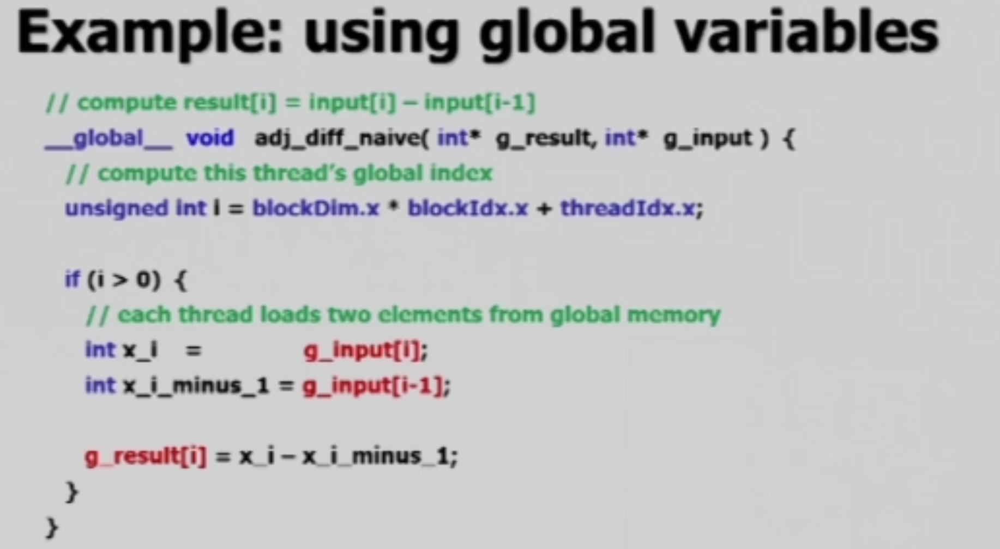

위 코드는 global memory를 두 번 access하고 load 합니다. 이는 200 cycle을 요구하는 큰 작업입니다. 그런데 global memory의 데이터를 shared memory로 옮겨온 뒤, 실제로 차이를 구하는 작업은 shared memory를 사용할 경우 훨씬 빠르게 작업할 수 있습니다.

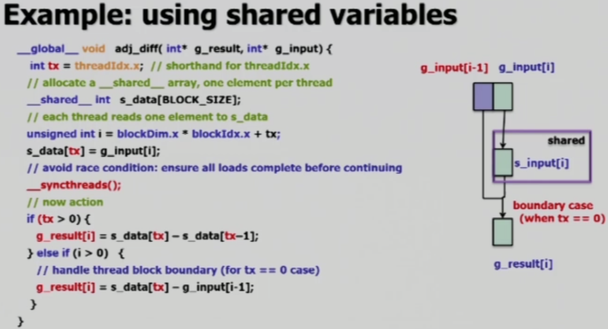

Global memory의 경우 2 회 access, load 하는 동안 200 cycle을 사용하지만, shared memory로 옮겨와서 작업할 경우 100 + 5 * 2 cycle로 작업할 수 있습니다.

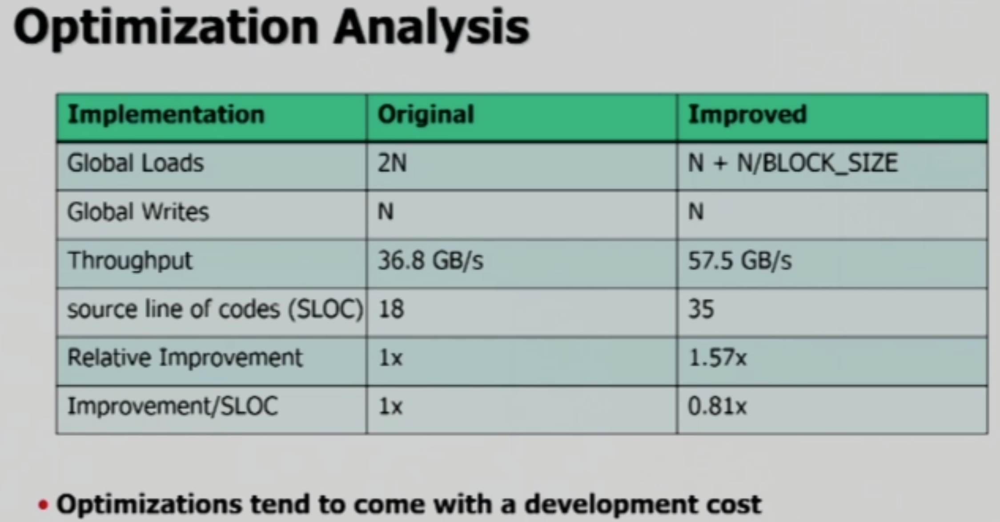

위 표는 해당 작업 전후의 성능을 비교한 내용입니다. 요약하자면, 1.57배 향상된 성능을 보이지만, code 수가 올라가고 복잡한 코드가 필요해서 개발이 어려워집니다.

 

### Dynamic Allocation of Shared Memory

Shared memory의 크기를 compile time이 아닌, execution time에 정의할 수 있습니다.

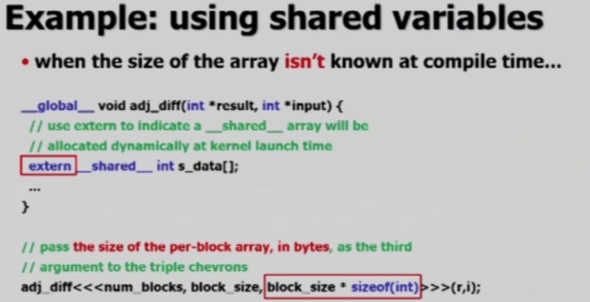

`extern`을 사용하여 외부에서 지정하도록 하고, kernel function 실행 시 `block_size * sizeof(int)`를 추가적으로 기입하여 전체 크기를 알려줍니다.