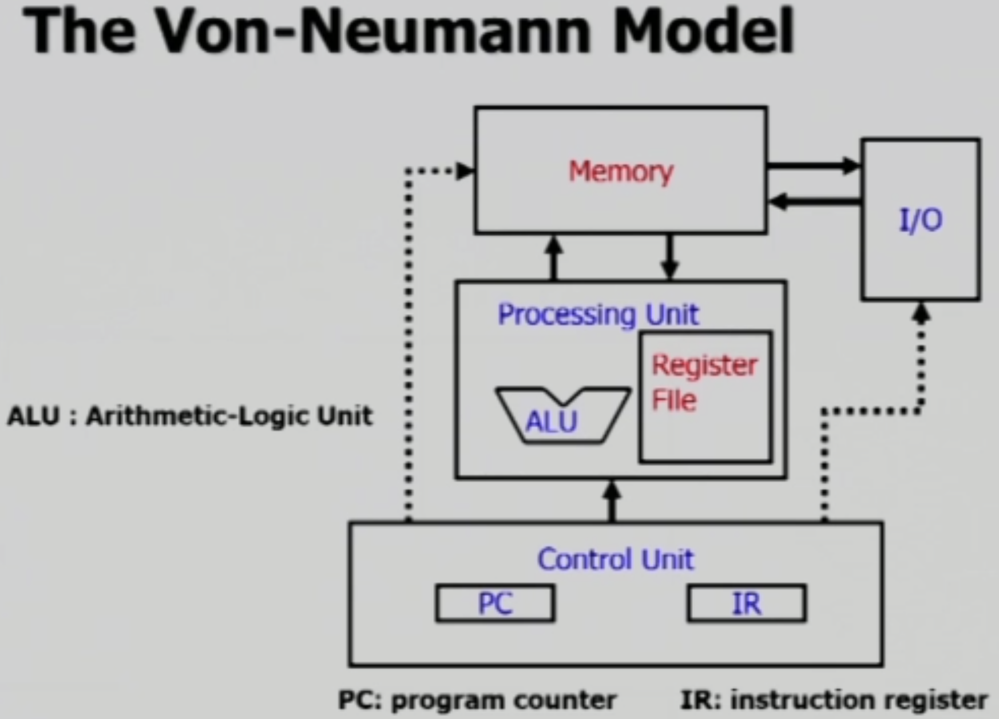
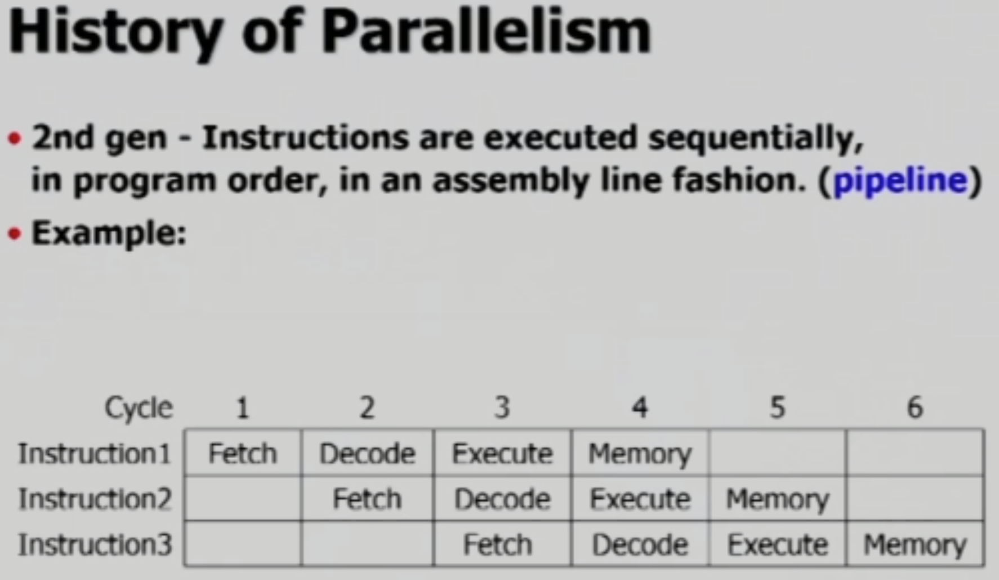
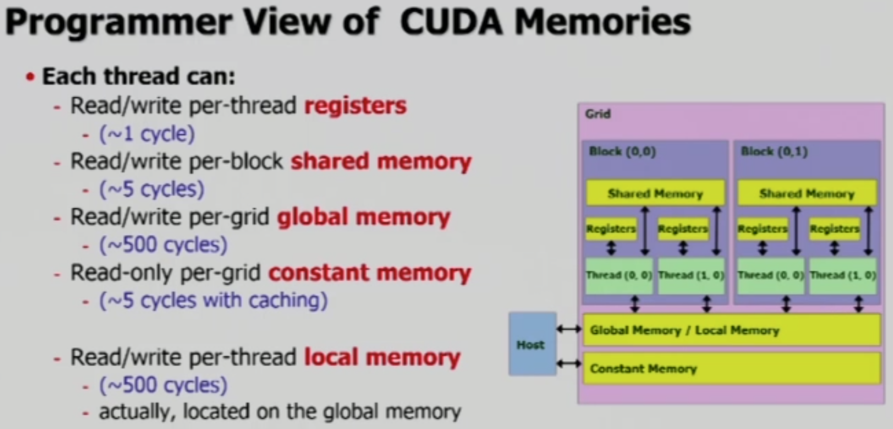
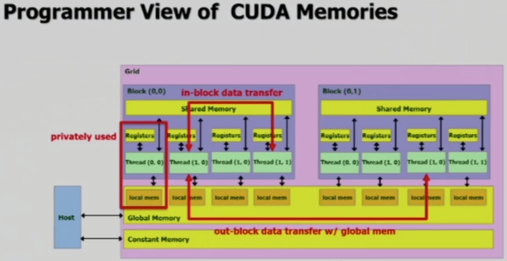
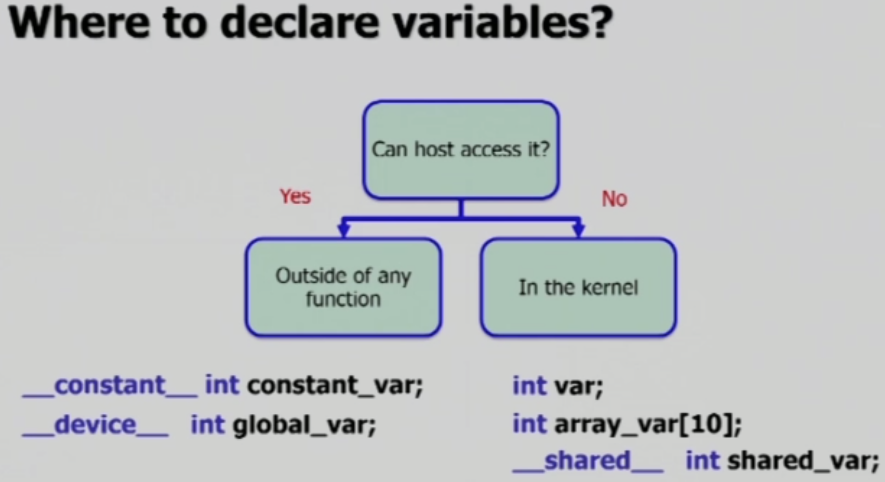

# Memory Hierarchy

GPU의 processor 또한 CPU의 processor와 유사한 구조를 가지고 있습니다.

 

## CPU Architecture

CPU는 Von-Neumann 모델을 사용하는 구조입니다.

계산을 담당하는 Processing Unit이 있지만, 실질적으로 CPU를 조작하고 작동시키는 작업은 Control Unit이 담당합니다.

 

### Instruction Cycles

CPU가 Instruction을 수행할 때에는 3, 혹은 4개의 단계를 거칩니다.

- **Fetch**
  - Memory로 부터 instruction을 가져와서 IR(Instruction Register)에 저장
  - 경우에 따라 data를 함께 가져오기도 한다.
- **Decode**
  - IR의 instruction이 어떤 작업을 지시하는가를 해석
- **Execute**
  - ALU를 사용하여 계산하고, register에 저장
- (optional) **Memory Store**
  - (필요시) 계산 결과를 memory에 저장
- Instruction 예시
  - Only Register Instruction
    - 적은 용량, 빠른 속도
    - 1 clock per instruction
    - 1K registers per CPU
    - `ADD`
  - use Memory Store
    - 큰 용량, 느린 속도
    - 100 clocks per read/write
    - 8G bytes 이상 per CPU
    - `LDR`
    - `STR`
  - Cotrol Flow Instruction
    - `BRp` - PC에게 Instruction을 수정하도록

 

### CPU Parallelism 1st, 2nd gen

1세대 CPU에서는 병행 처리가 불가하던 시절에는 위 그림과 같이 **한 cycle에 하나의 instruction**을 수행했습니다.

2세대 CPU는 위와 같이 **Pipelining**이 가능합니다.

 

### CPU Parallelism 3rd gen

3세대 CPU는 Parallelizable한 상황(독립적인 계산)들에 대해 추가적인 병렬 처리를 합니다. 병렬 처리를 하는 방법으로는 두 가지가 있습니다.

- Superscalar
  - Pipeline을 n 개 사용하는 방법(multiple pipelines)
  - n-way superscalar processor

- VLIW(Very Long Instruction Word)
  - 진행하던 중 함께 사용해도 될 명령어들을 한 번에 계산하는 방법
  - `+`, `-`, `*`, `/`를 담당하는 ALU들을 동시에 사용(이전에는 한 cycle에 하나씩)
  - AMD CPU에서 사용중
  - Compiler가 많은 일을 해야 하는 단점

  

## CUDA Memory

크게 봤을 때, CUDA Memory는 register, shared memory, global memory 총 세 가지로 구분됩니다. Shared memory는 register와 global memory 사이의 cache 역할을 합니다.

Global memory는 VRAM에 위치하며, global memory는 그 일부를 다른 용도로 사용하게 됩니다. **Constant memory**의 경우 global memory와 동일한 구조이지만, cache를 붙여 빠른 속도로 read 작업을 수행합니다. **오직 read만 가능**합니다. **Local memory**의 경우 global memory의 일부를 **특정 thread에게만 할당**해 줌으로서, register에 담기 어려운 큰 데이터를 저장할 수 있도록 합니다. 두 메모리 모두 global memory의 일부이므로 VRAM이 맞습니다.

### Thread의 메모리

**Thread 별로 register를 할당 받아서 작업**을 진행하게 되는데, **만약 처리해야 할 작업이 배열과 같이 사이즈가 클 경우 local memory를 사용**하게 됩니다. Local memory는 해당 thread에게 private 하게 할당되며, 다른 thread가 사용할 수 없게 됩니다.

만약 **여러 thread가 데이터를 공유**해야 한다면, SM의 shared memory를 사용해야 합니다. Shared memory는 같은 block 내의 모든 thread들이 공유할 수 있습니다.

다른 Block의 thread 간에 같은 데이터를 공유하려면, global memory를 사용해야만 합니다. 하지만 여러 SM을 사용할 수 없는 경우, 혹은 block들 간의 동시성을 보장할 수 없기 때문에 global memory를 통신 목적으로 사용하기는 어렵습니다. 따라서 주로 main memory와 데이터를 한번에 많은 양을 주고 받는 목적으로 사용됩니다.

 

### Shared Memory

Shared memory는 register에 비해 훨씬 큰 용량과 global memory에 비해 훨씬 빠른 속도를 갖고 있으므로 매우 유용합니다. Shared memory를 CPU의 cache와 유사하다 했는데, 정확히 말하자면 **SPRAM(Scratchpad Memory)**라고** 합니다. SPRAM은 일종의 cache memory이며, **real-time calculation**을 지원합니다.

 

### Variable Declarations of CUDA Programming

위 표를 봤을 때, 1~2 row에 있는 아무런 declaration 없이 사용하는 변수들의 경우 thread에 할당되며, thread의 life가 끝나면 함께 할당이 해제됩니다. 위에서 언급했듯이, register에 할당되며, 배열의 경우 local memory에 할당됩니다. Local memory는 해당 thread 만을 위해 할당되며, 다른 thread의 사용이 불가합니다.

`__shared__`와 같이 특별히 선언하는 변수들은 해당 메모리 영역에 할당되며, 표와 같은 scope를 가집니다.

위 표는 각 변수 별 처리 속도를 비교한 내용입니다. 다음 그림은 상황에 따라 변수를 어떻게 선언해야 하는가를 보여줍니다.

만약 host가 메모리에 접근해야만 하는 내용이라면 kernel 외에 선언하고, 그림의 왼쪽과 같은 형태로 선언해야 합니다. 하지만 그렇지 않은 경우, 오른쪽과 같이 선언하여 private 하게, 혹은 block 내에서만 공유가능하도록 하여 더 빠르게 작업할 수 있도록 합니다.