# Tiled-MatMul via Shared Memory

## Using Global Memory

우선 global memory를 사용한 matrix multiplication을 다시 한번 보자면, 다음과 같습니다.

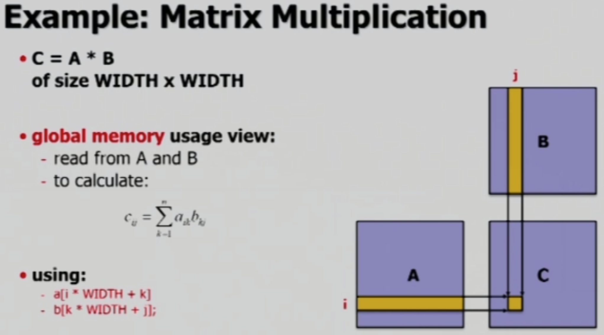

하나의 thread가 하나의 dot product 계산을 수행하게 됩니다.

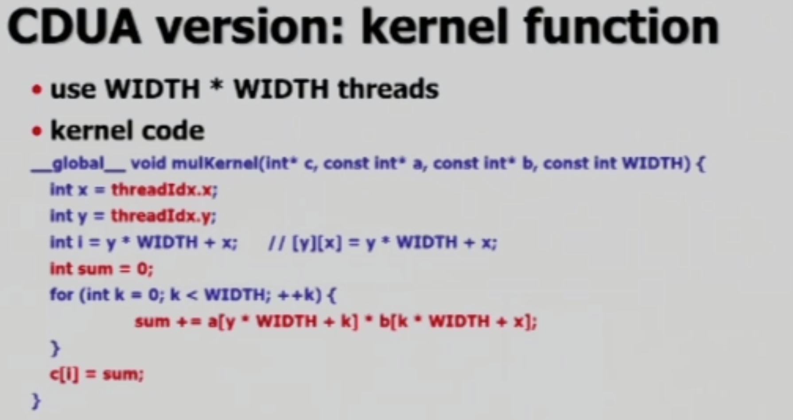

 

### Tiled Matrix Multiplication

규모가 큰 행렬의 경우 하나의 block이 처리할 수 없으므로, block들이 행렬을 나누어서 처리합니다.

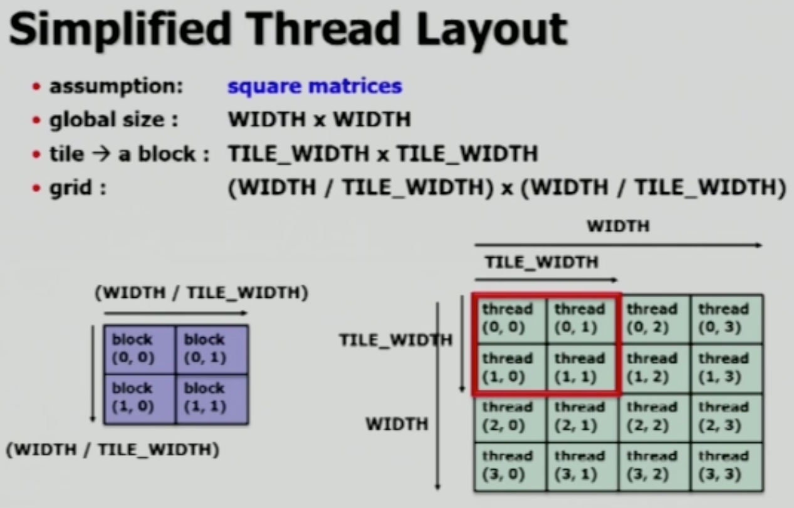

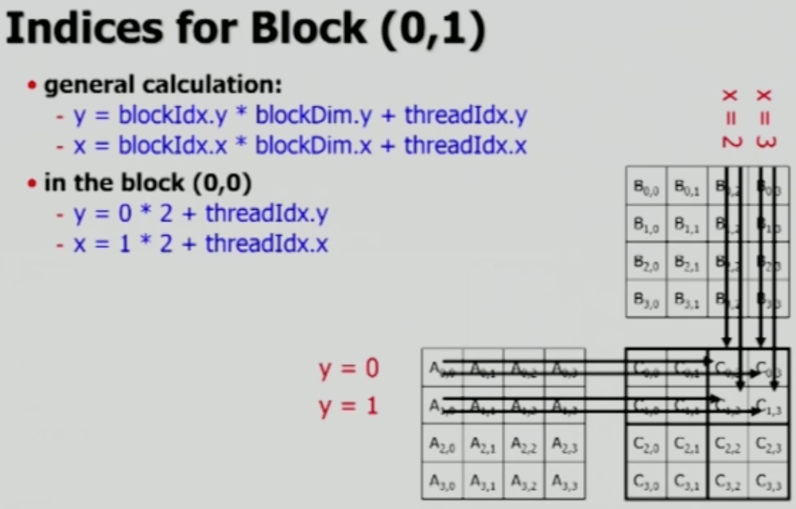

  

## Using Shared Memory

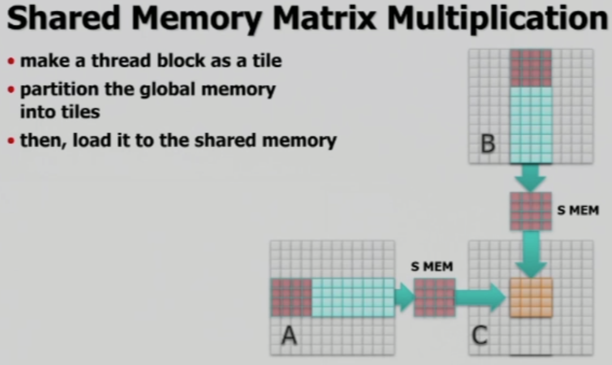

Global memory의 일부 데이터를 tile 단위로 shared memory로 load하고, shared memory의 데이터만을 이용해서 matrix multiplication의 일부 작업을 수행합니다. 그런데 shared memory는 저장할 수 있는 메모리 공간이 작기 때문에, 위 그림과 같이 행과 열 전체를 load할 수 없습니다. 따라서 아래와 같이 **input matrix들 또한 tiling하여 일부만을 load**하게 됩니다.

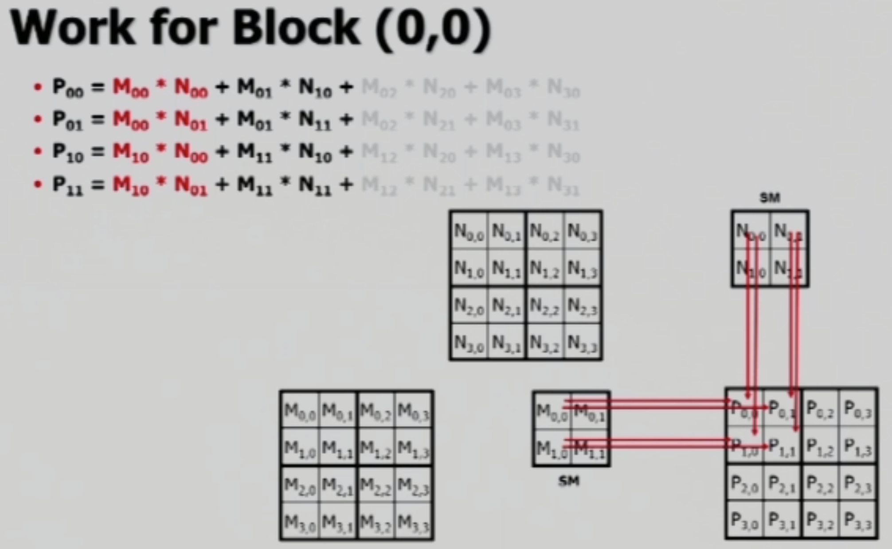

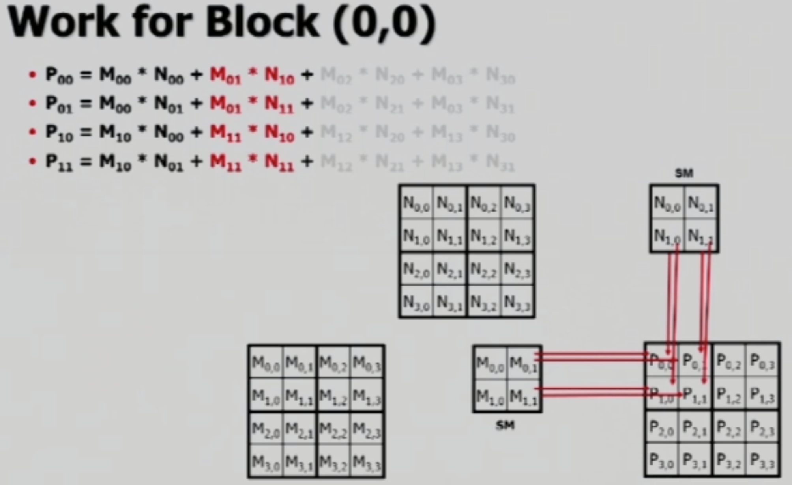

먼저 tiling 된 $P$ 행렬의 tile 하나를 계산하는데 필요한 row와 column에 대해, $M$과 $N$ 행렬의 tile들을 가져옵니다. $M$, $N$, $P$ 행렬들 모두 같은 사이즈의 tile을 사용하며, 위 그림과 같이 연산할 경우, 결과값을 저장하는 행렬 $P$의 요소들인 $P_{00}$, $P_{01}$, $P_{10}$, $P_{11}$ 을 **일부** 계산하게 됩니다. Tile들을 가져오는 순서는 $M$ 행렬의 경우 왼쪽에서 오른쪽, $N$ 행렬의 경우 위에서 아래쪽으로 가져오며 필요한 계산들을 마무리하게 됩니다.

위 그림들의 두 과정을 인덱싱으로 표현하면 아래 그림들로 표현됩니다.

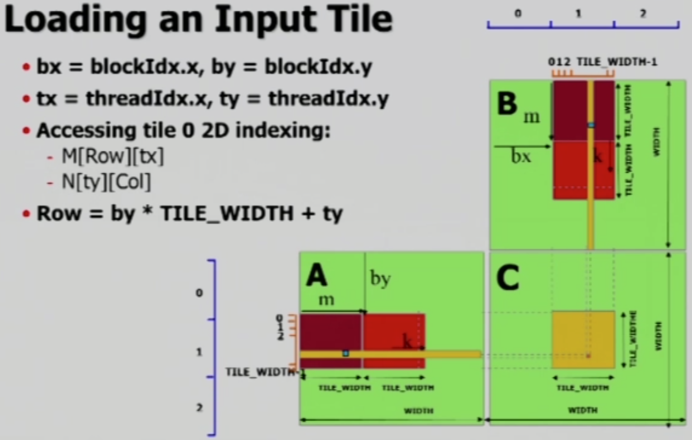 

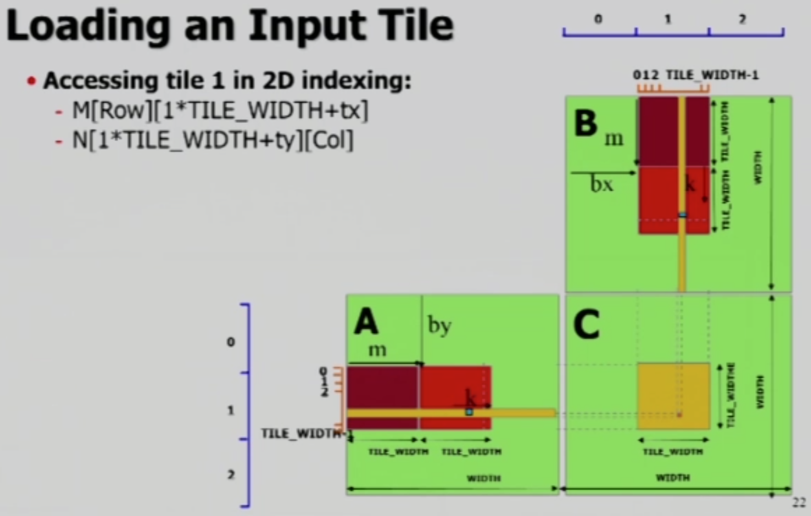

이를 일반화하여, `m` 번째 타일에 대해 표현하면 다음과 같습니다.

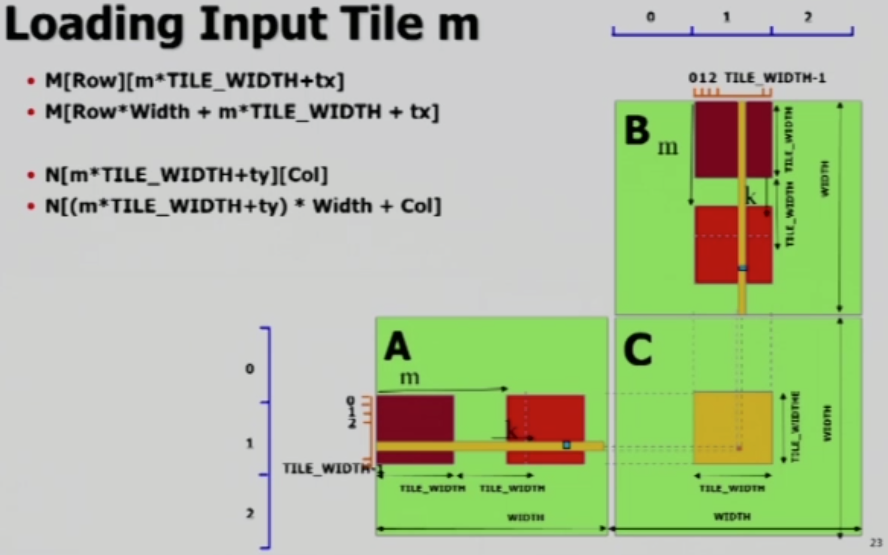

 

### Effect of Using Shared Memory

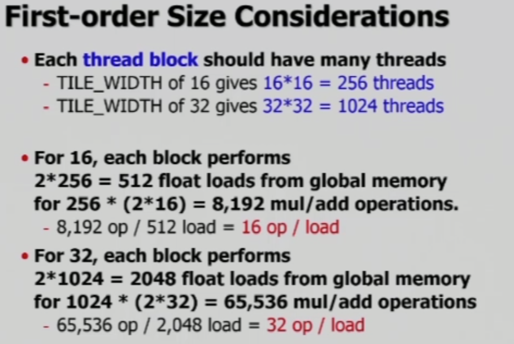

Pascal Architecture의 경우 block 당 최대 1024개의 thread를 가질 수 있으므로, 현재 사용할 수 있는 **tile의 최대 크기는 32**입니다.

위 그림의 내용은, 만약 16의 size를 선택할 경우 두 행렬($M$, $N$)로 부터 각각 256 개씩, 총 512개의 float 값을 load하게 됩니다. 그리고 행렬곱 계산시 각 행과 열은 16개씩 존재하며, 곱한 후 더하는 연산을 수행하게 되므로, 결과값을 저장하는 행렬($P$)의 256개 요소에 대해 32(곱한 후 총합 계산 = 2 * 16)회의 연산을 수행하게 됩니다. 이렇게 수행한 행렬곱 연산과 load 작업의 비율을 계산해 보면, `16op per load` 만큼의 효율을 얻음을 알 수 있습니다.

 

### Restriction of Using Shared Memory

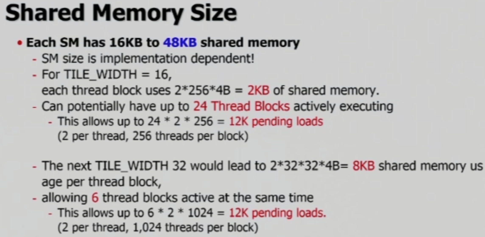

Tile size가 커질 수록 효율은 높아지게 되지만, shared memory의 용량, register의 개수 등의 제약이 존재합니다.

Pascal Architecture의 경우, 하나의 SM은 최대 48KB의 shared memory를 갖고 있습니다. 그리고 16의 tile size를 사용할 경우 thread block 별로 2KB의 shared memory가 필요하므로,  동시에 24개의 thread block을 실행할 수 있습니다. 계산해 보면, `24 * 2 * 256`인 `12K`의 load 작업이 수행되는데, `2` 는 `read/write`를 의미하고, `256`은 thread block의 thread 개수를 의미합니다.

그런데 Tile size를 32로 높힌다고 해도 가능한 load 횟수는 늘어나지 않습니다. 왜냐하면 최대 사용량인 48K는 유지되지만 thread block의 size는 커지기 때문입니다. 가용 thread block의 개수는 6개로 줄어들게 되고, pending loads는 같게 됩니다.

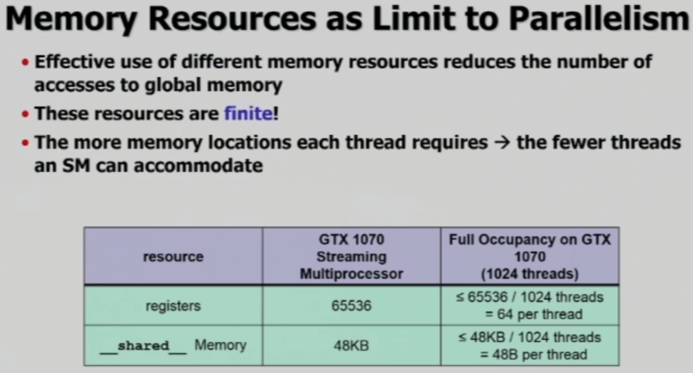

위 그림을 보면, 해당 GPU의 경우 하나의 thread 당 64개의 register를 사용할 수 있으며, 48 Byte의 shared memory 공간을 사용할 수 있음을 알 수 있습니다.

 

### Kernel Code

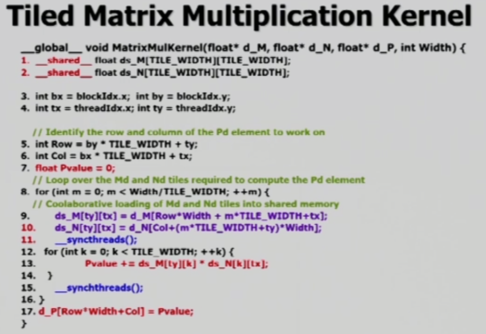

위 코드는 2중 for문을 사용하여 계산을 합니다.

- 바깥 for문

  Global memory에 위치한 데이터를 tile 크기 만큼 shared memory로 load

- 안쪽 for문

  Tiled data들에 대해 matmul을 진행

