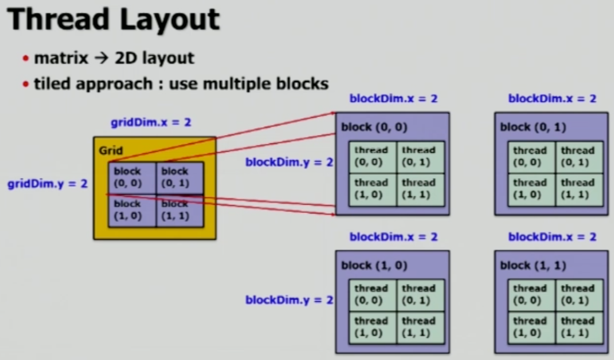
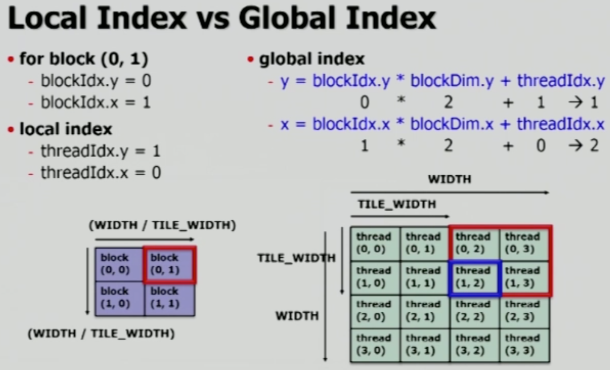
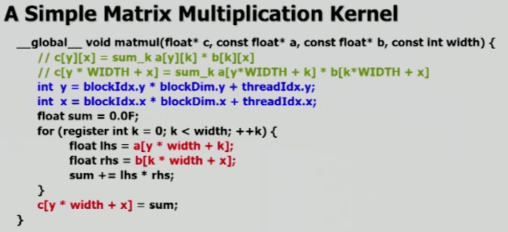

# Tiled Matrix Multiplication

- __Tiling__: 전체 thread block을 하나로 사용하는 것이 아니라, 이를 여러 개의 block들로 나누는 것
- __Tiled matrix multiplication__: Tiled grid 내부의 block들 별 local index를 global index로 변경하고, 이를 이용하여 계산하는 방법

  

## Tiling이 필요한 이유

GPU Architecture는 **여러 개의 SM**들로 이루어져 있으며, SM들은 **여러 개의 block**들로 구성됩니다.

SM을 간단히 설명하자면, CPU는 하나의 작업에 대해 하나의 SM에게 일을 할당하게 됩니다. 서로 다른 SM들은 각기 다른 작업을 하게 되며, 각각 SM들과 block들은 GPU Architecture 마다 사용 가능한 thread 개수가 다릅니다.

그런데, GPU 별로 하나의 thread block에 포함될 수 있는 thread 개수가 매우 제한적이며, 매우 큰 행렬을 계산할 때에는 하나의 thread block으로 모두 표현할 수 없게 됩니다. 즉, 정말 큰 규모의 행렬을 계산하려면, **SM을 최대한으로 활용하기 위해 적절한 크기의 block들을 구성**해야 합니다.

 

### Tiling example

아래 그림들에서 사용할 `grid`는 사용하는 모든 thread block들을 의미하며, `gridDim`은 thread block의 개수입니다.

위 그림은 하나의 thread block을 사용하는 grid를 나타낸 것이며, 아래 그림은 __tiled approach__를 이용하여 위에서 언급한 문제를 해결하는 것입니다.

위 그림과 같이, 여러개의 thread block들을 사용하게 되며, 이를 보기 쉽게 펼치면 아래 그림과 같습니다.

그림에서의 빨간색 영역이 thread block, 그리고 tile 하나를 의미합니다.

  

## Indexing and Code

### Indexing of Grid

`(0, 1)`의 인덱스를 가진 block, 해당 block 내에서 `(1, 0)`의 인덱스를 가진 thread는 오른쪽 아래 그림의 파란색 thread를 의미합니다. Global index는 전체 grid를 하나의 matrix로 봤을 때, 해당 thread의 index를 의미합니다.

위 그림의 (0, 1) block은 아래 그림과 같이 `A` 행렬의 `0`, `1` row, 그리고 `B` 행렬의 `2`, `3` column 만을 사용하여 값을 계산하게 됩니다.

 

### Code

주석처리 된 것은 일반적인 Matrix Multiplication의 내용이며, 달라지는 것은 indexing을 보다 세부적으로 진행하는 과정입니다.

