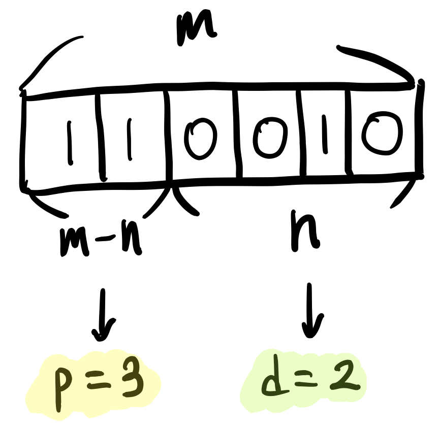
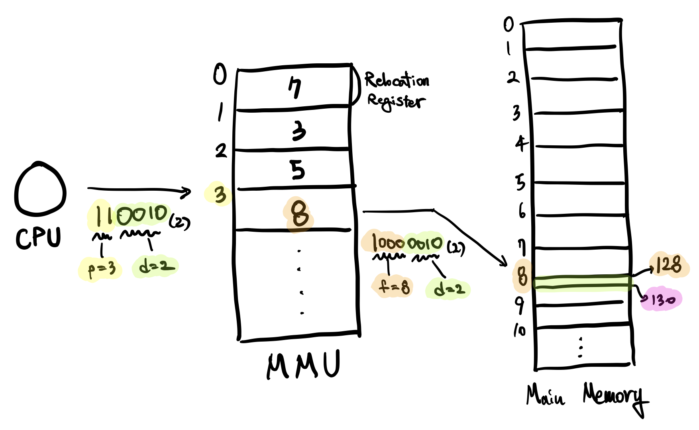

# 4-5. 페이징, Paging

프로세스와 메모리 공간을 **일정 크기**로 잘라서 관리합니다. 프로세스를 나누는 단위를 **페이지(Page)**라고 하며, 메모리 공간을 나누는 단위를 **프레임(Frame)**이라고 합니다. **페이지와 프레임의 크기**는 같으며, 페이지를 프레임에 할당하게 됩니다.

페이지를 프레임에 할당하는 작업에 있어서, 이전 4-2-3에서 언급했었던 MMU의 **Relocation Register**가 중요한 역할을 합니다. 프로세스의 각 페이지들은 각각의 Relocation Register를 통과하여 각각의 프레임 주소로 할당됩니다. 여기서 MMU는 여러 Relocation Register들이 합쳐진 **페이지 테이블(Page Table)**이 됩니다.

 

## 4-5-1. 주소 변환, Address Translation

CPU는 메인 메모리로 논리 주소(Logical Address)를 전송하는데, 전송하는 과정에 MMU를 거치면서 물리 주소(Physical Address)로 변환됩니다.

 

### 주소의 구성

주소는 두 부분으로 구성됩니다.

- `p`
  - 페이지 테이블의 번호
- `d`
  - 변위, Displacement
  - 오프셋, Offset

 

### `p`와 `d`의 크기

CPU가 보내는 주소를 2진수로 표현했을 때, 이는 총 `m` bit 입니다. 그 중 하위에 존재하는 `n` bit는 `d`(Displacement) 역할을 하며, 주소 상위의 `m-n` bit는 `p`(페이지 번호) 역할을 합니다.

 

### 예시

- 가정
  - 페이지 크기 = 16 Byte
  - 논리 주소 = 50

16 = 2^4이므로, `n = 4`입니다. 만약 페이지 크기가 10 KB라면 `n` 값은 `10`입니다.

CPU에서 전송한 주소는 50이며, 50을 이진수로 표기하면 `110010`(이진수)입니다. 따라서 `n` 개의 이진수로 표시되는 `d` 값은 `0010`(이진수)이며, `m-n` 개의 이진수로 표시되는 `p` 값은 `11`(이진수)인 `3`(10진수)입니다.

`p` 값은 페이지 테이블의 주소값이며, 페이지 테이블 주소의 값으로 변환됩니다. `p`로 부터 변환된 `f` 값은 `8`이며, 물리적 주소는 `10000010`(이진수)가 됩니다. 물리적 주소는 `d`와 `p`를 분리하여 계산하지 않으며, 해당 값의 주소인 `130`으로 직접 접근합니다.

