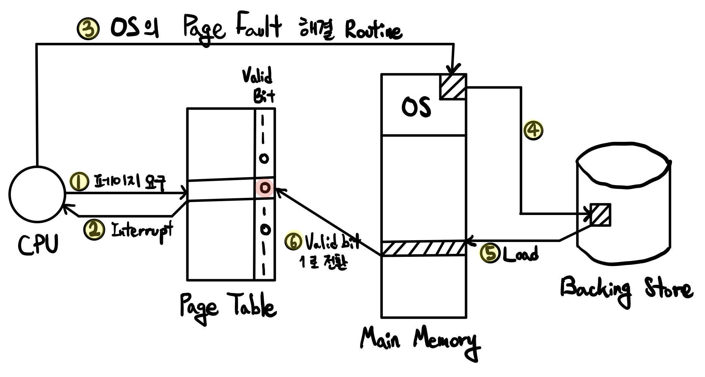

# 5-1. 가상 메모리, Virtual Memory

만약 실제로 우리가 보유하고 있는 물리 메모리 보다 크기가 큰 프로세스를 실행하면 어떻게 될까요?

우리는 가상 메모리를 통해 아주 큰 프로그램도 실행할 수 있습니다. 프로세스 이미지를 모두 메인 메모리에 적재하는 것이 아니라, **현재 실행하는 데에 필요한 이미지 만을 메모리에 부분적으로 로드**할 수 있습니다.

현재의 실행에 필요하지 않은 메모리로는 오류 처리, 일부 데이터 등이 있을 수 있습니다. 만약 프로그램이 워드프로세스라면, 정렬이나 표와 같은 기능들은 실행되지 않을 가능성 또한 있습니다. 이는 앞서 배웠던 4-3-1의 동적 적재(Dynamic Loading)와 비슷한 개념입니다.

<br>

<br>

## 5-1-1. 요구 페이징, Demand Paging

요구 페이징이란, 당장 요구되는, 당장 필요한 페이지만을 로드하는 페이징 방법입니다. 당장 필요하지 않은 페이지들은 Backing Store(=Swap Device)에 저장되어 있으며, 필요시 마다 로드합니다.

<br>

### Valid Bit

요구 페이징을 구현하기 위해서는 현재 작업하고자 하는 프로세스의 페이지가 로드 되어 있는지, 혹은 앞으로 로드해야 하는지를 확인할 수 있어야 합니다. 이를 위해 MMU에 Valid bit를 추가합니다. Valid bit는 현재 로드되어 있는 프로세스 페이지는 `1`, backing store에 있는 페이지는 `0`으로 표현합니다.

<br>

### 페이지 결함, Page Fault

현재 접근하려는 페이지가 메모리에 없는 상태(Invalid)이자, valid bit가 `0`인 상황입니다.

<br>

### 요구 페이징의 과정



<br>

### Pure Demand Paging

프로그램을 로드하는 순간 부터 페이지 결함을 발생시킵니다. 즉, 프로그램을 로드하는 작업을 제외하면 특정 페이지를 요청하기 전 까지 아무런 페이지도 로드해 놓지 않습니다.

정말 필요로 하는 페이지들 만을 로드하기 때문에 메모리를 꼭 필요한 만큼만 사용합니다. 하지만, 모든 작업을 수행하며 페이지 결함이 발생하고, 새 페이지를 로드하는 작업이 필요하기 때문에 작업 속도가 느려집니다. 주의할 점은 I/O는 CPU의 작업 속도에 비해 매우 느리므로, backing store를 자주 조작하는 pure demand paging은 더욱 느릴 수 밖에 없습니다.

<br>

### Prepaging

프로그램 제작자가 미리 필요한 페이지들을 선정하여 자동으로 로드되게끔 합니다.

<br>

### 유효 접근 시간, Effective Access Time

유효 접근 시간이란, 평균적인 접근 시간을 말합니다.

- `p`: Page fault rate
- `Tm`: 메모리를 읽는 시간
- `Tp`: 페이지 결함 시 소요되는 시간
  - Seek time: 목표 track으로 header를 움직이는 시간
  - Rotational delay: 디스크가 회전하며 자기 신호(Data)를 생성하는 시간
  - Transfer: 데이터를 전송하는데 걸리는 시간

```
Teff = (1-p)Tm + pTp
```

`p = 0.001`일 때 `Teff = 8.2 usec` 이며, 이는 결함이 없는 경우 보다 약 40배 느립니다.

`p = 1 / 40만`일 경우 `Teff = 220nsec` 이며, 이는 40만 회에 결함이 1회 발생하는 경우로, 결함이 없을 때 보다 10% 느립니다.

이렇듯 한 번 결함이 발생하는 것 조차 처리 속도에 큰 영향을 미치게 됩니다.

<br>

### 지역성의 원리, Locality of Reference

메모리의 접근은 **시간적, 공간적 지역성**을 가집니다.

**보통 한 번 실행됐던 메모리의 내용이 그렇지 않은 메모리 보다 더 자주 사용**되며, 페이지 로드 시 **Block 단위로 로드**하므로, **주변의 내용도 같이 로드**됩니다. 따라서 실제로 페이지 부재 확률은 매우 낮습니다.

<br>

### 기타 해결 방안

HDD는 접근 시간이 너무 오래 걸리므로, SSD(Solid State Disk) 혹은 저가형 DRAM을 Swap device로 사용하면 보다 빠르게 작업할 수 있다.

