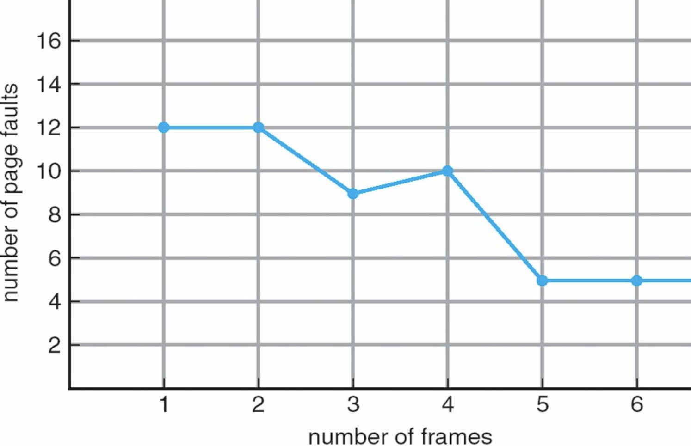



# 5-2. 페이지 교체, Page Replacement

아무리 필요한 페이지만을 메인 메모리에 로드하더라도, 언젠가는 메모리가 가득 차게 됩니다. 메모리가 가득 찬 상황이며, 추가적인 페이지를 메모리로 로드하고자 한다면, 로드 되어 있는 페이지를 backing store로 보내버린 후, 새로 사용할 페이지를 만들어 낸 빈 메모리 공간에 로드해야 합니다.

여기서 backing store로 페이지를 보내버리는 작업을 **Page-out**이라고 하며, 로드해 오는 작업을 **Page-in**이라고 합니다. 그리고 backing store로 보내지는 페이지를 **Victim Page**라고 부릅니다.

<br>

## 5-2-1. Victim Page

CPU는 어떤 페이지를 backing store로 보내야 효율적으로 작업할 수 있을 지 결정해야 합니다. 여기서 중요한 것은 최대한 **수정되지 않은 페이지를 Victim Page로 선정하는 것**입니다.

만약 메모리로 로드하기 이전과 비교했을 때 아무런 수정이 이루어지지 않은 파일을 backing store로 page-out하게 되면, backing store 내부에서 writing 할 일이 없습니다. 우리가 생각해야 할 것은 **I/O의 작업 처리 속도는 CPU의 속도 보다 매우 느리다**는 것입니다. 만약 수정이 이루어진 페이지라면, 해당 페이지의 수정 내용을 I/O 내부적으로 적용하는 작업이 필요하기 때문에 수정되지 않은 페이지를 page-out 하는 것이 효율적입니다.

<br>

### Modified Bit

페이지가 수정됐는지, 수정되지 않았는지 판단하는 작업은 또 다시 MMU가 수행해 줍니다. 5-1-1의 Valid Bit과 같이 **Modified Bit**을 설정하여 수정 여부를 표시합니다. 과거에는 **Dirty Bit**이라고 불렸습니다.

| Frame Number | Valid Bit | Modified Bit |
| ------------ | --------- | ------------ |
| 6            | 1         | 0            |
| 5            | 1         | 1            |

위의 표가 MMU의 일부라고 했을 때, 첫 번째 행의 Relocation Register는 6번 Frame으로 주소를 변환 시킵니다. 현재 Main Memory에 존재하고 있으며, 수정되지 않아 Backing Store의 Load 이전의 내용과 동일합니다.

하지만 두 번째 행의 재배치 레지스터의 경우 메인 메모리에 존재하지만, 수정되어 있어 Page-out 시 writing 작업이 필요합니다.

<br>

<br>

## 5-2-2. 페이지 교체 알고리즘, Page Replacement Algorithms

여러 페이지들 중 어떤 페이지를 Victim Page로 설정하는가에 대한 방법들입니다. 페이지 교체 알고리즘들을 알아보기에 앞서, 각 알고리즘들이 사용하는 페이지 참조 열(Page Reference String)에 대해 알아보겠습니다.

<br>

### 페이지 참조 열, Page Reference String

MMU는 바이트로 표현되는 논리 주소로 부터 필요한 페이지가 무엇인지 알아내야 하며, 그 과정은 다음과 같습니다.

`논리 주소 -> 페이지 번호 -> 페이지 참조 열`

페이지 사이즈가 100 byte이며, CPU가 요구하는 주소들이 다음과 같다고 해 봅시다.

```
100, 101, 102, 432, 612, 103, 104, 611, 612
```

페이지 사이즈가 100이므로, 주소들의 페이지 번호는 다음과 같습니다.

```
1, 1, 1, 4, 6, 1, 1, 6, 6
```

지역성의 원리(Locality of Reference)로 인해 100에 해당하는 페이지를 로드할 때에는 199까지의 내용까지 함께 로드 됩니다. 그러므로 101과 102를 요구할 때에는 Page Fault가 발생하지 않으며, 참조해야 하는 페이지의 순서 열이 다음과 같습니다.

```
1, 4, 6, 1, 6
```

<br>

### Replacement 대상

- **Global Replacement**: 메모리 상의 모든 프로세스들의 페이지들을 교체 대상으로 합니다.
- **Local Replacement**: 메모리 상의 모든 프로세스들 중, 자기 자신의 페이지들만을 교체 대상으로 합니다.

<br>

### 페이지 교체 알고리즘의 종류

1. FIFO, First-In First-Out
2. OPT, Optimal
3. LRU, Least-Recently-Used

<br>

### 1) FIFO, First-In First-Out

계속해서 가장 빠른 시점에 로드 됐었던 페이지를 Page-out 합니다. 메모리의 크기가 증가하면 Page Fault가 계속해서 줄어들 것이라 생각되지만, 사실상 **Belady's Anomaly**에 의하면 그렇지 않습니다.

Belady's Anomaly는 FIFO 방식의 페이지 교체 알고리즘을 사용할 때, 프레임의 수(메모리 용량)이 증가하지만, 특정 구간에서 PF(Page Fault) 횟수가 증가하는 현상을 말합니다. 이러한 현상으로 인해 무작정 메모리의 크기를 늘린다고 해서 효율이 줄어드는 효과가 무조건적으로 발생하지는 않습니다.



<br>

### 2) OPT, Optimal

가장 오래동안 사용되지 않을 페이지를 Page-out 합니다. 설명이 다소 이상하게 들리실 수 있습니다. 하지만 말 그대로, 미래까지 예측할 수 있어야 가능한 방법이며, SJF CPU Scheduling Algorithm과 같이 현실적으로 사용기 어렵습니다.

<br>

### 3) LRU, Least-Recently-Used

과거 이력을 봤을 때, 가장 오래동안 사용되지 않은 프로세스를 Page-out 합니다. 이는 최근에 사용되지 않았다면, 나중에도 사용되지 않을 것이라는 예상에 기반을 합니다.

