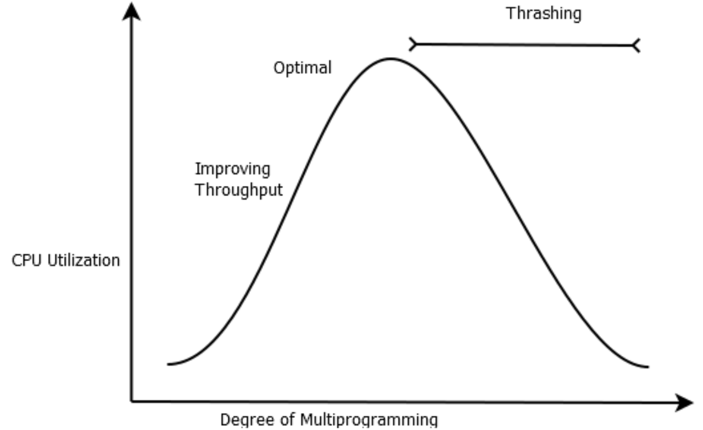
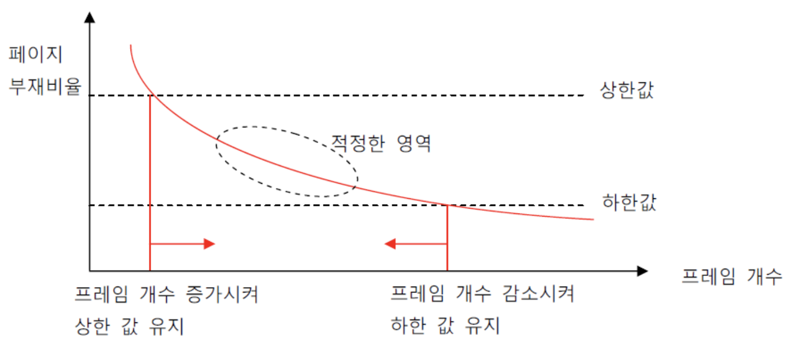

# 5-3. Frames Allocation

CPU Utilization(활용률)과 Degree(차수) of Multi-Programming의 관계에 대해 알아보겠습니다. 다시 말하자면, 메모리에 올리는 프로세스의 개수(동시에 처리하는 개수)가 많아질 수록 CPU의 활용률이 증가하는가에 대해 알아보겠습니다.

<br>

## 5-3-1. 쓰레싱, Thrashing

얉게 생각해 보자면, 동시에 여러 프로세스를 처리할 수록 CPU를 많이 사용하는 것이며, 효율적으로 일들을 처리하여 빠르게 작업을 수행할 수 있습니다. 하지만 우리가 사용하는 PC는 그렇지 않습니다. CPU의 작업 처리 속도는 매우 빠르지만, **I/O이자 Backing Store인 하드 디스크의 읽기/쓰기 속도는 비교적 매우 느립니다**. 따라서 페이지 교체가 일어날 경우 작업 속도의 저하를 야기하며, Multi-Programming의 차수가 일정 이상 증가하게 되면 페이지 교체가 너무 빈번하게 일어나게 되어 오히려 작업 속도를 감소됩니다.

**메모리의 크기는 한정**되어 있으며, 멀티 프로그래밍이 활발해질 경우 **프로세스 당 사용할 수 있는 프레임의 개수는 더욱 제한**되므로 페이징 교체의 증가는 막을 수 없습니다. 이러한 이유들로 인해 오히려 CPU Utilization이 감소하는 현상을 **Thrashing**이라고 합니다.



<br>

### 쓰레싱 극복 방법

쓰레싱을 극복하려면 **프로세스 별로 충분한, 그리고 적절한 수의 프레임이 할당되어야 합니다**. 그렇지 않으면, **Context Switching**이 발생할 때 마다 자신에게 필요한 프로세스 페이지들을 로드하기 위해 다른 프로세스의 페이지들을 아웃 시킬 것입니다. 따라서 Global Replacement 보다는 **Local Replacement**가 쓰레싱 극복에 유리합니다.

프로세스 별로 프레임을 할당하는 방법에는 다음과 같은 방법들이 있습니다.

- 정적 할당, Static Allocation
  - 균등 할당, Equal Allocation
  - 비례 할당, Proportional Allocation
- 동적 할당, Dynamic Allocation
  - Working Set Model
  - PFF, Page Fault Frequency

<br>

<br>

## 5-3-2. 정적 할당, Static Allocation

정적 할당은 프로세스를 로드할 때 할당 받을 프레임의 개수를 결정합니다.

<br>

### 균등 할당, Equal Allocation

프로세스의 활용도, 크기와 상관 없이 모든 프로세스들에게 동일한 개수의 프레임을 할당합니다.

<br>

### 비례 할당, Proportional Allocation

프로세스 별로 크기에 비례하여 프레임들을 할당합니다.

```
P1 프레임 = P1 / (P1 + P2 + P3)
P2 프레임 = P2 / (P1 + P2 + P3)
P3 프레임 = P3 / (P1 + P2 + P3)
```

<br>

<br>

## 5-3-3. 동적 할당, Dynamic Allocation

그런데 프로세스의 크기가 크다고 프레임을 많이 할당하는 것이 효율적인 방법은 아닐 수 있습니다. 어떤 프로세스는 다른 프로세스들 보다 오랫동안 실행될 수 있으며, 그렇다면 이 프로세스에 더 많은 프레임을 할당하는게 더 효율적일 것입니다. 그리고 이러한 관점에서 동적 할당을 고려했을 때, 대표적인 할당 방법으로 Working Set Model과 PFF(Page-Fault Frequency) 알고리즘이 있습니다.

<br>

### Working Set Model

시간과 참조(Reference, CPU가 참조하는 Page Number)의 그래프를 그려봤을 때, 시간대 별로 Locality를 만족하는 프레임들이 사용됨을 확인할 수 있습니다. 즉, 서로 유사한 페이지 군을 각 시간대 별로 사용합니다. 따라서 이런 Locality를 만족시키는 프레임들 만을 할당하는데, 미래를 예측할 수는 없으므로, **과거에 사용했었던 기록을 토대로 작업군을 선정하는 방법**이  바로 **Working Set Model** 입니다.

얼마간의 과거 기록을 참고할 것인지를 결정하는 요소는 **Working Set Window** 입니다.

<br>

### PFF, Page-Fault Frequency 알고리즘

Page Fault 발생 비율의 상한선과 하한선을 설정합니다.



