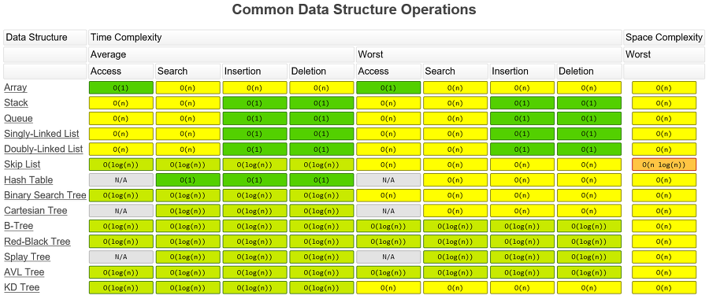

# Overall

자료구조 총 정리

  

## 1. 단순 구조

기본 자료 구조인 단순 구조에는 네 가지가 있다.

1. 정수
2. 실수
3. 문자
4. 문자열

#### 레코드

논리적으로 서로 연관이 있는 자료 원소들의 집합체이다.

i.g., 학번, 성명, 성별, 주민번호, 주소, 전화번호 등

- 한 레코드 내에 있는 필드들의 이름은 모두 달라야 하지만, 각 필드들의 자료형은 같지 않아도 된다.

- 각 원소(필드)마다 고유한 이름으로 구별하므로 원소의 순서를 임의로 변경할 수 있다.

  

## 2. 선형 구조

> element와 element의 관계가 `1:1`
>
> 자기 자신에서 이어질 수 있는 경우의 수 = 1개
>
> 2차원일 경우, 같은 차원 당 경우의 수 = 1개
>
> 물리적 구조 == 논리적 구조

선형 구조는 자료 간의 관계가 `1:1`인  자료 구조를 말한다.

선형 구조의 종류는 다음과 같다.

1. 순차 리스트, List
2. 연결 리스트, Linked List
3. 스택, Stack
4. 큐, Queue
5. 덱, Deque

 

### 2-1. 순차 리스트, Array List

C/C++ 에서의 배열(Array)과 파이썬에서의 리스트(List)를 지칭하는 리스트이다.

 

### 2-2. 연결 리스트, Linked List

연결 리스트의 종류

#### 2-2-1. 단순 연결 리스트, Singly Linked List

- 구조
  - 노드가 하나의 Link Field에 의해 다음 노드와 연결되는 구조

    C의 경우 `자기 참조 구조체` 사용이 필요

  - 헤드가 처음 노드를 가리키고, Link Field가 연속적으로 다음 노드를 가리킴

  - 최종적으로 NULL을 가리키는 노드가 가장 마지막 노드

#### 2-2-2. 이중 연결 리스트, Doubly Linked List

앞 순서의 노드를 찾으려면, 단순 연결 리스트는 처음부터 다시 순회해야 하며, 원형 연결 리스트는 한바퀴를 순회해야 하는 단점이 있으므로, 이를 개선하고자 등장했다.

- Head는 첫 번째 원소의 주소(Link Field만이 존재)만을 보유

- 첫 번째 원소의 `prev`는 `null`

#### 2-2-3. 원형 연결 리스트, Circular Linked List

단순 연결 리스트의 마지막 노드의 링크 필드가 첫 노드를 가리키도록 하는 구조이다.

 

### 2-3. 스택, Stack

1차원 배열을 사용하여 구현할 경우 구현이 용이하지만, 스택의 크기를 변경하기가 어렵다는 것이 단점이 있다.

따라서 연결 리스트를 사용하여 메모리를 관리하는 것이 효율적이다.

- 식당에서 스프링으로 접시를 받쳐 올려주는 접시 스택에서 유래됐다.

- 스택의 연산

  - INSERT - PUSH
  - DELETE - POP

- 후입 선출(LIFO, Last-in Frist-out)

  마지막으로 삽입한 자료를 가장 먼저 꺼낸다.

- 저장소 자체를 스택이라 부르기도 한다.

- Function Call에서의 응용

  프로그램에서의 함수 호출과 복귀에 따른 수행 순서를 관리

  (함수 호출 순서의 역순으로 `return`을 수행)

  - 컴퓨터의 메모리

    - Code

    - Data

      전역 변수

    - Heap & Stack

      local 변수, 함수 호출 시 함수의 내용

 

### 2-4. 큐, Queue

- 큐의 종류
  - 선형 큐
  
  초기값: `front = rear = -1`
  
  - 원형 큐
  
    초기값: `front = rear = 0`
  
  - 우선순위 큐
  
- 큐의 FIFO 특성은 계산대에 줄을 서  있는 사람을 서비스하는 일과 유사하다.

- 큐의 연산
  - INSERT - ENQUEUE
  - DELETE - DEQUEUE
  
- 머리(`head`)와 꼬리(`tail`) 인자
  - 새로 도착한 손님이 줄의 맨 끝에 위치하는 것 처럼 새 원소는 꼬리(`tail`)에 위치
  - 큐의 삭제는 가장 오래 기다린, 대기열 맨 앞의 머리(`head`)
  - 머리를 `front`, 꼬리를 `rear`로 지칭하기도 한다.
  - `front`/`head`를 `첫 원소 index-1`, 그리고 `tail`/`rear`를 `마지막 원소의 index`로 처리하기도 한다.
  
-   작업 버퍼 큐, 프로세스 스케줄링, 대기 행렬을 모델링하는 시뮬레이션(큐잉이론) 등에서 사용

 

### 2-5. 덱, Deque

스택과 큐의 동작을 복합시킨 방식이며, 두 가지가 있다.

- 스크롤: 양쪽으로 삭제가 가능하며, 한 쪽으로만 삽입할 수 있다.
- 셀프: 양쪽으로 삽입할 수 있으며, 한 쪽으로만 삭제할 수 있다.

  

## 3. 비선형 구조 - 트리, Tree

> element와 element의 관계가 `1:N`

- 트리의 표현
  - 1차 배열
  - 리스트
  - 스태틱 링크드 리스트

- 트리의 종류
  - 이진 트리
  - 이진 탐색 트리
  - 힙, Heap
  - AVL
  - B
  - 트라이
  - 허프만 트리
  - 아호코라식 트리
  - 세그먼트 트리
- 트리의 순회
  - Pre-Order
  - In-Order
  - Post-Order
  - 트리의 순회에 DFS, BFS를 사용할 수 있지만, 닭 잡는데 소 잡는 칼을 쓰는 격이다.

 

### 3-1. 트리 용어

- Tree는 어떤 노드도 가지지 않을 수 있으며, 이 경우 Null 또는 빈(Empty) 트리라고 부른다.
- 부모(Parent)는 어떤 노드에서 위로 연결된 노드를 뜻한다.
- 자식(Child or Childern)은 어떤 노드에서 아래로 연결된 노드를 뜻한다.
- 자손들(Siblings)은 같은 부모를 가진 노드들을 뜻한다.
- 뿌리(Root)는 부모를 가지지 않는 최상위 노드를 뜻한다.
- 잎(Leaf)은 자식이 없는 노드를 뜻한다.
- 조상(Ancestor)은 어떤 노드의 부모 노드들을 뜻한다. 부모 노드의 부모도 해당 노드의 조상이다.
- 후손(Descendant)은 어떤 노드의 자식 노드들을 뜻한다. 자식 노드의 자식도 해당 노드의 후손이다.
- 하위 트리(Subtree)는 기존 트리에 속한 부분적인 트리를 뜻한다.

 

### 3-2. 이진 트리, Binary Tree

#### 3-2-1. 포화 이진 트리, Full Binary Tree

배열로 표현했을 때 공백이 없는 트리

- 모든 leaf가 같은 depth를 가진다.
- leaf가 아닌 모든 노드들은 2개의 자식 노드를 가진다.

#### 3-2-2. 완전 이진 트리, Complete Binary Tree

높이가 h이고 노드 수가 n일때, 노드의 위치가 포화 이진트리의 노드 1번부터 n번까지의 위치와 완전히 일치하는 이진 트리. 예를 들어 높이가 3이고 노드의 개수가 12개이면 13번부터 15번까지의 노드는 공백이 되어야한다.

- 가장 깊은 depth를 제외한 depth의 노드들은 모두 존재해야 한다.
- 가장 깊은 depth의 노드들은 왼쪽으로 채워진다.
- 가장 깊은 depth가 모두 채워진 것도 Complete Binary Tree다.

#### 3-2-3. 편향 이진 트리

이진 트리 중에서 최소 개수의 노드를 가지면서 왼쪽이나 오른쪽 서브 트리만 가지고 있는 트리 

#### 3-2-4. Representing a Binary Tree

- With Array
  - Root는 [0]
  - Left는 [2i + 1]
  - Right는 [2i + 2]
- With Node
  - data_field : 데이터 저장
  - left_field : Left를 가리키는 포인터 저장
  - Right_field : Right를 가리키는 포인터 저장

- 이진트리의 구현 방식 

  1. 순차 자료구조 방식

     인덱스 1번부터 시작하여 i번째 인덱스를 지정해 일차원 배열에 저장한다. 그렇게 되면 부모의 노드는 i/2가 되고, 왼쪽 자식의 노드는 2*i 오른쪽 자식의 노드는 2*i+1가 된다. 

     장단점 : 인덱스 규칙에 따라 부모노드와 자식노드 찾기가 쉽다. 그러나 일차원 배열이기 때문에 메모리 공간의 사용에 있어서 완전이진트리의 경우에는 최적의 공간사용이 되지만 편향 이진트리의 경우에는 많은 공간이 낭비된다. 그렇기 때문에 메모리 낭비 문제와 삽입, 삭제 연산이 비효율적이기 때문에 연결 자료구조 방식을 많이 사용한다. 

  2. 연결 자료구조 방식

     노드는 데이터를 저장하는 데이터필드와 왼쪽 자식노드를 연결하는 왼쪽 링크 필드, 오른쪽 자식노드를 연결하는 오른쪽 링크 필드로 구성한다. 자식노드가 없는 경우에는 링크필드에 null을 저장한다. 

#### 3-2-5. 이진 트리의 순회

Traversals of Binary Trees

- Pre-Order
  1. Root에서 시작
  2. Recursive Call을 이용한 Left Subtree 탐색
  3. Recursive Call을 이용한 Right Subtree 탐색
- In-Order
  1. Recursive Call을 이용한 Left Subtree 탐색
  2. Root 탐색
  3. Recursive Call을 이용한 Right Subtree 탐색
- Post-Order
  1. Recursive Call을 이용한 Left Subtree 탐색
  2. Recursive Call을 이용한 Right Subtree 탐색
  3. 마지막으로 Root 탐색

-  D: DATA, L: LCHILD, R:RCHILD 일 때
  - 중위순회 : L → D → R
  - 후위순회 : L → R → D
  - 전위순회 : D → L → R

 

### 3-3. 이진 탐색 트리, Binary Search Tree

Binary Search Tree는 다음 조건을 만족하는 Binary Tree이다.

- 어떤 노드의 Left Subtree의 값은 항상 해당 노드의 값보다 작거나 같다.
- 어떤 노드의 Right Subtree의 값은 항상 해당 노드의 값보다 크다.

- 특징

  - 공백이 가능한 이진 트리
  - 공백이 아니라면 다음과 같은 성질 만족해야 함

  ☞ 키는 유일한 값

  ☞ 좌측은 루트 보다 적고, 우측은 큼

  ☞ 좌우측 서브트리도 이진 탐색 트리

- 이진 트리와의 차이

  이진트리는 효율적으로 사용하기 위해서 일정한 형태로 정의한것이다. 탐색을 위한 자료구조로 이진 트리를 사용하기 위해서 저장할 데이터의 크기에 따라 노드의 위치를 정의 한 것이 이진 탐색 트리이다. 

  1. 모든 원소는 서로 다른 유일한 키를 가지고 있다. 
2. 왼쪽 서브 트리에 있는 원소의 키들은 그 루트의 키보다 작다. 
  3. 오른쪽 서브트리에 있는 원소의 키들은 그 루트의 키보다 크다. 
4. 왼쪽 서브트리와 오른쪽 서브 트리도 이진 탐색 트리이다. 
  
- 이진 탐색 트리의 탐색

  root 탐색 → null → 탐색실패

  → null(×) → 탐색 key = root key → 탐색성공

  → 탐색 key ＜ root key → 좌측 서브트리 탐색

  → 탐색 key ＞ root key → 우측 서브트리 탐색

- 이진 탐색 트리의 삽입

  root와 비교하여 크면 오른쪽, 작으면 왼쪽과 비교함

  - 단말노드가 나올 때까지 비교하고 삽입
  - 트리의 높이가 h라면 삽입에 필요한 시간은 O(h)임

 

### 3-4. 힙, Heap

이진 트리에 있는 노드 중에서 키값이 가장 큰 노드 또는 키 값이 가장 작은 노드를 찾기 위해 만든 자료구조이다.

Heap은 특정 노드 N의 값이 항상 자식들보다 큰 Complete Binary Tree이다.

- REPRESENTING HEAP WITH PRIORITY QUEUE
  - Adding New Entry
    1. Complete Binary Tree에 맞게 마지막 노드에 새 값을 넣는다.
    2. 위쪽 방향으로 Parent와 비교하여 새 값이 크면 Swap한다.
  - Removing an Entry
    1. 마지막 노드의 값을 삭제하고자 하는 노드에 삽입.
    2. 교체한 값을 아래쪽 방향으로 Child와 비교하여 작으면 Swap한다.

-  힙의 종류
  - 최대힙: 직계 조상이 큰 수
  - 최소힙: 직계조상이 작은 수

- 힙의 삽입

  배열의 가장 마지막 부분에 위치(트리의 끝부분)시킨 후, 직계 조상과 비교하여 알맞은 위치로 찾아감

  최대힙은 직계조상과 비교하여 클수록 위로 올라감

- 힙의 삭제

  루트를 제거한 후, 배열의 가장 마지막 부분에 위치(트리의 끝부분)한 노드를 루트로 올리고, 직계 자손과 비교하여 알맞은 위치로 찾아감

  최대히프는 직계자손과 비교하여 작을수록 아래로 내려감

 

### 3-5. B-Tree

- Rules of B-Tree
  - 단일 노드에 저장될 수 있는 최소 개수를 의미하는 양의 정수 *Minimum*이 있다.
  - Rules
    1. 노드의 데이터 수가 N개이면 자식의 수는 항상 N+1개여야 한다. 즉, 노드 2개의 데이터를 가진다면 그 노드의 자식은 반드시 3개여야 한다.
    2. 노드 내의 데이터는 반드시 정렬된 상태여야 한다.
    3. 노드의 데이터 D1의 왼쪽 서브 트리는 D1보다 작은 값들로 이루어져 있어야 하고, D1의 오른쪽 서브 트리는 D1보다 큰 값들로 이루어져 있어야 한다.
    4. Root 노드가 자식이 있다면 적어도 2개 이상의 자식을 가져야 한다.
    5. Root 노드를 제외한 모든 노드는 적어도 *Minimum/2*개의 데이터를 가지고 있어야 한다. ex) 5차 B트리라면 각 노드는 적어도 2개의 데이터를 가지고 있어야 한다.
    6. Leaf 노드로 가는 경로의 길이가 모두 같다. 즉, Leaf 노드는 모두 같은 레벨에 존재한다.
    7. 입력 자료는 중복될 수 없다.

 

### 3-6. 트라이, Trie

- 키 탐색을 위해 킷값을 직접 표현하지 않고 키를 구성하는 문자나 숫자의 순서로 킷값을 표현한 자료 구조이다.
- 트라이의 차수는 킷값을 표현하기 위해 사용하는 문자의 수에 의해 결정된다.
- 트라이의 크기는 나타내려고 하는 킷값의 기수와 키 필드 길이에 의해 결정된다.
- 노드의 삽입 및 삭제시 노드의 분열과 병합이 없다.

 

### 3-7. 인덱스 순차 파일, Indexed Sequential File

- 순차처리와 직접처리가 모두 가능하다.
- 실제 데이터 처리외에 인덱스를 처리하는 추가적인 시간이 소모되므로 파일처리 속도가 느리다.

1. 정적(Static) 인덱스 방법 - ISAM 파일
   - 기본 구역, 인덱스 구역, 오버플로 구역으로 구성
   - 인덱스 구역은 마스터 색인, 실린더 색인, 트랙 색인으로 구성

2. 동적(Dynamic) 인덱스 방법 - VSAM 파일

   기본 구역과 오버플로 구역을 구분하지 않는다.

 

 

## 4. 비선형 구조 - 그래프, Graph

트리 또한 무방향 그래프이다. 그래프의 경우 cycle이 가능하며, 방향성이 존재할 수 있다.

- Graph는 Node와 Node 사이의 Link로 이루어진 비선형적 자료구조다.
- Tree와 다르게 어떤 형식으로도 연결될 수 있고, 비어있을 수도 있다.

 

### 4-1. Graph Terms

- Undirected Graphs
  - *vertices*와 *edges*로 이루어진 유한 집합이다.
  - *edges*는 방향(direction)을 가지지 않는다.
  - *vertices*와 *edges* 둘 다 이름(Label)을 가진다.
- Directed Graphs
  - Undirected Graph와 같이 *vertices*와 *edges*로 이루어진 유한 집합이다.
  - Undirected Graph와 다르게 *edges*는 방향을 가진다.
  - Undirected Graph와 같이 *vertices*와 *edges* 둘 다 이름(Label)을 가진다.
- Loop
  - 자기 자신과 연결된 *vertex*의 *edge*.
- Path
  - *vertex*의 연속
- 단순 경로 : 한 경로상에 있는 모든 정점이 서로 다를 때의 경로
- 사이클 : 처음과 마지막 정점이 같은 단순 경로
- 정점의 차수 : 그 정점에 부속된 간선들의 수

 

### 4-2. 그래프의 표현

- 인접 행렬

- 인접 리스트

  메모리 소요가 크며, (스태틱) 링크드 리스트를 사용

 

### 4-3. 그래프의 순회

- Depth-First Search
  - 시작 vertex에서 이웃 vertex로 탐색을 진행하고, 또 그 이웃의 이웃으로 진행한다.
  - 더 이상 탐색을 진행할 이웃이 없을 때, 뒤로 돌아간다.
  - Stack 또는 Recursion으로 수행할 수 있다.
  
  깊이 우선 탐색
  
  막다른 길이면 되돌아옴
  
  Stack을 사용
  
  재귀형식의 경우 DFS 형식으로 호출
  
  Back Tracking이라고도 불림
  
- Breadth-First Search
  - 시작 vertex의 모든 이웃들을 탐색하고, 이웃의 이웃을 탐색하는 방식으로 진행한다.
  - 탐색 가능한 모든 vertex에 방문했을 때 탐색이 종료된다.
  - Queue로 수행할 수 있다.
  
  Queue를 사용하며, 가까운 것부터 탐색

- 신장 트리

  사이클을 이루지 않으며 모든 정점이 연결된 트리

- 최소 신장 트리

  간선의 가중치의 합이 최대/최소를 이루는 연결

  - Prim의 최소 신장 트리
  1. 최소 비용을 갖는 간선을 (u, v)라 할 때 (u, v)를 최소비용 신장트리 T에 포함한다.
    2. 정점 u 또는 v와 연결된 간선 중에서 최소 비용을 갖는 간선을 (u, w)라 하면 사이클을 형성하지 않으므로 이를 T에 포함하고,
  3. u, v, w와 연결된 간선 중에서 최소 비용을 가지면서 이미 T에 포함된 간선들과 사이클을 형성하지 않는 간선을 T에 포함한다.
    4. T가 n-1개의 간선을 갖거나 간선이 모두 소모될 때까지 이를 반복한다.

  - Kruscal의 최소 신장 트리

    1. 간선들을 하나씩 결정하여 마지막으로 최소비용 신장트리 T를 만들게 됨

       간선들은 비용이 적은 순으로 T에 포함

    2. 간선들은 이미 T속에 있는 간선과 비교해서 사이클을 형성하지 않으면 그 간선은 T에 포함

### 4-4. 그래프의 종류

- 완전그래프

  최대 수의 간선을 가지는 그래프

  정점의 수가 n일 때, n(n-1)/2인 경우

- MST, Minimum Static Tree

- 최단 경로

  경로 별 cost 계산

  - 다익스트라 알고리즘
  - TSP, Traveling Salesman Problem
  - 플로이드

- AoV

- AoE

- 네트웍

- 기하

  

## 4. 파일 구조

서로 관련있는 필드들로 구성된 레코드의 집합인 파일에 대한 자료구조로서, 보조기억장치에 데이터가 실제로 기록되는 자료구조

- 파일의 구성방식에 따른 파일 구조의 종류
  1. 순차 파일
  2. 색인 파일
  3. 직접 파일

 

 

## 5. Reference

[Hue Log](https://devhue.github.io/blog/datastructure)

[도연이 지식창고](https://doyeonii.tistory.com/9)

[ITance](https://itance.tistory.com/entry/)