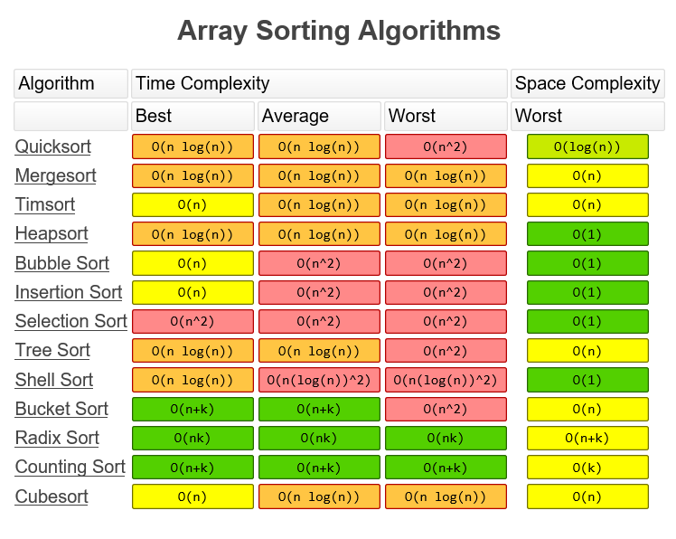

# Overall

## 0. 복잡도 분석

시간 복잡도와 공간 복잡도

- 공간 복잡도의 표현식 `Sp = Sc + Se`
  - Sc, 고정 공간

    프로그램의 크기나 입출력의 횟수에 관계없이 고정적으로 필요한 저장 공간을 의미한다.

  - Se, 가변 공간

    실행과정에서 자료구조와 변수들이 필요로 하는 저장 공간이 포함

- 시간 복잡도의 표현식 `Tp = Tc + Te`
  - `Tc`, 컴파일 시간
  - `Te`, 실행 시간

- 연산 시간의 크기 순서

  O(`1`) < O(`logn`) < O(`n`) < O(`nlogn`) < O(`n^2`) < O(`n^3`) < O(`n!`)

 

### 0-1. 빅오 표기법

상한

 

### 0-2. 빅오메가 표기법

하한

 

### 0-3. 빅세타 표기법

빅오와 빅오메가가 같을 때 사용

 

### 0-4. 복잡도 별 Searching, Sorting 알고리즘

- O(`1`), 상수 시간, Constant Time
  - 해싱(키 값에 특별한 수식을 적용하여 원하는 자료가 저장되어 있는 주소를 직접 참조하여 빠르게 탐색)

- O(`logn`), 로그(대수) 시간, Logarithmic time
  - 이진 탐색

- O(`n`), 선형 시간, Linear Time

  - 순차 탐색

  - 카운팅 정렬

- O(`nlogn`), 로그 선형 시간, Log-Linear time
  - 퀵 정렬, 힙 정렬, 병합 정렬

- O(`n^2`), 제곱 시간, Quadratic time
  - 버블 정렬, 삽입 정렬, 선택 정렬
- 프림 Prim(최소 신장 트리), 크루스칼 Kruscal(최소 신장 트리), 다익스트라(두 정점 간의 최단 거리 구하기)
  
- O(`n^3`), 세제곱 시간, Cubic time
  - 플로이드-워셜(모든 정점과 연결하는 최단거리 구하기, DP 사용)

- O(`2^n`), 지수 시간, Exponential time
  - 부분집합 구하기, 배낭문제, 순열, TSP => 근사 알고리즘, 인공지능으로 해결

 

 

## 1. 탐색, Searching

### 1-1. 순차 탐색

찾고자 하는 레코드가 나타날 때까지 차례로 비교하면서 순차적으로 검색을 수행한다.

 

### 1-2. 이진 탐색

- 중앙값은 루트에 있으며, 파일의 중앙에서부터 탐색한다.
- 이진 탐색을 위한 트리는 루트의 중앙값을 시작으로 왼쪽에는 부모노드 보다 작은 수가 저장되고, 오른쪽은 큰 수가 저장됨
- 찾고자 하는 수가 비교하는 노드보다 작으면 비교 노드의 왼쪽 자식노드로 가서 비교하고 크면 오른쪽 자식노드로 가서 비교하며, 이러한 과정을 반복하며 찾아나감

 

### 1-3. 피보나치 탐색

- 나눗셈을 사용하지 않고 덧셈과 뺄셈만 사용

  나눗셈이 덧셈이나 뺄셈보다 더 많은 시간 소요

- 평균 효율이 이진탐색 보다 좋음

 

### 1-4. AVL 트리

- 원소의 삽입과 삭제 연산 시간도 짧으면서 검색 시간이 을 갖는 2-원 탐색 트리
- 왼쪽 서브트리와 오른쪽 서브트리의 높이의 차가 1이하인 2-원 탐색 트리
- 노드의 균형 인수가 ۫이하이면 그 노드는 AVL 성질을 만족하고 ۬이상이면 AVL 성질을 만족하지 못함

 

### 1-5. 해싱

- 키 값에 특별한 수식을 적용하여 원하는 자료가 저장되어 있는 주소를 직접 알아냄(직접주소를 이용하여 빠르게 탐색)

- 충돌 : 자료를 삽입할 때 두 개의 서로 다른 자료가 해싱 함수에 의해 똑같은 주소의 버킷으로 해싱되는 경우가 발생되는 현상

#### 해싱 함수

해싱 테이블 내의 버킷 주소로 변환하며, 주소가 특정 주소에 편향되지 않도록 하고, 편향된 주소로 해싱된 자료들이 오버플로우를 발생시키지 않도록 하는 것이 중요하다.

- 해싱 함수의 종류

  1. 제산 잔여 해싱 : 나머지 연산자(%)를 사용하여 키를 어떤 정해진 수로 나누고 나머지를 버킷 주소로 사용

     가장 큰 소수를 제수로 사용

  2. 중간 제곱 해싱 : 키 값을 제곱한 후에 그 결과의 중간에서 미리 정해진 자리의 숫자를 뽑아내어 버킷 주소로 사용

  3. 폴딩 해싱 : 키 값을 주소와 같은 자리수를 갖는 몇 개의 부분으로 나눈 다음, 그 부분들을 서로 더하여 주소를 만들어 내는 방법

     가. 이동 폴딩 방법 : 나누어진 부분의 값을 그대로 더하는 방법

     나. 경계 폴딩 방법 : 마치 종이를 접듯이 부분을 경계에서 겹친 다음

     만나는 수를 더하는 방법

  4. 숫자분석 해싱 : 저장할 자료를 미리 알고 있는 경우에 유용하게 활용

     키 값의 분포를 활용하여 적절하게 배치

#### 충돌 해결 방법

- 개방 주소법

  선형 조사법 : 비어있는 버킷을 찾아 자료를 저장하는 방법

- 폐쇄 주소법

  체인법 : 각 버킷마다 개별적인 연결리스트 구조를 할당하는 방식

 

 

## 2. 정렬, Sort

### BINARY SEARCH

- 정렬된 상태의 배열을 정 가운데 index와 찾고자 하는 값을 비교하여 값을 찾아내는 방식
- 하지만, 정렬되지 않는 배열에 적용할 수 없다는 단점을 가진다.

### HASHING

- 특정 Key를 Hash Function에 넣어 얻은 값을 index로 사용하여 해당 index에 데이터를 저장하는 방식
- 다른 Key값이 같은 index를 내놓는 Collision이 발생할 수 있다. Collision의 해결방법이 필요하다.

### OPEN-ADDRESS HASHING

- Linear Probing
  - 특정 Hash Function을 통해 얻어낸 index를 *hash(key)* 라고 한다.
  - 만약 *data[hash(key)]* 가 비어있으면 저장하고 끝낸다.
  - 비어있지 않으면, *data[hash(key)+1]* 를 확인하고 비어있으면 저장후 종료, 비어있지 않으면 index를 하나씩 늘려가면서 확인한다.
- Doublie Hasing
  - Linear Probing의 경우 Clustering Problem으로 인해 Insertion 작업의 시간이 오래 걸릴 수 있다.
  - *Hash Function 1*과 *Hash Function 2*를 정의한다.
  - *Hash Function 1*을 통해 얻어낸 index가 비어있지 않으면 *Hash Function 2*를 통해 얻은 값을 index에 더한다.

### CHANINED HASHING

- Array가 하나 이상의 Entry를 가질 수 있는 Hashing 방법이다.
- Collision이 발생하면 해당 index에 새로운 Entry를 추가한다.

### TABLE

- Table은 record에 대해 Insertin, Deleting, Locating을 수행하는 container이다.
- Single Key Field에 의해 결정된다.
- Hash와 Table의 개념이 합펴진 것이 HashTable이다.

### HASH FUNCTIONS

- Division

   

  Hash Functions

  - 보통 *key % table_size*
  - table_size는 소수인 경우가 제일 이상적이다

- Mid_Square

   

  Hash Functions

  - *key \* key* 를 2진수로 바꾼 후, 중간 digit을 선택

- Multiplicative

   

  Hash Functions

  - *a \* key(0<a<1)* 의 값에서 숫자 몇 개를 선택
  - ex) key = 157, a = 0.0234521, 0.0234521 * 157 = 3.6819797에서 681 선택

### 2-1. 삽입 정렬, Insert Sort

자료가 소량인 경우에 유리하며, 알고리즘이 간단하다는 장점이 있다.

해당 *index* 값의 적절한 위치를 *index 0*부터 *index - 1* 사이에서 찾아 정렬하는 방식.

- 최악의 경우

  역순으로 정렬된 경우 O(`n^2`)

- 최상의 경우

  이미 정렬되어 있는 경우로, 비교만 하므로 O(`n`)

 

#### 셸 정렬, Shell Sort

입력 파일을 여러 개의 부분 파일로 세분화하여 부분 파일을 삽입 정렬

방법에 따라 순차적으로 정렬하는 과정을 반복함

삽입정렬을 개선

- Gap

  우선적으로 데이터를 띄엄띄엄 정렬시켜 둔다.

  1. gap 만큼 떨어진 데이터들을 부분정렬
  2. gap은 N/2 ~ 1
  3. gap = 1이 되면 데이터 전체를 삽입정렬것과 같음

 

### 2-2. 합병 정렬

쪼개어진 이미 정렬되어 있는 2개의 파일을 하나의 정렬된 파일로 만들며 전체를 정렬한다.

- 분할 정복(Divide and conquer)

  큰 문제를 쪼개 작은 문제부터 해결해 나감

  1. 분할 과정

     배열을 반으로 쪼개며, 배열의 크기가 0이나 1이 될 때 까지 쪼갠다.

  2. 합병 과정

     두 배열의 원소를 하나씩 비교하며 순서에 맞게 새 배열에 저장한다. (합치면서 정렬)

- 분할 과정을 `logn`번 거쳐야 크기가 1인 배열로 쪼갤 수 있다.

  각 분할별로 합병 진행 => O(`nlogn`)

 

### 2-3. 퀵 정렬

평균적으로 가장 좋은 성능을 내며, 스택 구조와 순환적 알고리즘을 사용한다.

- 분할 정복을 응용하지만, 합병 정렬과는 다르다.

  비균등하게 분할하며, 분할과 동시에 정렬

- 과정
  1. 피봇 값 설정
  2. 피봇 보다 작은 값은 피봇 왼쪽에, 큰 값은 피봇 오른쪽으로 이동
  3. 피봇 제외하고 왼쪽리스트, 오른쪽 리스트에 대해 재귀적으로 수행
  4. 부분 리스트를 더이상 분할할 수 없을 때까지 반복

 

### 2-4. 버블 정렬

좌측에서 우측으로 인접한 두 요소를 반복적으로 비교하며 크기가 큰 요소를 계속해서 비교하며 정렬한다.

- 최악/최상 어떤 경우이든 요소 전부를 비교해야 하므로 O(`n^2`)

 

### 2-6. 힙 정렬

완전이진트리를 이용하고, 일정한 기억장소만을 필요로 한다.

- 최소힙/최대힙 트리를 구성하여 정렬하는 방법.
  1. build heap
  2. root부터 원소 삭제하며 새로운 배열에 저장
- 완전이진트리이므로 노드 하나를 삽입/삭제할 때 `logn`만큼 소요하므로 O(`nlogn`)
- 자료 전체보다는 최대/최소값 몇 개를 구할 때 유용

 

### 2-7. 선택 정렬

가장 단순한 정렬 방식이다. 키를 비교하여 가장 작은 값을 임시저장소에 넣고 비교하여 나머지 원소들과 비교가 끝나면 원래 장소와 원소의 위치를 교환한다.

1. 최대 범위부터 시작하여 범위를 하나씩 줄여나간다.
2. 해당 범위에서 가장 큰 수를 찾아 마지막 index와 swap한다.

- 최악/최상 어떤 경우이든 요소 전부를 비교해야 하므로 O(`n^2`)

 

### 2-8. 기수 정렬

다중키를 사용하고 비교적 많은 공간을 사용하지만, 상대적으로 수행시간이 적게 든다.

  

## 3. Reference

[진호박's Life Style](https://jinhobak.tistory.com/221)

[groonngroo](https://groonngroo.tistory.com/37)