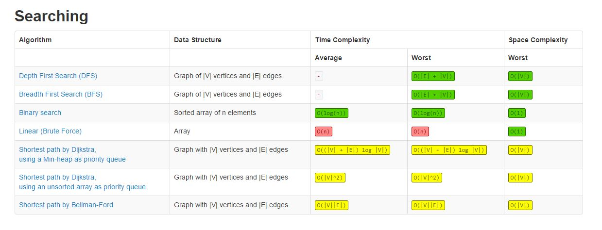

# Complexity

시간 복잡도와 공간 복잡도

- 공간 복잡도의 표현식 `Sp = Sc + Se`

  - Sc, 고정 공간

    프로그램의 크기나 입출력의 횟수에 관계없이 고정적으로 필요한 저장 공간을 의미한다.

  - Se, 가변 공간

    실행과정에서 자료구조와 변수들이 필요로 하는 저장 공간이 포함

- 시간 복잡도의 표현식 `Tp = Tc + Te`

  - `Tc`, 컴파일 시간
  - `Te`, 실행 시간

- 연산 시간의 크기 순서

  O(`1`) < O(`logn`) < O(`n`) < O(`nlogn`) < O(`n^2`) < O(`n^3`) < O(`n!`)

 

### 0-1. Ο 빅오 표기법

해당 속도가 알고리즘의 연산 횟수를 포함하고 있을 때 사용한다. 즉 Ο(n^2)는 최고차항이 n^2보다 작은 모든 연산 횟수를 포함하며, 해당 연산이 아무리 심해져도 해당 표기법을 능가하지 않는다는 것을 표현한다.

 

### 0-2. Ω 빅오메가 표기법

Ο-표기법과 반대인 하한적 표현이다. 해당 연산 횟수는 최소한으로 발생할 수 있는 속도를 의미한다.

 

### 0-3. Θ 빅세타 표기법

빅오와 빅오메가가 같을 때 사용하며, 위 두 표기법의 교집합을 나타낸다. 상한과 하한의 값을 동시에 내포하고 있으나 최고차항의 연산 횟수를 벗어나지는 못한다.

 

### 0-4. 복잡도 별 Searching, Sorting 알고리즘

- O(`1`), 상수 시간, Constant Time 
  - 해싱(키 값에 특별한 수식을 적용하여 원하는 자료가 저장되어 있는 주소를 직접 참조하여 빠르게 탐색)
- O(`logn`), 로그(대수) 시간, Logarithmic time 
  - 이진 탐색

 

 

 

## Reference

[hackerearth](https://www.hackerearth.com/practice/notes/big-o-cheatsheet-series-data-structures-and-algorithms-with-thier-complexities-1/)