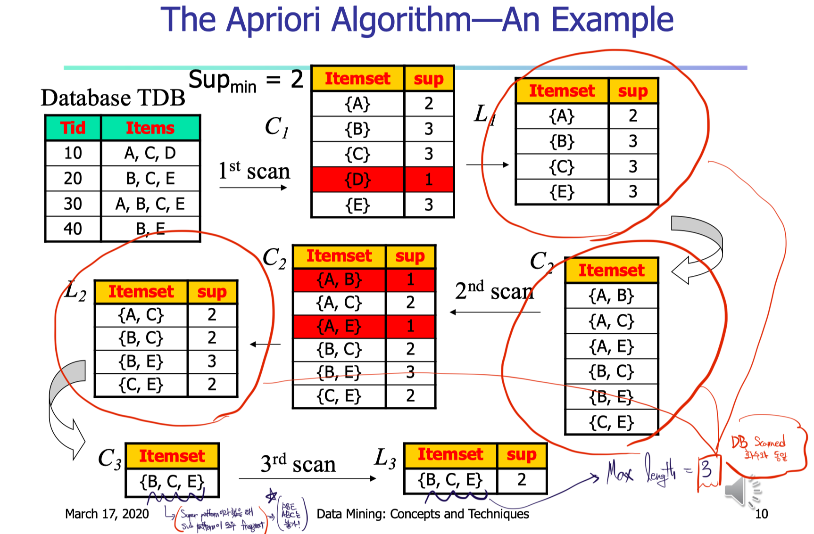
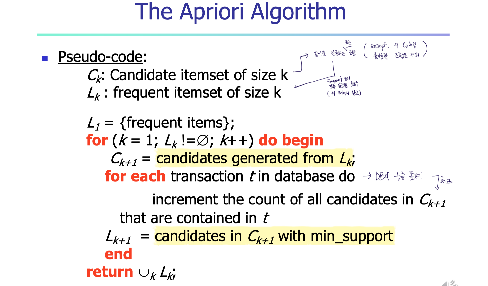

# Association Rule Mining

## Frequent Pattern

- Frequent pattern
  - a pattern (a set of items, subsequences, substructures, etc.) that occurs frequently in a data set
  - Finding inherent regularities in data, 고유한 규칙성

### Association Rules

- Find all the association rules $X \rarr Y$ with minimum Support and Confidence
  - Support, `S`
    - Probability that a transaction contains $X \cup Y$
  - Confidence, `C`
    - Conditional probability that a transaction having $X$ also contains $Y$
- Find patterns over `S`, and then search over `C` in the final list

### Closed Patterns & Max-Patterns

- Closed Patterns
  - An itemset $X$ is closed if,
    1. $X$ is frequent
    2. There exists **no super-pattern** $Y \supset X$, **with the same `S`** as $X$
- Max-Patterns
  - An itemset $X$ is a max-pattern if,
    1. $X$ is frequent
    2. There exists **no frequent super-pattern** $Y \supset X$ 

  

## Apriori Algorithm

### Apriori pruning principle

- If there is any itemset which is infrequent, its superset should not be generated/tested!
- Any subset of a frequent itemset must be frequent
- If `{beer, diaper, nuts}` is frequent, so is `{beer, diaper}`

### Method

1. Initially, scan DB **once to get frequent 1-itemset**
2. Generate candidate itemsets of length ($k+1$) **from frequent itemsets of length $k$**
3. **Test the candidates**(count `S`) against DB, and prune
4. Iterate `2`, `3`, and terminate when no frequent or candidate set can be generated

### Generating Candidates

- To generate $L_{k+1}$ candidates,
  1. Self-join $L_k$ (Join: Compbining a tuple in table $A$ with a tuple in table $B$)
  2. Prune
- Example
  - $L_3 = \{abc, abd, acd, ace, bcd\}$
    1. Self-join, $L3*L3$
       1. $abcd$ from $abc$ and $abd$
       2. $acde$ from $acd$ and $ace$
       3. ...
    2. $acde$ is removed because ade is not in $L_3$
  - $\therefore C4=\{abcd\}$

### Challenges of Frequent Pattern Mining

- Challenges
  - Multiple scans of a transaction database -> Too much disk I/O time
  - Huge number of candidates
  - Tedious workload of support counting for candidates
- Improving Apriori
  - Reduce the number of transaction database scans
  - Shrink the number of candidates
  - Facilitate support counting of candidates