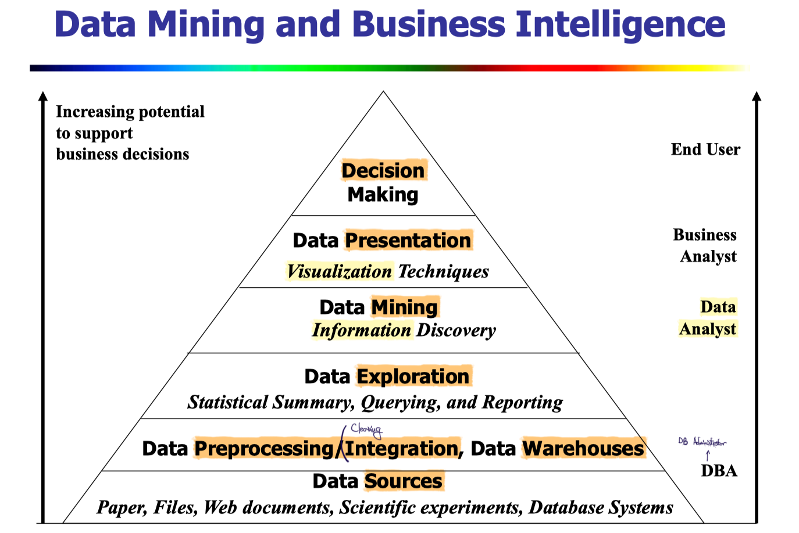

# Introduction to Data Mining

**Extraction of interesting** (non-trivial, implicit, previously unknown and potentially useful) patterns or knowledge from huge amount of data.

실제로는, Data Mining이 아니라, Knowledge Mining으로 해석하는 것이 맞다.

- 다음 두 가지는 Data Mining이 아니다.
  - Simple search and query processing
    - Not hidden
  - (Deductive) expert systems
    - Imforms sth with predefined rules

### Why Not Traditional Data Analysis?

- Tremendous amount of data
  - Algorithms must be highly scalable to handle such as tera-bytes of data
- High-dimensionality of data
  - Micro-array may have tens of thousands of dimensions
- High complexity of data
  - Data streams and sensor data
  - Time-series data, temporal data, sequence data
  - Structure data, graphs, social networks and multi-linked data
  - Heterogeneous databases and legacy databases
  - Spatial, spatiotemporal, multimedia, text and Web data
  - Software programs, scientific simulations
- New and sophisticated applications

### KDD, Knowledge Discovery in Database Process

A KDD process includes `data cleaning`, `data integration`, `data selection`, `transformation`, `data mining`, `pattern evaluation`, and `knowledge presentation`

  

## Multi-Dimensional View of Data Mining

- **Data** to be mined
  - Relational, data warehouse, transactional, stream, object-oriented/relational, active, spatial, time-series, text, multi-media, heterogeneous, legacy, WWW
- **Knowledge** to be mined
  - Characterization, discrimination, association, classification, clustering, trend/deviation, outlier analysis, etc.
  - Multiple/integrated functions and mining at multiple levels
- **Techniques utilized**
  - Database-oriented, data warehouse (OLAP), machine learning, statistics, visualization, etc.
- **Applications adapted**
  - Retail, telecommunication, banking, fraud analysis, bio-data mining, stock market analysis, text mining, Web mining, etc.

### Data Mining: Classification Schemes

- General functionality
  - Descriptive data mining
  - Predictive data mining
- Different views lead to different classifications
  - Data view: Kinds of data to be mined
  - Knowledge view: Kinds of knowledge to be discovered
  - Method view: Kinds of techniques utilized
  - Application view: Kinds of applications adapted

### Data Mining: On What Kinds of Data?

- Database-oriented data sets and applications
  - Relational database, data warehouse, transactional database
- Advanced data sets and advanced applications
  - Data streams and sensor data
  - Time-series data, temporal data, sequence data (incl. bio-sequences)
  - Structure data, graphs, social networks and multi-linked data
  - Object-relational databases
  - Heterogeneous databases and legacy databases
  - Spatial data and spatiotemporal data
  - Multimedia database
  - Text databases
  - The World-Wide Web

### Data Mining Functionalities

Data mining functionalities: characterization, discrimination, association, classification, clustering, outlier and trend analysis, etc.

- **Multidimensional concept** description: **Characterization** and **Discrimination**
  - Characterization: summerize large number of tuples into several tuples
  - Discrimination: compare 2 sets of data
- Frequent patterns, association, **correlation**(상관관계) vs. **causality**(인과관계)
  - $Diaper \Rightarrow Beer \; [0.5\%, 75\%]$ (Correlation or causality?) -> 상관은 있지만, 인과는 아닐 수 있다.
- Classification and prediction
  - Construct models (functions) that describe and distinguish classes or concepts for future prediction
    - E.g., classify countries based on (climate), or classify cars based on (gas mileage)
  - Predict some unknown or missing numerical values
- Cluster analysis
  - Class label is unknown: Group data to form new classes, e.g., cluster houses to find distribution patterns 
  - Maximizing intra-class similarity & minimizing interclass similarity
- Outlier analysis
  - Outlier: Data object that does not comply with the general behavior of the data
  - Noise or exception? Useful in fraud detection, rare events analysis
- Trend and evolution analysis (주로 time-series data)
  - Trend and deviation: e.g., regression analysis
  - Sequential pattern mining: e.g., $digital \; camera \Rightarrow large \; SD \; memory$ (역은 성립x)
  - Periodicity analysis
  - Similarity-based analysis

  

## Major Issues in Data Mining

- Mining methodology
  - Mining different kinds of knowledge from diverse data types, e.g., bio, stream, Web
  - Performance: efficiency, effectiveness, and scalability
  - Pattern evaluation: the interestingness problem
  - Incorporation of background knowledge
  - Handling noise and incomplete data
  - Parallel, distributed and incremental mining methods
  - Integration of the discovered knowledge with existing one: knowledge fusion
- User interaction
  - Data mining query languages and ad-hoc mining
  - Expression and visualization of data mining results
  - Interactive mining of knowledge at multiple levels of abstraction
- Applications and social impacts
  - Domain-specific data mining
  - Protection of data security, integrity, and privacy

  

## Top-10 Algorithm Finally Selected at ICDM’06

### Candidates

- Classification
  - C4.5
  - CART
  - K Nearest Neighbours (kNN)
  - Naive Bayes Hand
- Statistical Learning
  - SVM
  - EM
  - Apriori
  - FP-Tree
- Link Mining
  - PageRank
  - HITS
- Clustering
  - K-Means
  - BIRCH
- Bagging and Boosting
  - AdaBoost
- Sequential Patterns
  - GSP
  - PrefixSpan
- Integrated Mining
  - CBA
- Rough Sets
  - Finding reduct
- Graph Mining
  - gSpan

### Selected

#1: C4.5
#2: K-Means
#3: SVM
#4: Apriori
#5: EM
#6: PageRank
#7: AdaBoost
#7: kNN
#7: Naive Bayes
#10: CART