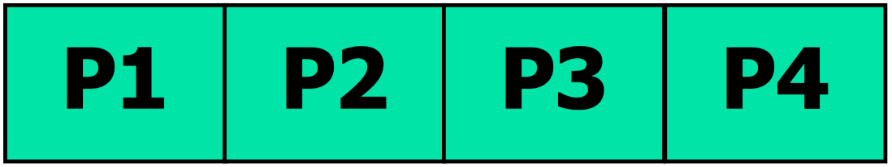
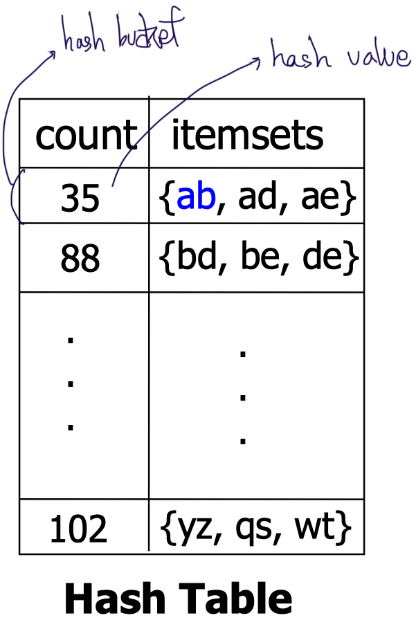
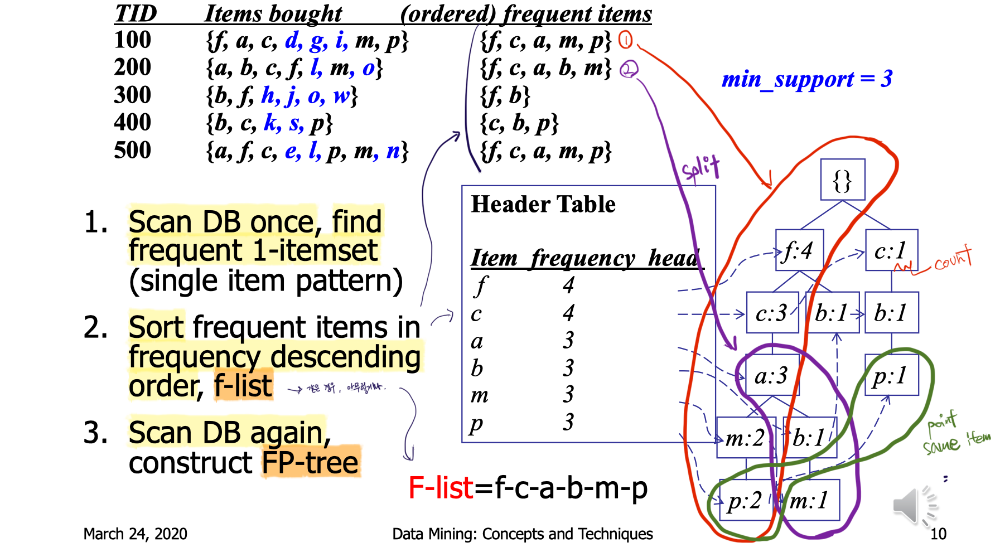

# Partitioned Apriori Algorithm

## Partition

### Scan Database Only Twice

1. Divide a database into $k$ pieces (local databases called **partition**)
   - Each partition should reside in main memory
2. **Find local frequent patterns** in each partition (**scan 1**)
   - $localMinSup = MinSup / k$
   - Local frequent patterns have their $localSup$ larger than $localMinSup$ in any local database
3. Consolidate global frequent patterns (**scan 2**)

기존 apriori 방법 보다 더 많은 itemset을 frequent pattern이라고 잘 못 판별될 수 있지만, **적어도 빼먹지는 않는다!**

  

## Bottleneck of Frequent-pattern Mining

Bottleneck occurs in **candidate generation** and **testing** of it

- Multiple database scans are costly
- Mining long patterns needs many passes of scanning and generates lots of candidates
  - To find frequent itemset $i_1, i_2, … i_{100}$
    - num of scans = 100
    - number of Candidates: $100^1 + 100^2 + … + 1 0 0^{100} = 2^{100} -1 = 1.27*10^{30} $

  

## DHP, Direct Hashing and Pruning

### Reduce the Number of Candidates

> Paper: [An Algorithm for Mining Association Rules Using Perfect Hashing and Database Pruning](http://www.cs.bilkent.edu.tr/~guvenir/publications/TAINN01-AOAG.pdf)

- The set of large $k$-itemsets ($L_k$) is used to form the set of candidate $k+1$-itemsets ($C_{k +1}$) by joining $L_k$ with itself on $k-1$ common items for the next pass.
- In general, the more itemsets in $C_{k +1}$ , the higher the processing cost of determining $L_{k +1}$.
- **Step of determining $L_2$ from $C_2$ by scanning the whole database and testing each transaction against $C_2$ is very expensive.**

**$C_k$의 개수를 감소시켜, DB scan을 통해 $C_k$에서 $L_k$(frequent $k$-itemsets)를 계산하는 cost를 감소시키기 위함**

### Method

1. 1-itemsets($L_1$)를 제작 하기 전, $L_2$에 대한 hash table($H_2$)을 생성
2. **Xact 별로 hash bucket 존재**(하나의 bucket에는, 해당 Xact에 대해 가능한 모든 2-itemsets가 존재)
3. 1-itemsets를 만들기 위해 DB를 scan하면서 count 하고, 동시에, $H_2$의 2-itemsets가 얼마나 등장하는 가를 함께 count
4. 1-itemsets($L_1$)이 완성된 후, $L_1$를 이용하여 $C_2$를 만들고자 할 때, $L_1$으로 부터 join된 2-itemset이 $H_2$에서 `min_sup`을 넘지 못하면, $C_2$로 추가하지 않는다.
5. 3-itemsets를 제작할 때에는, 가능한 조합들 중 모든 subset이 $H_2$에서 min-sup을 넘는 경우만 $H_3$에 등록

  

## Sampling

Select a sample of an original database, SDB(Sampled DB)(= `S`), and use a smaller value of the minimum support(`/k`)

### Problems with the simple sampling

- Some of frequent patterns found in `S` are **not really frequent in the original database**
- Some of **true frequent patterns could be missed** if they are not included in `S`

### Solution: 2 more scanning for verification

1. Scan the whole database once
   - Verify a collection of frequent itemsets found in `S`, and its **negative borders**(`NB`: not in `S`, but all its subsets in `S`)
     - $S = \{a\}, \{b\}, \{c\}, \{f\}, \{a,b\}, \{a,c\}, \{a,f\}, \{c,f\}, \{a,c,f\}$
     - $NB = \{b,c\}, \{b,f\}, \{d\}, \{e\}$
2. Scan the whole database again
   - Find missed frequent patterns (due to the success of `NB`s)

  

## DIC, Dynamic Itemset Counting

### Reduced Number of Scans

Overlapping counting of candidates.

e.g., Once both A and D are determined frequent, the counting of AD begins

e.g, Once all length-2 subsets of BCD are determined frequent, the counting of BCD begins

  

## FP-Growth

### Mining Frequent Patterns Without Candidate Generation

핵심: Grow long patterns from short ones using local frequent items

1. Scan DB once, find frequent 1-itemset (single item pattern)
2. **Sort** frequent items in frequency **descending order**( `F-list`)
3. Scan DB again, **construct FP-tree**

### Benefits

- Completeness
  - Preserve complete (i.e., lossless) information for frequent pattern mining
- Compactness
  - Remove irrelevant info—infrequent items are gone
  - **Items in frequency descending order**: the more frequently occurring, the more likely to be shared
  - Never be larger than the original database