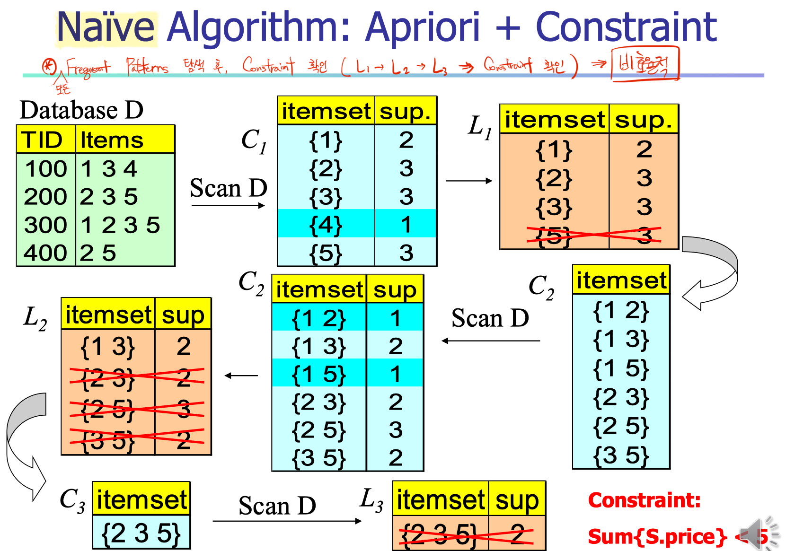
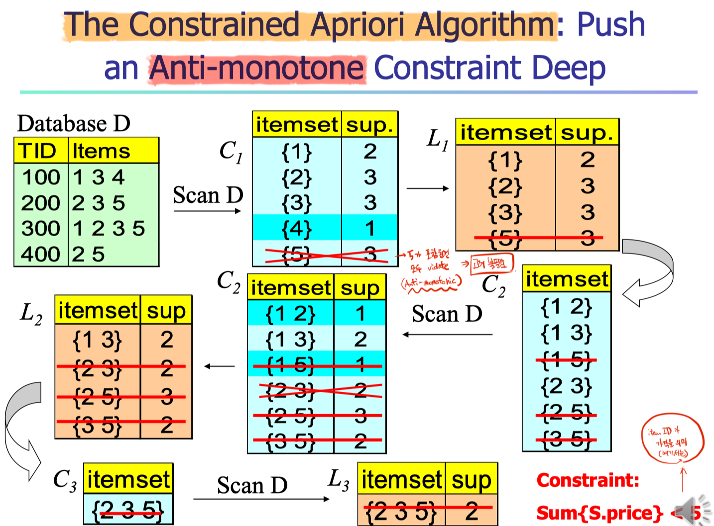
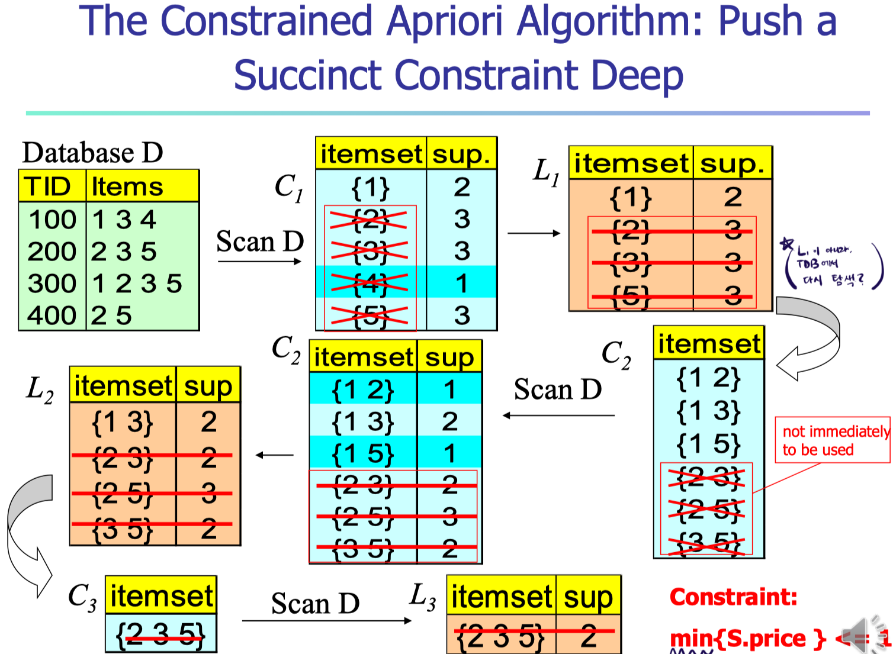

# Constraint-based Mining

It's impossible to find all the patterns in a database autonomously. Patterns could be too many but not focused.

- User flexibility
  - Provides constraints on what to be mined
- System optimization
  - Explores such constraints for efficient mining

### Constraints in Data Mining

- Knowledge type constraint
  - 원하는 지식을 제한하여 목표를 설정
  - Classification, Association, Clustering, etc
- Data constraint
  - Using SQL-like queries, use specific data which satisfy constraints
  - e.g., Find product pairs sold together in stores
- Dimension/Level constraint (attributes, features, columns)
  - In relevance to region, price, brand, customer category
- Interestingness constraint (apriori's support)
  - Strong rules: $min\_support \ge 3\%$, $min\_confidence \ge 60\%$

  

## Comparing Constrained Mining & Others

### CM vs Constraint-based Search

Both are aimed at reducing search space.

- Constrained Mining
  - Finding **all patterns** satisfying constraints
- Cnstraint-based Search
  - Finding **some (of one) answer** in constraint-based search in AI

### CM vs Query Processing in DBMS

Both are aimed at finding all answers, like `SELECT` in query.

- Constrained Mining
  - Discovering patterns hidden in a databse
- Query Processing
  - Finding tuples in a database

  

## Tags of Constraints

Constraint들은 자신의 성향으로 인해 다음과 같은 tag들을 부여 받는다.

- Anti-Monotonicity

  - When an itemset $S$ **violates** the constraint, so does any of its superset.
    - Itemset의 가격 총 합이 30 이하인 constraint 설정
    - 어떤 itemset $S$ 의 가격 총합이 32라면, $S$ 의 superset들 모두 violate

- Monotonicity

  - When an itemset $S$ **satisfies** the constraint, so does any of its superset.

- Succinctness, 간결

  - When a set of items($A_1$) satisfies a constraint $C$, any set $S$ satisfying $C$ is ‘simply computed’ based on $A_1$

    (In this case, $S$ contains a subset belonging to $A_1$)

  - $min(S.price)$는 succinct, $sum(S.price)$는 not succinct

    e.g., $A_1$이 $\{1, 2, 3, 4\}$ 일 때, $A_2$ 가 어떤 item들을 가지고 있든, $A_1$과 $A_2$ combination의 $min_score$는 5보다 작다.

### Converting "Tough" Constraints

Convert **tough constraints** into anti-monotone or monotone **by properly ordering items**.

- e.g., Constraint $C: avg(S.profit) \ge 25$
  - Itemset $S$의 길이가 길어질 때,  추가되는 값에 따라 충족 여부가 달라진다.
- Item을 **value-descending order**로 재정렬
  - $items = \{a, f, g, b, h, c\}$
- If $afb$ violates $C$, $afbh$ also violates (더 작은 값이 추가 됐으므로)
- Anti-monotone 성향을 갖게됨

