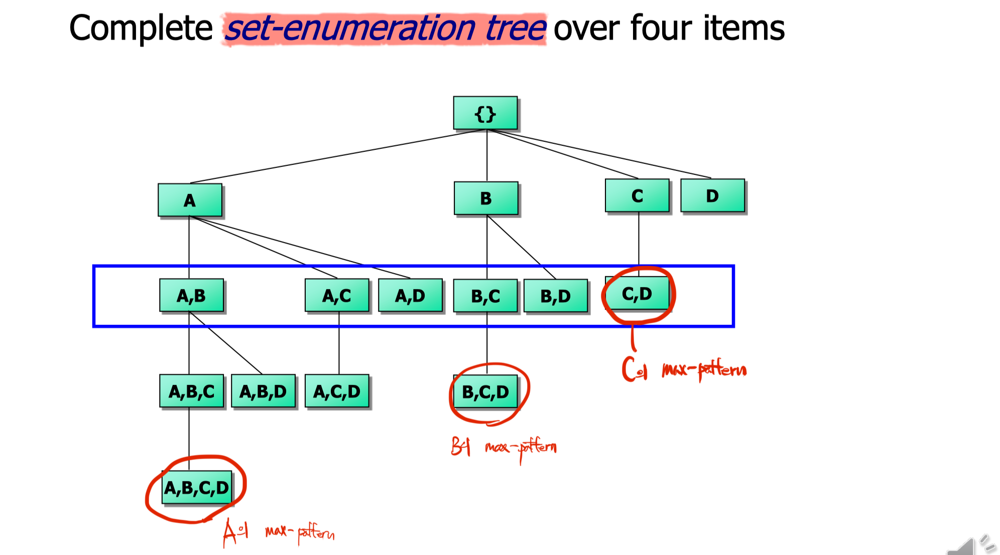

# Scalable Frequent Pattern Mining Methods

- Apriori
  - Candidate generation & test
- Projection-based
  - FPgrowth
  - CLOSET+
- Vertical format approach
  - CHARM

  

## MaxMiner

### Mining Max-patterns

Max-pattern: An itemset $X$ is a max-pattern, if $X$ is frequent and there exists no frequent super-pattern $X \supset Y$

1. Frequent 1-itemsets을 구하며 DB를 scan
2. 구해진 Frequent 1-itemsets에 대해 ascending order로 정렬
3. Complete **set-enumeration tree** over items
4. 찾아진 max-pattern 부터 support 검사 시작

### Example

$정렬된 Frequent\;1\; itemsets = \{A, B, C, D\}$ 일 때, set-enumeration tree는 다음과 같다($D$ is the most frequent item).

- $AB, AC, AD, AE, ABCDE$
- $BC, BD, BE, BCDE$
- $CD, CE, CDE$
- $DE$

- Since $BCDE$ is a max-pattern, no need to check $BCD$, $BDE$, $CDE$ in later scan
- If $AC$ is infrequent, no need to check $ABC$ in later scans

  

## CLOSET

### Mining Closed Patterns

Closed-pattern: An itemset $X$ is closed, if $X$ is frequent and there exists no super-pattern $Y \supset X$, with the same support as $X$

