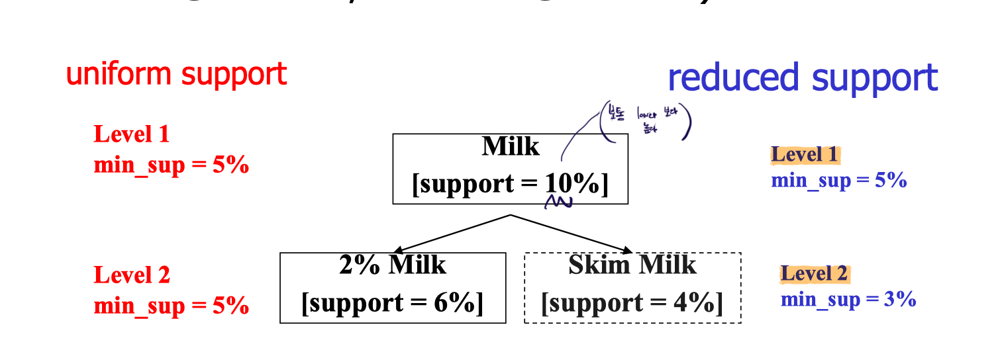
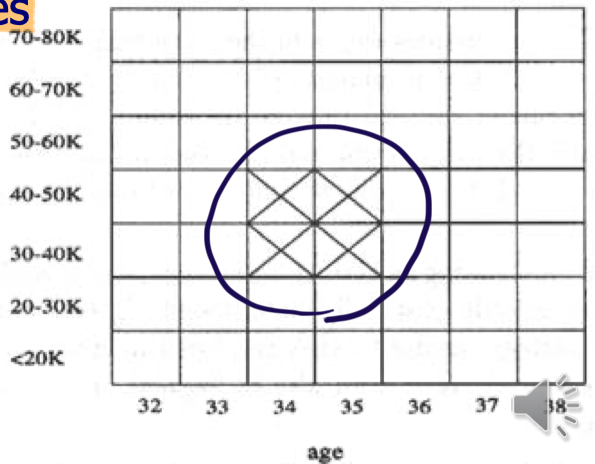
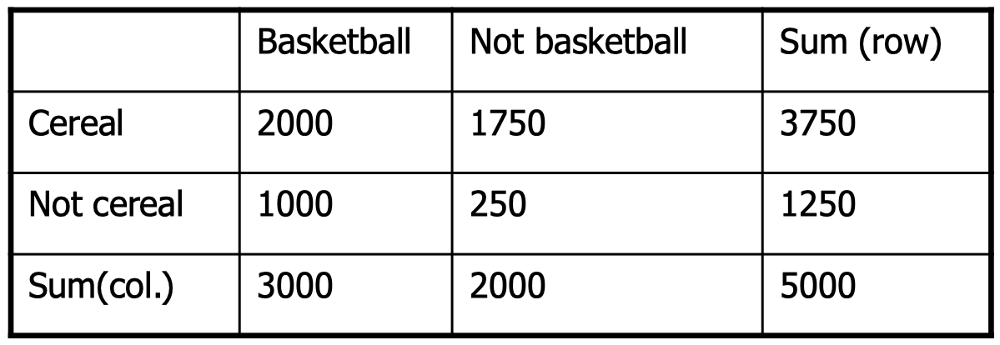

# Mining Various Kinds of Association Rules

## Multi-level Association

- Items often form hierarchies
- Flexible support settings
  - Items at the lower level are expected to have lower support
- Exploration of shared multi-level mining

### Redundancy Filtering

Some rules may be redundant due to “**ancestor**” **relationships** between items.

- Example
  - `milk -> wheat bread` : [support = 8%, confidence = 70%]
  - `2% milk -> wheat bread` : [support = 2%, confidence = 72%]
  - We say the **first rule is an ancestor** of the second rule.
- A descendent rule is redundant if, (불필요한 rule)
  - Its support is close to the “expected” value, based on the rule’s ancestor
  - Its confidence is close to that of the rule’s ancestor

  

## Multi-dimensional Association

- Single-dimensional rules: (having a dimension or a predicate)
  - $buys(X, “milk”) \Rightarrow buys(X, “bread”)$
  - 두 가지 모두 $buys$ 에 해당
- Multi-dimensional rules는 dimensions or predicates가 2개 이상 사용됨
  - Inter-dimension assoc. rules (no repeated predicates)
    - $age(X,”19-25”) \and occupation(X, “student”) \Rightarrow buys(X, “coke”)$
  - hybrid-dimension assoc. rules (repeated predicates)
    - $age(X,”19-25”) \and buys(X, “popcorn”) \Rightarrow buys(X, “coke”)$

  

## Attribute Types

$age(X,”19-25”) \and occupation(X, “student”) \Rightarrow buys(X, “coke”)$

에서, $age, occupation, buys$는 **attribute**이며, $19-25, student, coke$는 **attribute value**

- **Categorical** Attributes
  - Finite number of possible values, **no ordering among values**
- **Quantitative** Attributes
  - Numeric, implicit **ordering among values**
  - **Discretization and clustering** approaches required (e.g., $age$는 $19-25$ 등의 범위로 묶음)

  

## Multi-quantitative Association

Techniques can be categorized by how numerical attributes, such as age or salary are treated

1. **Static discretization** based on predefined concept hierarchies (data cube methods)

   e.g., $age(X,”19-25”)$

   Numeric values are replaced by ranges (as a categorical value).

2. **Dynamic discretization** based on data distribution

3. **Clustering**: Distance-based association

### Quantitative Association Rules

- Proposed by Lent, Swami and Widom ICDE’97
- Numeric attributes are **dynamically discretized**
- **Cluster adjacent association rules** to form general rules using a 2-D grid
  - 2-D quantitative association rules: $A_{quan1} \and A_{quan2} \Rightarrow A_{cat}$
    - The **confidence** is higher than threshold
    - The **support** is higher than threshold
    - C, S를 만족하는 cluster를 선택
- 장점: Rules are simplified

e.g., $age(X,”34-35”) \and income(X,”30-50K”) \Rightarrow buys(X,”high resolution TV”)$

  

## Interesting Correlation Patterns

Association Rule Mining의 한계를 극복하기 위함.

### Interestingness Measure: Correlations (Lift)

- $play \; basketball \Rightarrow eat \; cereal \; [S: 40\%, C: 66.7\%]$ is misleading.

  - Because, the overall $\%$ of students eating cereal is $75\% > 66.7\%$
  - $play \; basketball \Rightarrow not \; eat \; cereal \; [20\%, 33.3\%]$ is more meaningful, **although it has lower support and confidence**
  - **Support and confidence are not good to represent correlations**

- Measure of dependent/correlated events: **lift**

  $lift = \frac{P(A \cup B)}{P(A)P(B)}$

By the Contingency Table below,

$lift(B, C) = \frac{2000/5000}{3000/5000*3750/5000} = 0.89$

$lift(B, \lnot C) = \frac{1000/5000}{3000/5000*1250/5000} = 1.33$

### Other Interestingness Measures

- Lift
  - $lift = \frac{P(A \cup B)}{P(A)P(B)}$
- Cosine
  - $Cosine = \frac{P(A \cup B)}{\sqrt{P(A)P(B)}}$
  - Lift와 유사, but, $total \; number \; of \; xacts$를 고려하지 않는다.
- $all\_conf = \frac{sup(X)}{max\_item\_sup(X)}$
  - $X = itemset$

