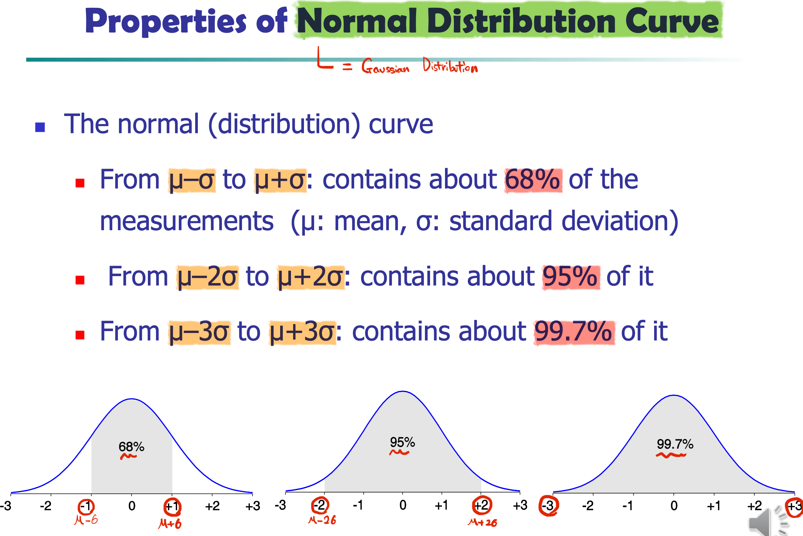
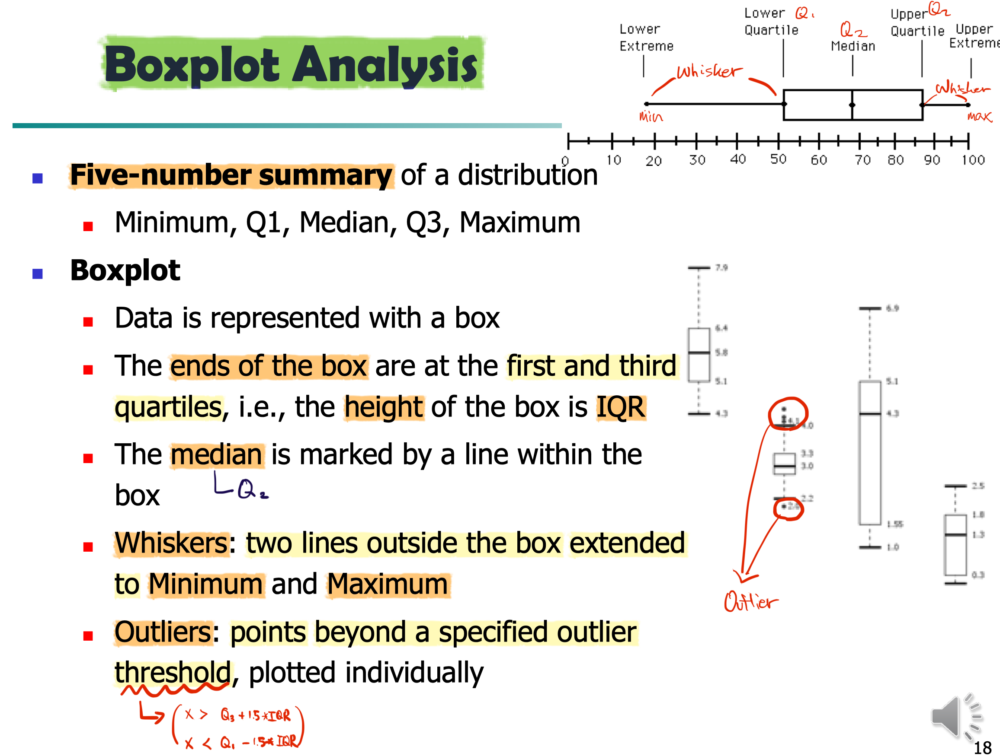

### Types of Datasets

- Record
  - relational records
  - data matrix
  - text documents: term-frequency vector
  - Xact data
- Graph & Network
- Ordered
  - video
  - sequential
- Spatial, Image, Multimedia
  - map
  - image
  - video

### Characteristics of Data

- Dimensionality

  - Number of attributes

  - Curse of Dimensionality

    `n_dim`이 너무 커질 경우, 거리가 가장 먼 pari와 가까운 pair, 두 pair들의 거리 차이가 매우 작아져 분석이 어렵다.

- Sparsity

- Resolution

  - e.g., 이미지 해상도
  - Patterns depend on the scale

- Distribution

  - **Centrality & Dispersion**

### Data Object

Data object = **Real-world entity described by attributes**

In DB, rows are data objects, and columns are attributes.

- Examples
  - Sales DB
    - objects: customers, items, sales
  - University DB
    - objects: students, professors, courses

Also called as **tuples, samples, instances**

  

## Attributes

Also called as **dimensions, features, variables**.

### Attributes' Types

- **Nominal**
  - categories, states, or names of things
  - **Finite** number of values
- **Binary**
  - **Special case of nominal attributes with only 2 states**
  - Symmetric Binary
    - Both outcomes **equally important**
  - Asymmetric Binary
    - not equally important (convention: 1 is the important one)
    - e.g., drug-cell response
- **Numeric** (quantitative)
  - **Ratio-scaled**
    - Times meaningful
    - **Zero(0) means absence**, e.g., weight
  - **Interval-scaled**
    - **Only difference meaningful**, measured on a scale of equal-sized units
    - Values have order
    - **No true zero-point**
    - e.g., temperature
- **Ordinal**
  - Values have a **meaningful order** (ranking)
  - **Magnitude between successive values is not know**
  - example
    - {small, medium, large}
    - medium이 large 보다 얼마나 작은지 모른다.

### Discrete vs Continuous Attributes

- Discrete Attributes
  - **Finite** or **countalbly infinite** set of values
  - e.g., zip codes, profession
- Continuous Attributes
  - Real numbers as values
  - 하지만, 컴퓨터의 하드웨어 한계(floating point)로, 실제로 무한한 표현은 불가

  

## Basic Statistical Descriptions of Data

To understand data better!

### Central Tendency

- Mean

- Median
  - Odd number of values: middle value
  - Even num of data: Average of the middle two values
  - 값이 추가/변경/삭제 될 때 마다 변경되므로, dynamic한 상황에서 사용이 어려움
  - 따라서 보간법(**Interpolation**)을 사용 가능

- Mode
  - **Value** that occurs **most frequently in the data**
  - Unimodal, bimodal, trimodal(가장 빈번한 3개 값)
  - Empirical formula
    - $mean - mode = 3 * (mean-median)$
    - 항상x, 대체로 성립
    - 3개 중 2개 값으로 나머지 하나 구할 수 있다.

### Dispersion

- Quartiles
  - $Q_1 ~ Q_4$
- Inter-Quartile Range (IQR)
  - $Q_3 - Q_1$
- Five number summary
  - $min, Q_1, median, Q_3, max$
- Boxplot
  - visualized with five number summary
- Outlier
  - usually, a value higher/lower than $1.5 * IQR$ from the IQR box

### Normal Distribution Curve

== **Gaussian Distribution**

### Graphic Displays of Basic Statistical Descriptions

- **Boxplot**: graphic display of five-number summary

- **Histogram**
  - x-axis are **values**, y-axis repres. **frequencies**
  - Categories are usually specified as **non-overlapping intervals**
  - Differs from a **Bar Chart**
    - Bar chart's frequenxy value == area of a bar
    - Histogram's frequency value = height
    - 이로 인해, category들의 width가 다를 때 큰 차이가 발생

- **Quantile plot**
  - each value $x_i$ is paired with $f_i$ indicating that approximately $100 f_i \%$ of data are $\le x_i$
  - 모든 데이터에 대해 ascending order로 정렬
  - 데이터의 value 기준, 위치(f-value)를 표현

- **Quantile-quantile (q-q) plot**
  - graphs the quantiles of one univariant distribution against the corresponding quantiles of another
  - Quantile에 따른 두 데이터셋을 비교

- **Scatter plot**
  - each pair of values is a pair of coordinates and plotted as points in the plane
  - 주로, 같은 데이터셋에 대해, 두 가지 attribute들의 관계를 보기 위해 사용

  

## Simiarity & Dissimilarity

Proximity = Similarity or Dissimilarity

- Similarity
  - Numerical measure of how much alike two data objects are
  - This value is higher when objects are more alike
  - **Often falls in the range [0,1]**
- Dissimilarity (e.g., **distance**)
  - Numerical measure of how much different two data objects are
  - Lower when objects are more alike
  - **Minimum dissimilarity is often 0**
  - Upper limit varies

### Standardizing Numeric Data

Age의 경우 0부터 100까지, Salary의 경우 0부터 million 까지 매우 다양하다. 그런데 이렇게 그냥 사용을 하게 되면, Salary의 영향력이 Age에 비해 매우 커지게 된다. 따라서 이를 normalize 해 주는 작업이 필요하다.

Z-score:  $z = \frac{x - \mu}{\sigma}$

- Notations
  - $x$: raw score to be standardized
  - $μ$: mean of the population
  - $σ$: standard deviation
- Meaning
  - the distance between the raw score and the population mean in units of the standard deviation
  - “-” when the raw score is below the mean
  - “+” when the raw score is above the mean

