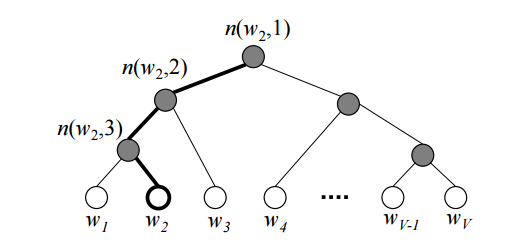

# Skip-grams

Variants of Skip-grams.

## Objective Funtion

$maximize \; J(\theta) =  \frac{1}{T} \sum_{t=1}^{T} \sum_{-c \le j \le c , j \neq 0} log \, p(w_{t + j} | w_{t})$

 

### 확률 계산

$p(w_{O} | w_{I}) = \frac{exp(v\prime _{w_O} ^{T} v_{w_{I}})}{\sum_{w=1}^{W} exp(v\prime _{w} ^{T} v_{w_{I}})}$

 

 

## Hierarchical Softmax

계층적 소프트맥스는 이진 트리(binary tree) 구조를 활용하여 계산량을 감소시키는 소프트맥스의 한 종류입니다. 모든 단어 벡터들을 계산하여 합하는 소프트맥스는 $O(|V|)$의 계산 복잡도를 가지지만, 이진 트리의 경우 $log_{2}|V|$ 회의 곱셈 계산, 시간복잡도 $O(log_{2}|V|)$로 감소시킬 수 있습니다.

- 트리의 모든 잎(leaf)들은 모두 각각 하나의 단어를 의미하며, 그 단어를 표상하는 벡터들이다.
- 잎이 아닌 노드들 또한 벡터로 이루어져 있다.
- $L(w)$: root node에서 잎들 중 하나인 $w$까지 경로의 길이
- $ch(n(w,j))$ : $j$ 번째 노드의 왼쪽 자식

$p(w|w_{I}) = \prod_{j=1}^{L(w) - 1} \sigma ([\![ n(w, j+1) = ch(n(w, j))]\!] \cdot v\prime _{n(w, j)}^{T} v_{w_{I}})$

여기서 시그모이드($\sigma$) 인자 내부의 $[\![ x ]\!]$ 는 다음과 같은 형태로 사용됩니다.

$[\![x]\!] = \left\{ \begin{array}{ll} 1 \ if \ x \ is \ true \\ -1 \ otherwise\\ \end{array} \right.$

위의 확률 식에서는 왼쪽 자식 노드로 이동할 경우 1, 오른쪽 자식 노드로 이동했을 경우 -1의 값을 갖음을 의미합니다. 이를 이용하는 이유는 자식 노드들의 확률 합을 1로 만들기 위해서입니다. 이는 아래 시그모이드 함수의 그래프를 통해서도 $\sigma(x)+\sigma(-x)=1$ 임을 간단히 확인할 수 있습니다.

$\sigma(v_n^Tv_{w_i})+\sigma(-v_n^Tv_{w_i}) = 1$

 따라서 위 식이 만족됨을 알 수 있으며, 이는 첫 번째 식과 같이 모두 곱해주는 것 만으로도 전체 합이 1인 확률이 되는 것을 보장합니다. (소프트맥스 또한 단어들간의 확률합이 1임을 만족)

논문에서는 binary Huffman tree를 사용했으며, 이는 자주 등장하는 단어들을 짧은 경로에 할당하는 방법입니다.

 

 

## Negative Sampling

Negative sampling은 Noise Contrastive Estimation(NCE)를 변형하여 language modeling을 적용한 방법입니다. 모든 단어를 모두 계산하지 않고 근사하여 값을 구하는데, 주변 단어가 아닌 틀린 단어들에 대해 $k$ 개만을 선별하여 계산하고, 파라미터를 업데이트 하는 방법입니다. $k$ 는 주로 작은 데이터셋에서는 5~20, 큰 데이터셋에서는 2~5의 값으로 설정합니다.

$log \, p(w_{O} | w_{I}) = log \, σ(v\prime_{w_{O}}^{\top} v_{w_{I}}) + \sum_{i=1}^{k} \mathbb{E}_{w_{i} \sim P_{n}(w)}[log \, σ(−v\prime _{w_{i}}^{⊤} v_{w_{I}})]$

$P_{n}(w)$ 은 noise distribution이며, unigram distribution을 따르고, 단어 $w$ 가 선정될 확률입니다.

$P_{n}(w_{i}) = \frac{f(w_{i})^{3/4}}{\sum_{j=1}^{n}\, f(w_{j})^{3/4}}$

$f(w)$ 은 단어 $w$ 가 데이터셋(말뭉치) 내에서 등장하는 비율(단어의 등장 횟수 / 전체 단어수)입니다. $\frac{3}{4}$ 의 지수승을 사용하여 확률을 구하는 것은, 개수가 적은 값을 갖는 데이터의 확률은 보다 크게, 많은 개수의 데이터는 보다 작게 만듭니다.

 

 

## Subsampling of Frequent Words

Subsampling은 단어들의 등장 빈도에 따라 해당 step에서의 학습 여부를 확률적으로 결정하고, 계산량을 감소시킵니다. 등장 빈도가 높은 단어일 수록 작은 확률을 갖습니다. 다음 식의 $P(w)$ 는 단어 $w$ 가 학습에 사용될 확률을 의미합니다.

$P(w_{i}) = 1 - \sqrt{\frac{t}{f(w_{i})}}$

$f(w)$ 은  negative sampling에서와 동일한 의미이며, hyper parameter인 $t$ 는 주로 0.00001의 값으로 사용합니다.