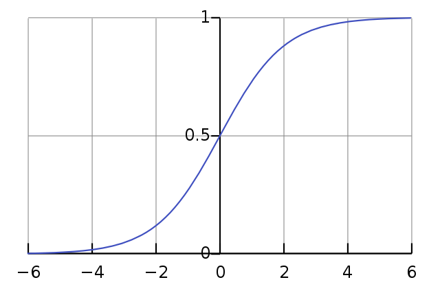

# Skip-grams

Variants of Skip-grams.

## Objective Funtion

$maximize \; J(\theta) =  \frac{1}{T} \sum_{t=1}^{T} \sum_{-c \le j \le c , j \neq 0} log \, p(w_{t + j} | w_{t})$

 

### 확률 계산

$p(w_{O} | w_{I}) = \frac{exp(v\prime _{w_O} ^{T} v_{w_{I}})}{\sum_{w=1}^{W} exp(v\prime _{w} ^{T} v_{w_{I}})}$

 

### Sigmoid Function

아래 알고리즘들에서 등장하는 시그모이드 함수는 다음과 같습니다.

$\sigma (x) = \frac {1}{1 + e^{-x}}$

 

 

## Hierarchical Softmax

계층적 소프트맥스는 이진 트리(binary tree) 구조를 활용하여 계산량을 감소시키는 소프트맥스의 한 종류입니다. 모든 단어 벡터들을 계산하여 합하는 소프트맥스는 $O(|V|)$의 계산 복잡도를 가지지만, 이진 트리의 경우 $log_{2}|V|$ 회의 곱셈 계산, 시간복잡도 $O(log_{2}|V|)$로 감소시킬 수 있습니다.

- 트리의 모든 잎(leaf)들은 모두 각각 하나의 단어를 의미하며, 그 단어를 표상하는 벡터들이다.
- 잎이 아닌 노드들 또한 벡터로 이루어져 있다.
- $L(w)$: root node에서 잎들 중 하나인 $w$까지 경로의 길이
- $ch(n(w,j))$ : $j$ 번째 노드의 왼쪽 자식

Hierarchial softmax를 사용할 경우 기존 CBOW나 Skip-gram에 있던 $W’$ matrix를 사용하지 않게 됩니다. 대신, $|V|-1$ 개의 internal node들이 각각 길이 $N$ 의 weight vector를 가지게 됩니다. 이를 $v\prime _{i}$ 라고 하며, 학습 과정에서 update 됩니다.

 

### 확률 계산

$p(w|w_{I}) = \prod_{j=1}^{L(w) - 1} \sigma ([\![ n(w, j+1) = ch(n(w, j))]\!] \cdot v\prime _{n(w, j)}^{T} v_{w_{I}})$

여기서 시그모이드($\sigma$) 인자 내부의 $[\![ x ]\!]$ 는 다음과 같은 형태로 사용됩니다.

$[\![x]\!] = \left\{ \begin{array}{ll} 1 \ if \ x \ is \ true \\ -1 \ otherwise\\ \end{array} \right.$

위의 확률 식에서는 왼쪽 자식 노드로 이동할 경우 1, 오른쪽 자식 노드로 이동했을 경우 -1의 값을 갖음을 의미합니다. 이를 이용하는 이유는 자식 노드들의 확률 합을 1로 만들기 위해서입니다. 이는 아래 시그모이드 함수의 그래프를 통해서도 $\sigma(x)+\sigma(-x)=1$ 임을 간단히 확인할 수 있습니다.

$\sigma(v_n^Tv_{w_i})+\sigma(-v_n^Tv_{w_i}) = 1$

따라서 위 식이 만족됨을 알 수 있으며, 이는 첫 번째 식과 같이 모두 곱해주는 것 만으로도 전체 합이 1인 확률이 되는 것을 보장합니다. 다음은 이러한 사실에 대한 [BEOMSU KIM](https://shuuki4.wordpress.com/2016/01/27/word2vec-관련-이론-정리/) 님의 설명입니다.

> 특정 노드에서 왼쪽, 오른쪽 자식으로 갈 확률을 더하면 1이 된다. 이를 이용하면, sigma p(w_i | hidden layer) 값이 1이라는 것을 쉽게 보일 수 있을 것이다. Softmax function의 계산이 오래 걸렸던 것은 확률 계산을 위해 모든 결과에 대한 합을 1로 만들어주기 위함이었다. 이 과정에서 최종적으로 나온 output값에 대해 일일히 계산을 해주어서 전체 합으로 normalize를 해주었기 때문에 V 만큼의 계산이 더 필요했던 것인데, 이 Hierarchical Softmax를 사용하면 전체 확률에 대한 계산 없이 전체 합을 1로 만들어 줄 수 있어 좋은 multinomial distribution function으로 사용할 수 있게 되는 것이다.
>
> word2vec 논문에서는 이러한 Binary Tree로 Binary Huffman Tree를 사용했다고 한다. Huffman Tree를 사용할 경우 자주 등장하는 단어들은 보다 짧은 path로 도달할 수 있기 때문에 전체적인 계산량이 더 낮아지는 효과를 볼 수 있을 것이다. 또한 Huffman Tree는 Full Binary Tree이기 때문에 Hierarchical Softmax의 조건에도 부합한다.

 

 

## Negative Sampling

### Noise Contrastive Function, NCE

CBOW와 Skip-Gram 모델에서 사용하는 비용 계산 알고리즘을 말한다. 전체 데이터셋에 대해 SoftMax 함수를 적용하는 것이 아니라 샘플링으로 추출한 일부에 대해서만 적용하는 방법을 말한다. k개의 대비되는(contrastive) 단어들을 noise distribution에서 구해서 (몬테카를로) 평균을 구하는 것이 기본 알고리즘이다. Hierarchical SoftMax와 Negative Sampling 등의 여러 가지 방법이 있다.
일반적으로 단어 갯수가 많을 때 사용하고, NCE를 사용하면 문제를 (실제 분포에서 얻은 샘플)과 (인공적으로 만든 잡음 분포에서 얻은 샘플)을 구별하는 이진 분류 문제로 바꿀 수 있게 된다.

Negative Sampling에서 사용하는 목적 함수는 결과값이 최대화될 수 있는 형태로 구성한다. 현재(목표, target, positive) 단어에는 높은 확률을 부여하고, 나머지 단어(negative, noise)에는 낮은 확률을 부여해서 가장 큰 값을 만들 수 있는 공식을 사용한다. 특히, 계산 비용에서 전체 단어 V를 계산하는 것이 아니라 선택한 k개의 noise 단어들만 계산하면 되기 때문에 효율적이다. 텐서플로우에서는 tf.nn.nce_loss()에 구현되어 있다.

출처: https://pythonkim.tistory.com/92 [파이쿵]

 

### NEG

Negative sampling(NEG)은 NCE를 변형하여 language modeling을 적용한 방법입니다. 모든 단어를 모두 계산하지 않고 근사하여 값을 구하는데, 주변 단어가 아닌 틀린 단어들에 대해 $k$ 개만을 선별하여 계산하고, 파라미터를 업데이트 하는 방법입니다. $k$ 는 주로 작은 데이터셋에서는 5~20, 큰 데이터셋에서는 2~5의 값으로 설정합니다.

$p(w_{O} | w_{I}) = σ(v\prime_{w_{O}}^{\top} v_{w_{I}}) + \sum_{i=1}^{k} \mathbb{E}_{w_{i} \sim P_{n}(w)}[log \, σ(−v\prime _{w_{i}}^{⊤} v_{w_{I}})]$

$P_{n}(w)$ 은 noise distribution이며, unigram distribution을 따르고, 단어 $w$ 가 **학습에 사용될 확률**입니다. Positive sample을 의미하는 좌측 항의 경우 ‘$(w,c)$ 조합이 이 corpus에 있을 확률’ 을 정의하며, negative sample의 경우 ‘$(w,c)$ 조합이 이 corpus에 없을 확률’을 정의합니다. 이후, 각각을 더하여 log를 취하고 정리하면, 위과 같은 형태의 식이 됩니다.

하지만, 사실상 negative sample을 다루는 오른쪽 항은 별도의 objective의 형태로 학습됩니다. 왜냐하면 이렇게 확률적으로 negative sample들을 구성할 때, 모든 corpus가 학습될 수 있도록 조절해야 하기 때문입니다.

 

### Negative samples 선정

$P_{n}(w_{i}) = \frac{f(w_{i})^{3/4}}{\sum_{j=1}^{n}\, f(w_{j})^{3/4}}$

$f(w)$ 은 단어 $w$ 가 데이터셋(말뭉치) 내에서 등장하는 비율(단어의 등장 횟수 / 전체 단어수)입니다. $\frac{3}{4}$ 의 지수승을 사용하여 확률을 구하는 것은, 개수가 적은 값을 갖는 데이터의 확률은 보다 크게, 많은 개수의 데이터는 보다 작게 만듭니다.

 

 

## Subsampling of Frequent Words

Subsampling은 단어들의 등장 빈도에 따라 해당 step에서의 학습 여부를 확률적으로 결정하고, 계산량을 감소시킵니다. 등장 빈도가 높은 단어일 수록 작은 등장 확률을 갖습니다. 다음 식의 $P(w)$ 는 단어 $w$ 가 **학습에서 제외될 확률**을 의미하며, negative sampling에서의 $P(w)$ 와는 반대의 의미입니다.

$P(w_{i}) = 1 - \sqrt{\frac{t}{f(w_{i})}}$

$f(w)$ 은  negative sampling에서와 동일한 의미이며, hyper parameter인 $t$ 일정 값 이상일 때에만 제외한다는 의미의 threshold 값이며, 주로 0.00001($10^{-5}$)의 값ㅇ을 사용합니다. 만약 $f(w)$ 가 0.01인 빈도가 매우 높은 단어가 있을 때, $P(w)$ 는 0.9684이므로, 100번의 학습 기회가 주어질 경우 대략 96번 정도는 학습에서 제외됩니다.

 

 

## Training Phrases

단어 간의 결합으로 생성되는 구문(phrase)은 결합 이전의 뜻과는 전혀 다른 뜻을 가질 수 있습니다. 이를 처리하기 위해 많은 연구들이 진행되고 있지만, 그 중 하나는 다음과 같은 점수(score)를 통해 구문임을 구별하여 별도의 tokenizing을 하는 것입니다.

$score(w_{i}, w_{j}) = \frac{count(w_{i}, w_{j}) - \delta}{count(w_{i}) \times count(w_{j})}$

Skip-gram 모델을 전체 n-grams를 통해 학습할 경우 지나친 메모리 소비를 유발합니다. 따라서 위의 식을 통해 unigram과 bigram을 counting하고, 이를 여러번 시행하여 2 개 단어 길이 이상의 구문들 또한 tokenizing합니다.

$\delta$ 의 경우 threshold 역할을 하며, 구문 파악을 위해 2~4 회 학습 데이터를 살펴보는 동안 그 값을 감소시켜 보다 긴 길이의 구문들을 포착할 수 있도록 합니다.

