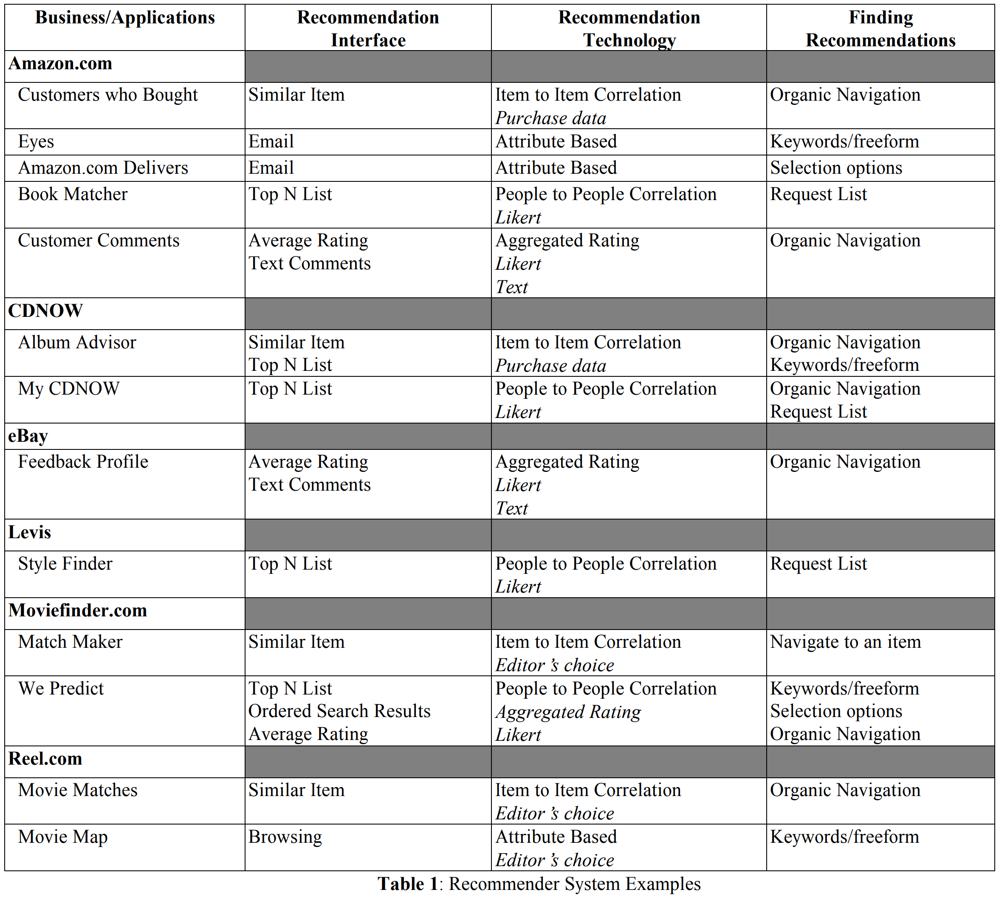

# 1. Recommender System Overview

출처: [Yamarae](https://yamalab.tistory.com/67)

*이 글은 Yamarae 님의 추천 시스템의 글을 요약하거나, 그대로 담아온 내용입니다.*

 

## 1-1. 추천 시스템의 목적

추천 시스템, 혹은 추천 모델링은 **'특정 시점'**에 **'특정 고객'**이 **좋아할 만한 리스트**를 **찾아주는 것**입니다.

우리는 특정 시점에, 특정 고객이 원하는 리스트를 찾기 위해 (1)고객의 정보를 살펴보고, (2)보유하고 있는 전체 리스트(아이템)을 살펴보고, (3)때로는 시스템 외부의 정보들을 끊임없이 살펴보면서 (4)이를 리스트에 반영할 수 있는 시스템을 만들어야 합니다.

 

 

## 1-2. 시스템의 고려 요소

### 고객

고객 정보

 

### 아이템

시스템이 보유한 아이템

 

### 시스템 업데이트

시스템의 업데이트를 고려한다는 것은 얼마나 자주 추천되는 아이템의 리스트가 업데이트 되는 지에 대한 것이다. 추천의 영역마다 아이템 리스트의 업데이트가 얼마나 빠른 주기로 이루어지는지가 매우 중요할 것이다.

 

### 알고리즘 성능

좁은 의미에서는 추천 모델의 **계산량**이나 **연산 속도**를 의미한다. 현재 state of the art의 취급을 받고 있는 협업 필터링(CF, Collaborative Filtering)이나 딥러닝(DL, Deep Learning)의 경우 **다수의 Hadoop Cluster 환경 등의 빅데이터 시스템**이 안정적으로 구축되어야 합니다. 따라서 최신 알고리즘보다 훨씬 쉽고 간단하면서도 연산량이 작고, 그럼에도 불구하고 고급 알고리즘들과 비슷한 성능을 낼 수 있는 Association Rule과 같은 알고리즘들이 여전히 널리 활용되고 있습니다.

넓은 의미에서는 **빅데이터를 처리할 수 있는 좋은 환경을 의미**합니다. 대부분의 추천 시스템은 수 많은 사용자를 대상으로, 대량의 데터를 활용하는 B2C 비즈니스 모델이기 때문입니다. 연산량이 적은 알고리즘을 사용할 지라도, 방대한 양의 고객들을 대상으로 서비스하려면 좋은 환경이 필수적입니다.

 

 

## 1-3. 장애 요소

### Sparsity Problem

추천 시스템에서의 가장 널리 알려진 장애 요소는 **Sparsity Problem**입니다. 추천할 아이템과 고객의 수는 계속해서 증가합니다. 하지만 **전체 아이템**에 대해 **고객이 실제로 소비하게 되는 콘텐츠나 아이템의 비율**은 계속해서 감소하게 되며, 이를 Sparsity Problem이라고 합니다. 서비스가 성장하는 단계에서는 더욱 잘 나타나는 현상입니다. 지금처럼 소비의 헤게모니가 오프라인에서 모바일로 옮겨가는 상황에서는 대부분의 서비스에서 양적 팽창이 발생하기 때문에 더욱 발생하기 쉽습니다. 디지털 환경에서는 '추천'이라는 타이틀의 리스트가 노출되는 영역이 한정적이며, 한정된 영역에 게시할 아이템의 리스트를 추려내는 작업은 더더욱 어렵습니다.

 

### Information Utilization Problem 

**Information Utilization Problem**은 대부분의 추천 서비스에서 나타납니다. 한정적이며 Sparsity Problem을 야기할 수 있는 **Explicit Score(명시 점수)**가 아닌, **Implicit Score(암묵 점수)**를 활용하고자 하는 **고민**입니다. 예를 들자면, e-commere에서의 고객의 행동 데이터가 있습니다. 대부분의 고객들은 상품을 눌러보고, 다른 상품도 살펴보고, 본인 기준에 마음에 든다면 장바구니에 넣어뒀다가 이를 구매하기도 합니다.

왓챠나 넷플릭스 같은 영화 추천 서비스에서 사용자들은 아이템에 대한 명확한 평가를 내리지 않습니다. 관심 표시를 하거나, 얼마나 오래 동안 재생했는가에 대한 데이터 정도가 있습니다. 상품에 대한 리뷰를 작성하거나 별점을 주는 고객은 극소수에 가깝습니다. 이러한 로그 데이터 속에 숨어있는 정보를 이용하는 고민이 필요합니다. E-commerce에서 또한, 고객의 구매 목록 데이터가 있을 때, 구매가 완료되었다고 과연 이 데이터가 상품에 대한 호감을 나타내는 데이터라고 할 수 있을까요? 구매 했지만, 환불이나 교환이 발생했을 수도 있습니다. 이러한 암묵 점수를 활용하기 용이한 **Explicit Score(명시 점수)**처럼 Utilization 하는 과정이 필요합니다.

물론 Explicit Score가 항상 유용하기만 한 데이터인 것은 아닙니다. **대부분의 잘 정리된 명시 점수의 경우 Sparsity Problem을 유발**할 가능성이 큽니다.

 

 

## 1-4. 과거 추천 시스템의 동향

추천 시스템 중에서도, 가장 역사가 오래된 e-commerce를 기반으로 추천 시스템의 전반적인 내용을 설명하겠습니다. 우선 e-commerce의 경우 크게 3가지 분류의 데이터인 Implicit Score, Explicit Score, Contents를 시스템 구축에 활용할 수 있습니다. 이 중 Contents는 아이템 자체에 대한 정보를 의미합니다. 영화 제품의 경우 감독명, 출연진 리스트 등이 Contents에 포함되며, 의류 제품의 경우 상품의 색상, 사이즈, 상품 이미지 등의 정보가 해당됩니다.

과거의 추천 시스템에서는 **KDD(Knowledge Discover in Database)**라는 방법론을 기반으로 알고리즘을 개발했습니다. 물론 현재의 추천 시스템 역시 넓은 의미로는 KDD라고 할 수 있겠지만, 과거의 경우 보다 좁은 의미로 사용되었습니다.KDD를 말 그대로 해석한다면 '**데이터셋에서 유의미한 규칙을 찾아내는 것**'이라고 할 수 있습니다. 이 방법론의 가장 대표적인 알고리즘으로 **Association Rule**이 있습니다.

 

### Association Rule

Association Rule은 **고객들의 상품 묶음 정보를 규칙으로 표현하는 가장 기본적인 알고리즘**이며, 흔히 **장바구니 분석**이라고도 불립니다. 데이터마이닝과 같은 수업을 들었다면 한번 쯤 들어봤을 법한 알고리즘입니다. 이 알고리즘은 기초적인 확률론에 기반한 방법으로, **전체 상품중에 고객이 함께 주문한 내역을 살펴본 뒤 상품간의 연관성을 수치화**하여 나타내는 알고리즘입니다. 매우 직관적이고 구현하기도 쉬운데, 현재까지도 사용되기도 하는 알고리즘입니다. 추천 시스템에서 여전히 가장 중요한 알고리즘으로 분류되며, Association Rule에서 파생된 다양한 알고리즘들이 존재합니다.

Reference : [Recommender Systems in E-Commerce](http://files.grouplens.org/papers/ec-99.pdf)

위의 표는 e-commerce 초창기의 여러 사이트들에서 사용하던 추천 알고리즘의 리스트입니다. 대부분 Association Rule에 기반하거나, 인기도에 기반했음을 알 수 있습니다. 간혹 **Collaborative Filtering** 기반의 알고리즘도 존재합니다.

 

### 추천 알고리즘의 추천 방식

추천의 타입은 크게 3가지로 분류됩니다.

1. **Personalized Recommender**

   - 대표적인 알고리즘: CF, **Collaborative Filtering**

2. **Non-personalized Recommender**

   Rating 기반의 인기 상품, 혹은 현재 상품을 기준으로 AR(Association Rule) 순위 대로 상품을 추천

   주로 **Cold Start Problem**(개인화 추천 모델링을 위한 유저 정보 혹은 아이템 정보가 부족한 상황에서 발생하는 문제)이 발생하는 상황이나 개인화 추천이 잘 적용되지 않는 도메인에서 사용

   - 대표적인 알고리즘: **AR, Association Rule**

3. **Attribute-based Recommender**

   아이템 자체가 가지고 있는 정보, 즉 앞서 설명했던 Contents 정보를 활용하여 추천하는 방법

   Cold Start Problem을 해결하는 데에 사용되는 조금 더 세련된 방법

   **CF(Collaborative Filtering)와 상호 보완적**이며, Content-based approach라고도 불림

   - 대표적인 알고리즘: **Content based approach**

 

 

## 1-5. 현재 추천 시스템의 동향

현재 추천 시스템의 동향은 기본적으로는 과거와 다르지 않습니다. 하지만 **딥러닝**을 기반으로 하여 부분적으로는 보다 고도화된 알고리즘들이 적용되고 있으며, 하둡으로 대표되는 **빅데이터 처리 플랫폼**이 매우 안정화 되었습니다. 가장 중요한 것은 **고객이 추천 시스템을 접하는 창구가 고도화**되었다는 점입니다. 상품 판매에 AR 추천 시스템을 적용하여 노출시켰던 Amazon을 시작으로, YouTube는 고도화된 개인화 추천을 제공합니다.

 

### 현재 사용되는 추천 알고리즘의 추천 방식

현재 추천 모델링에 사용되는 방법론은 크게 3가지 정도로 요약될 수 있습니다.

1. 데이터에 대한 가장 기본적인 접근법인 통계 기반의 모델링
2. 추천 시스템 하면 가장 먼저 떠오르는 협업 필터링(CF)
3. 현재 가장 이슈가 되고있는 딥러닝 기반의 모델링

 

### 통계 기반의 모델링

E-commerce에서 패션 상품을 노출한다고 할 때, 여성 의류의 경우 **신상품에 대한 고객들의 반응(Implicit score)**이 어느정도 일반화 되었다고 가정해 보겠습니다. 이 때 해당 상품에 대한 암묵 점수들의 분포를 통계적으로 살펴보는 것이 의미가 있을 수 있습니다. **가설에 기반하여 실제의 분포나 반응이 얼마나 다른지를 검정하는 통계 검정 기법**으로 **카이제곱 검정**(자세한 내용은 [Wiki](https://ko.wikipedia.org/wiki/카이제곱_검정) 참고) 등의 통계 기법을 사용할 수 있습니다.

 

### Collaborative Filtering 기반의 모델링

CF 기반의 모델링의 경우, 가장 널리 알려져 있으며 대부분의 추천 시스템에 사용됩니다. CF 모델링을 기반으로 한 다양한 응용 알고리즘들이 있으며, 이를 발전시키거나 또 다른 알고리즘과 접목하는 방향으로 sota 알고리즘이 연구되고 있습니다. 일부 논문등의 자료에서는 AR 또한 CF 기반의 모델링으로 분류해버리기도 합니다. 그 이유는 '연관성'이라는 측면 때문인데, 추천이라는 행위 자체가 연관성을 기반으로 하는 것이기 때문입니다.

 

### Deep Learning 기반의 모델링

마지막으로, 딥러닝 기반의 모델링은 비교적 최근에 연구되고 있으며, 부분적으로 적용되고 있는 방법입니다. **Content based** 모델링 기법에서 이미지 등의 특별한 데이터를 다루기 위한 모델링을 하기도 하며, word2vec으로 대표되는 언어 처리 알고리즘을 키워드 분류 등에 사용하기도 합니다. 현재 가장 활발하게 연구 및 개발이 이루어지고 있는 분야입니다.

 

### 정리

이러한 방법론 중에 절대적인 방법론은 없으며, 추천 시스템을 구축하는 기술자 혹은 기획자의 입장에서 가장 중요한 것은 '고객이 무엇을 원하느냐'입니다. **나와 비슷한 유저가 좋아할(취향) 만한 아이템을 추천 하는 도메인**의 경우 **CF** 모델링이 유용할 것이며, 이미지 추천과 같이 **컴퓨터에 의한 정보 추출이 필요한 도메인**의 경우에는 **딥러닝** 모델링이 유용할 수 있습니다.

 

 

## 1-6. 추천 시스템을 평가하는 방법

추천 시스템을 얼마나 효율적으로 구축했는지를 평가하는 기준이 필요합니다. **알고리즘의 목표는 고객의 score와 예측 사이의 오차를 줄이는 것**이지만, 추천 시스템을 구축하는 사람에게는 또 다른 평가 기준이 필요합니다.

 

### 정량적 평가

B2C 추천 시스템에서 추천 결과를 평가하는 방법은 크게 두 개로 나누어 집니다. 알고리즘의 성능 자체를 평가하는 오프라인 모델과 알고리즘이 예측한 리스트와 실제 유저들이 좋아하는 리스트를 다양한 기준으로 비교해보는 실전 테스트, **온라인 모델**이 있다. **오프라인 모델**에서는 알고리즘마다의 평가 기준이 존재하지만, 일반적인 머신 러닝에서 사용하는 Accuracy, Precision, Recall, F1-score, ROCurve, RMSE, MAPE 등을 활용하며, nDCG와 같은 검색 분야에 활용하는 지표 등을 사용하기도 한다. 단순하게 top N개의 리스트의 목록의 구성 요소들을 보고 평가하기도 합니다.

오프라인 모델이 **주어진 데이터셋**을 학습과 테스트로 나누어 평가하는 것이라면, 온라인 모델은 완성된 알고리즘을 **유저들에게 배포했을 때 어떤 결과가 나오는지를 A/B 테스트 등으로 실험**해 보는 것입니다. 물론 여기에도 기술적인 평가 지표인 CR, CTR 등이 들어가기는 하지만, '**실험**'이라는 의미가 더 강합니다. 또한 도메인마다 다른 실험 측정 기준을 가지고 있으며, 페이지의 체류 시간이나 구매액 등을 평가하기도 합니다.

 

### 정성적 평가

정성적인 평가 기준 또한 존재합니다. 이는 흔히 추천 시스템에서 **Serendipity**라고 불리며, **상품의 우연성**을 나타낸다. 기계가 판단하기에 더 적합한 상품을 노출시키는 것도 중요하지만, 인간만이 인지할 수 있는 제 3의 요소, 티셔츠를 구매하면 조금 다른 카테고리의 의류를 보여준다던지 하는 상품의 우연성을 고려해야 합니다. 

