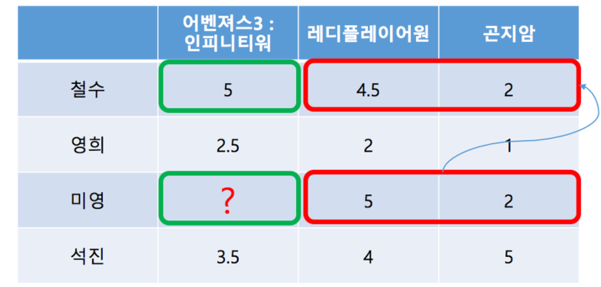
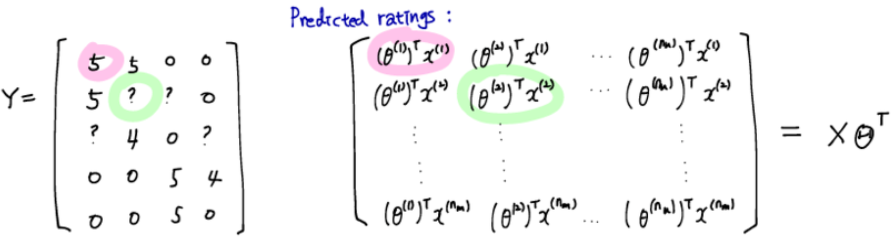
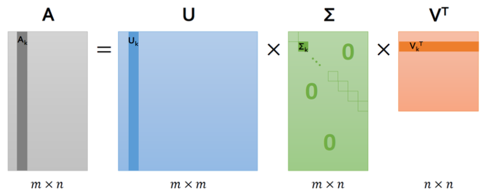
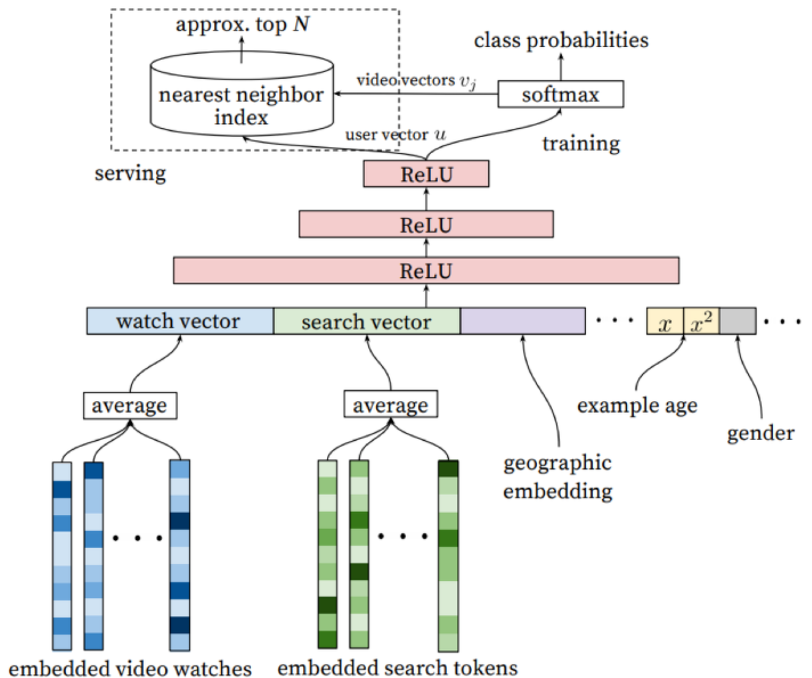

# 2. Recommender System's Algorithms

다음 세 가지 접근법들에서 사용하는 대표적 알고리즘들에 대해 대략적으로 알아보겠습니다.

1. 통계 기반 모델링
2. Collaborative Filtering 기반 모델링
3. Deep Learning 기반 모델링

 

 

## 2-1. 통계 기반 모델링

지난 포스팅에서 카이제곱 분포를 이용한 검정방법에 대해 잠시 언급했습니다. 추천 시스템에서 통계 기반 모델링이라는 것은 **이상 징후를 보이는 아이템을 추출해내는 작업**이라고 볼 수도 있겠다. 카이제곱 검정의 경우 구현 난이도가 높지 않으며, 데이터를 전문적으로 하는 사람이라면 알고 있어야 하는 내용입니다.

 

### 카이제곱 검정

카이제곱을 통계적 모델링에 활용하는 식은 다음과 같습니다.

$\chi ^{2} = \sum (관측값 - 기댓값)^{2} / 기댓값$

위 식을 이용, 관측값과 기댓값을 각각 **관측 빈도**와 **기대 빈도**로 치환하고, 카이제곱 분포에 대한 계수 값을 계산한 뒤, 이를 비정상적인 분포 검정에 활용합니다. 아래는 카이제곱 검정에 대한 예시입니다.

가정: 음주 여부에 따른 간질병 발병 빈도를 알고있다고 할 때, 다음과 같은 표로 관측 빈도를 나타낼 수 있다.

|        | 발병 | 정상 | 합계 |
| ------ | ---- | ---- | ---- |
| 음주   | 30%  | 15%  | 45%  |
| 비음주 | 10%  | 45%  | 55%  |
| 합계   | 40%  | 60%  | 100% |

위 표의 합계값을 이용하여 **기대 빈도**를 구하고, 다음과 같이 나타날 수 있다.

|        | 발병                   | 정상                   | 합계 |
| ------ | ---------------------- | ---------------------- | ---- |
| 음주   | 100 * 0.45 * 0.4 = 18% | 100 * 0.45 * 0.6 = 27% | 45%  |
| 비음주 | 100 * 0.55 * 0.4 = 22% | 100 * 0.55 * 0.6 = 33% | 55%  |
| 합계   | 40%                    | 60%                    | 100% |

이러한 두 테이블을 이용하여 카이제곱을 계산한다. 아이템의 **관측 빈도**를 알 수 있으니, 카이제곱 역시 적용하기에 쉬운 방법이다.

 

### 이외 방법

카이제곱 검정 외에도 쿨백-라이블러 발산, **KLD**(Kullback–Leibler divergence)는 **두 확률분포의 차이를 계산**하는 데에 사용하는 방법입니다. 어떤 이상적인 분포에 대해, **그 분포를 근사하는 다른 분포를 사용하여 샘플링**하고, **발생할 수 있는 정보 엔트로피 차이를 계산**합니다.

이는 정보이론의 한 방법이며, **상대 엔트로피(relative entropy)**, __인포메이션 다이버전스(information divergence)__라고도 합니다. 이 방법의 핵심은 **잘 일어나지 않는 사건은 자주 일어나는 사건보다 정보량이 높다**는 것입니다. 이 역시 수식이나 알고리즘이 간단한 편이고, 카이제곱 검정보다는 조금 더 많이 언급되는 듯 합니다.

 

 

## 2-2. Collaborative Filtering 기반 모델링

CF는 일반적으로 두 가지 방법으로 분류되며, 그 안에서 몇 가지로 다시 분류됩니다.

 

### Memory based algorithm

다시 Memory based 알고리즘은 다음과 같이 분류됩니다.

- Neighborhood model
  - User based
  - Item based
- Model based
  - MF, Matrix Factorization
  - RBM
  - 베이지안
  - 등

이 중에서 MF에 대해 알아보겠습니다. RBM과 베이지안은 처음 공부하기에 어려우며, 자주 사용되지는 않는 것 같습니다.

 

### Neighborhood model - User based CF

메모리 기반 알고리즘(Neighborhood model 기준)은 **유저와 아이템에 대한 matrix**를 만든 뒤, **유저 기반 혹은 아이템 기반으로 유사한 객체를 찾은 뒤 빈공간을 추론**하는 알고리즘입니다.

위와 같이 유저-영화 테이블이 있을 때, 채워진 값들은 영화에 대해 내린 rating 값들입니다. Implicit score를 가진 도메인의 경우, 이 rating을 채워넣는 것 자체에 대한 방법론을 고민해야 합니다. 미영은 레디플레이어원과 곤지암에 대해 점수를 평가했고, 시스템은 **미영이 아직 보지 않은 영화들**에 대해, 미영이 본다면 __어떻게 rating을 부여할 지 점수를 예측__하고, **높게 평가될 것이라고 예상되는 영화**를 추천해주어야 합니다. 이때  **user based CF**의 경우, **미영과 가장 유사한 철수**라는 유저를 통해 어벤져스3에 대한 평점을 예측할 수가 있습니다.

 

### 유사도

유사도를 구하는 방법에는 다음과 같은 방법들이 있습니다.

- euclidean distance
- cosine simularity
- jaccard index
- pearson correlation
- 등

데이터에 특성에 따라 다르긴 하지만, 일반적으로는 코사인 유사도, 자카드 계수, 타니모토 계수 등을 사용합니다.

 

### Neighborhood model - Item based CF

반대로 item based CF의 경우, 어벤져스에 대해 내린 **유저의 평가와 가장 유사한 레디플레이어원을 유사도 계산으로 찾아**내고, 빈공간을 메우는 것에 이용됩니다. 두 방법 모두 **Cold Start Problem**을 안고있지만, item based CF가 Hybrid 방식을 적용하여 콜드 스타트 문제를 해결하기에 조금 더 능동적입니다.

메모리 기반 알고리즘에서 rating의 빈공간을 추론하는 방법은, 아래에서 설명하게 될 MF와 동일한 문제를 다른 방법으로 해결하고자 합니다. 메모리 기반 알고리즘에서는 빈공간을 유사 유저나 아이템의 유사도 계수를 이용하여 채워넣는 방법, 혹은 regression 문제로 만들어 해결하는 방법 등으로 채워나갑니다.

 

### Model based - Matrix Factorization

모델 기반의 알고리즘 중, 가장 널리 사용되는 MF를 알아보겠습니다. MF는 **유저나 상품의 정보를 나타내는 벡터를 PCA, SVD같은 알고리즘으로 분해하거나 축소하는 방법**입니다. 즉 Matrix Factorization은, **유저를 행**으로 하고 상품에 대한 **평가를 열**로 하는 matrix가 있다고 할 때 **이를 두 개의 행렬로 분해**하는 방법으로, **유저에 대한 latent와 상품에 대한 latent를 추출해내는 것이 목적**입니다.

**Latent**는 **각각의 유저에 대한 특징을 나타내는 vector**로, 머신이 이해하는 방법과 개수대로 생성해낸 것입니다. **Latent vector 간의 distance**를 이용하여 **유사한 유저나 상품을 추천**하는 것에 활용할 수 있습니다. 구현 방법으로는, **latent의 rank를 학습**하는 알고리즘과 **사용자 지정**해주는 알고리즘으로 나뉩니다. **PCA의 에이겐 벡터 + 에이겐 벨류와 유사한 개념**이라고 생각하면 됩니다.

아래의 그림(Andrew Ng의 강의 슬라이드 발췌)을 보면 직관적으로 이해가 될 것입니다.

MF의 가장 대표적인 방법은 **SVD(Singular Value Decomposition)**이다. **특이값 분해**라고 하는데, 고유값 분해처럼 **행렬을 대각화하여 분해하는 방법 중 하나**입니다. 고유값 분해와 다른 점은 **nXn의 정방행렬이 아니어도 분해가 가능**하다는 것이고, **이는 Sparse한 특성을 가지는 추천 시스템에서의 Matrix를 분해하는 것에 유용한 특성**입니다.

(이미지 출처 : ratsgo's blog)

U는 AAT를 고유값 분해하여 얻어진 직교행렬로, U의 열벡터들을 A의 left singular vector라 부르며, V 의 열벡터들을 A의 right singular vector라고 부릅니다. 또한 Σ는 AAT, ATA를 고유값 분해의 결과물인 고유값들의 square root를 대각원소로 하는 m x n 직사각 대각행렬로, 그 대각원소들을 A의 특이값(singular value)이라 부릅니다. **즉** **U, V는 특이 벡터를 나타낸 행렬이고 Σ는 특이값에 대한 행렬**이라고 할 수 있습니다.

Σ의 크기를 지정해 줌으로써 latent(의미 부여 벡터)의 크기를 지정해 줄 수도 있습니다. 이후 decomposition 된 행렬들을 이용하여 원래의 행렬 A와 사이즈가 동일한 행렬을 만들어내면, 비어있는 공간들을 유추해내는 새로운 행렬이 나타나는 것입니다. 이를 Matrix Completion의 관점에서 보면, A 행렬에서 rating이 존재하는 데이터를 이용해 미지의 U, Σ, V를 학습하여 Completed 된 행렬 A`를 만들어내는 것입니다.

SVD를 비롯한 MF에서 목적함수는, Predicted rating을 구하는 Matrix Completion의 경우, 최적의 해(Rating – Predicted Rating의 최소)가 없이 근사값을 추론하는 문제입니다. 따라서 Gradient Descent 알고리즘, ALS(Alternating Least Square) 알고리즘 등으로, global minimum에 근접하는 thresh를 선정하여 이를 objective로 삼아 구하는 문제로 볼 수 있습니다. 일반적으로는 GD가 우수하지만, ALS는 병렬 처리 환경에서 좋은 성능을 보인다고 알려져 있습니다.

그래서 일반적으로 CF 기반의 추천 시스템을 구축할 때, 가장 많이 사용하는 알고리즘 스택은 SVD + ALS를 기반으로 한 Hybrid 방법이 많습니다.

 

 

## 2-3 Deep Learning 기반 모델링

딥 러닝 기반 모델링에 사용되는 알고리즘에 대해서도 포스팅을 길게 작성하고 싶었지만, 이 방법론은 아직 명확하게 정착된 스택이 없는 것 같습니다. 이전의 포스팅 2개에서 언급했던 예제들이 현재 리서치가 가능한 내용의 전부이고, 이를 직관적으로 이해하기 위한 아래의 이미지로 충분하리라 생각됩니다.

(구글 논문에 게재된 추천 시스템 구조도 이미지)

추천 시스템의 각 도메인에서 CF나 통계적 모델링으로 해결하기 어려운 부분, 즉 기계와 인간 사이의 관계를 유추하는 부분에서 딥 러닝이 보완적 용도로 활용되고 있습니다(혹은 전체 시스템을 딥 러닝을 축으로 하는 프로젝트들도 나타나고 있긴 하다). 딥 러닝 기반 모델링이 잘 활용되는 대표적 예로는 역시 구글의 추천 시스템이 있는데, 유튜브의 추천 시스템은 아예 오픈된 소스와 논문으로 공개해 놓았습니다. 어차피 그만한 자료와 소스가 있어도 활용할 회사는 자기들 밖에 없다는 배짱같은데, 추천 시스템을 공부하고자 하는 사람이라면 한 번쯤 읽어볼 만한 논문인 것 같습니다. [Deep Neural Networks for YouTube Recommendations] 라는 키워드로 검색하면 쉽게 읽어 볼 수 있습니다.