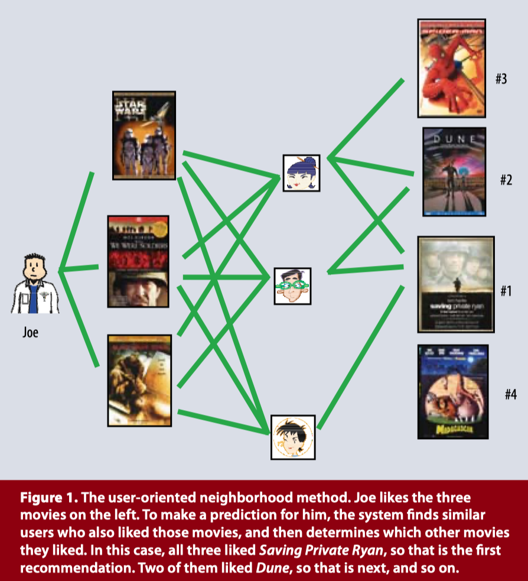
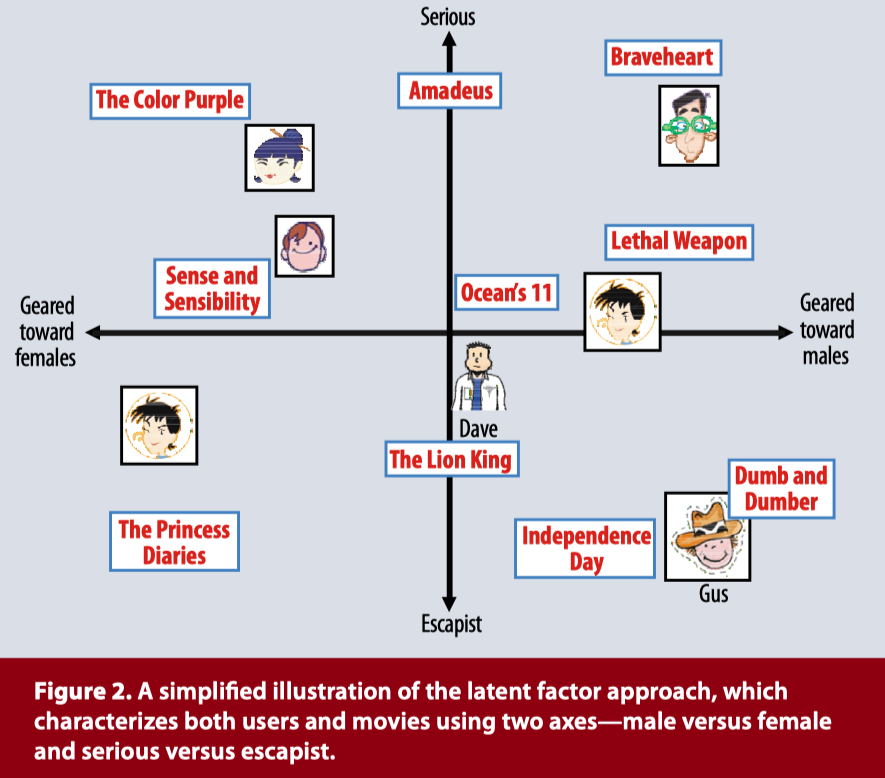

# Matrix Factorization

## Recommender System

추천 시스템은 크게 두 가지로 나뉜다.

- Content Filtering
- Collaborative Filtering

Content filtering은 주로 content-based recommendation이라고 부르며, item의 정보 혹은 user의 정보를 통해 추천할 item 혹은 user를 선정한다. Content-based recommendation은 연관 추천에서 자주 사용된다. 연관 추천은 user에 상관없이 item 간의 유사성과 같은 지표를 생성하여 추천에 활용한다.

Collaborative filtering은 user와 item의 정보를 모두 사용하여 추천할 item 혹은 user를 선정한다. 대표적인 예시로 user가 평가한 item들을 이용하여 평가하지 않은 다른 item에 대한 rating을 예측하는 것이 있다. Collaborative filtering은 주로 개인화 추천에 사용된다.

 

### Collaborative Filtering

Collaborative filtering은 다시 두 가지로 나뉜다.

- Neighborhood methods
- Latent factor models

위에서 설명한 예시가 바로 neighborhood methods이다. `user_1`이 rating한 item들을 토대로 `user_1`과 유사한 또 다른 `user_2`를 찾는다. 그 후, 찾아낸 비슷한 `user_2`의 rating들을 토대로 `user_1`이 경험해보지 못한, `user_1`이 높게 rating할 것이라 예측되는 item들을 추천한다.

Latent factor model은 user들이 rating한 내용들을 토대로 user들의 특성을 나타내는 matrix와 item들의 특성을 나타내는 matrix로 나눈다. 즉, neighborhood method들과 같이 유사도를 통해 값을 예측하는 것이 아니라, user와 item의 고유한 feature값을 생성(예측)한다.

 

### CF의 단점

- `Cold Start`
  - New user problem
  - New item problem
- `Sparse Data`: rating 내역이 충분하지 않은 경우
- `Gray/Black Sheep`: rating한 내용이 특정 취향을 가려낼 수 없는 경우
- `Shilling Attack`: 고의/의도적으로 특정 아이템의 rating을 조작하는 행위

 

 

## Matrix Factorization

Latent factor model의 가장 성공적인 알고리즘들 중 matrix factorization을 기반하여 개발된 알고리즘들이 많다. Matrix factorization은 user feature와 item feature의 inner(dot) product가 user가 평가한 item에 대한 rating이 되도록 학습한다. Hpyer parameter인 dimension $f$로 표현되는 user $u$의 벡터인 $p_{u} \in \real^{f}$와 item의 $i$벡터인 $q_{i} \in \real^{f}$가 있으며, 이 두 벡터의 dot product인 $q^{T}_{i}p_{u}$를 계산하여 item $i$와 user $u$의 interaction($r_{ui}$)을 계산한다.

$\hat r_{ui} = q^{T}_{i}p_{u}$

이렇게 계산되는 $\hat r_{ui}$를 실제 user $u$가 rating한 item $i$의 $\hat r_{ui}$와 비교하여 학습한다. 학습 이후에는 학습에 사용되는 모든 user들에 대해 모든 item들에 대한 user의 rating을 예측할 수 있다.

 

### Regularization

그런데 sparse한 user-item matrix를 사용하여 학습을 진행할 시 overfitting될 가능성이 크다.

 

 

## Learning

### Stochastic Gradient Descent, SGD

### Alternating Least Squares, ALS

